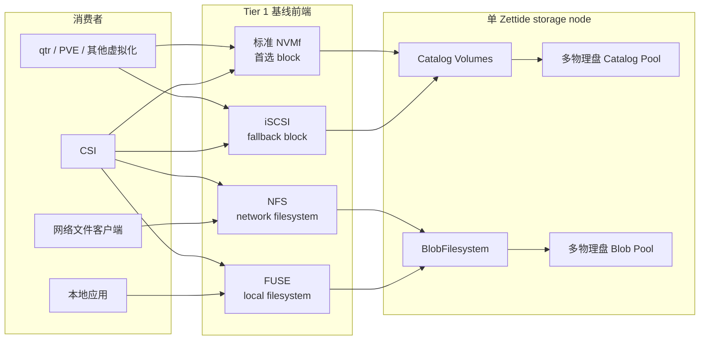
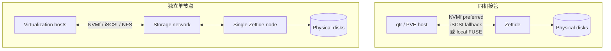
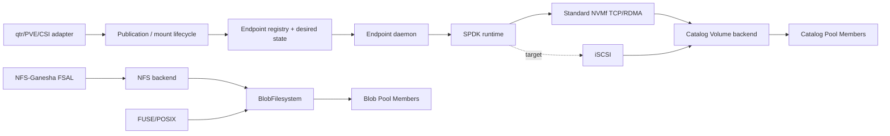
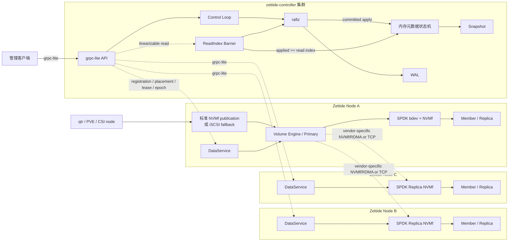

# 系统架构

> 状态：Tier 1 组件部分接通；Tier 2/3 为累积目标

## 系统上下文

Catalog Pool 与 Blob Pool 使用不同 data mode。图中不存在从 block frontend 到 BlobFilesystem 或从 filesystem frontend 到 Catalog Volume 的交叉路径。

## 两种部署

两种拓扑都属于 Tier 1。独立节点不等于 Tier 3；它仍是单 storage node 故障边界。

## 单节点组件

实线表示已有或部分已有路径；iSCSI target 与 managed platform adapter 是目标。当前 endpoint daemon 使用 owner-only Unix control socket、持久 desired state、Catalog backend 与标准 NVMf TCP/RDMA export；它不是完整平台控制面。

## Tier 2 增量

Tier 2 不由 NVMf、iSCSI、NFS 或 FUSE 中任一协议定义。它为上述数据路径增加：

- 动态 Pool Member 生命周期和容量 publication。
- Pool default/per-Volume protection 与可恢复 migration。
- multi-Volume 配额、观测、升级和 publication 治理。
- 更完整的 qtr/PVE/其他 adapter 与 CSI 生命周期支持。

## Tier 3 目标上下文

虚线表示目标集成。当前已有 Raft/WAL/snapshot/ReadIndex、grpc-lite transport 和标准 host-facing Catalog NVMf export；尚无 DataService、跨节点 Volume Engine 或 vendor-specific Replica protocol。

Host-facing NVMf 使用标准 NVMe block commands。内部 Replica NVMf 必须携带 Zettide replication metadata；两者不得共享 publication identity、授权域或 session。首版 publication target 与 primary 共置，以避免引入未定义的 frontend-to-primary forwarding protocol。未来若允许分离，必须先冻结、实现和验证独立 forwarding protocol，不能隐式复用 Replica NVMf。

## 组件职责

### `zettide`

- 当前管理 regular Blob file、Member v3 format、多成员 raw Pool、Blob stores、BlobFilesystem、backend-neutral FUSE/POSIX frontend、NFS backend/FSAL 单成员路径、multi-Volume Catalog、extent mapping、catalog data lease、本地 writable Volume backend、endpoint registry/daemon 和标准 NVMf TCP/RDMA export。
- 当前本地三成员路径在任一复制 write/sync 失败后 sticky freeze writer；quorum read 要求至少两个 byte-identical 结果；writable reopen 完整比较副本且不自动修复。
- 当前还提供 managed SPDK runtime、bdev dispatcher、NVMe-oF initiator、异步 bdev provider 和 vhost-user-blk export 的库级基础。
- 目标运行常驻 DataService、Tier 3 Volume Engine 和 SPDK reactor，管理本地 Replica/namespace，作为 initiator 访问远程 Replica，并按 protection policy 执行排序、quorum commit、fencing、resync 和 repair。
- 目标补齐 iSCSI target、动态 Pool/product lifecycle、统一四前端 publication/export control 和平台 adapter 所需接口。
- `zettide` 不自行决定 Tier 3 placement/lease/epoch 权威，不把标准 host NVMf 当作 Replica protocol，也不承担 VM host 调度。

### `zettide-controller`

- 当前保存 Pool/Node/Member/Volume metadata intent，提供 leader-local heartbeat、静态多 voter Raft runtime、WAL、snapshot、ReadIndex、grpc-lite transport 和恢复基础。
- 目标保存 Replica placement/allocation、primary、lease ID、write epoch 和 publication authority，执行节点注册、placement、reconciliation、fencing 协调和 Tier 3 failover。
- 它只复制权威元数据，不承载正常 block/filesystem payload，也不把 heartbeat 当成授权。

### 平台 adapter

- qtr 当前只有手动外部 iSCSI initiator。
- qtr 目标 adapter 持久化 Zettide identity，优先 NVMf，按策略 fallback 到 iSCSI，并 reconcile libvirt。
- PVE plugin 复用相同 provider contract；CSI 映射相同 Volume/publication/mount 生命周期。

### `raftz` 与 `grpc-lite`

`raftz` 负责复制控制面状态机命令，持久化 HardState、日志、membership 和 snapshot，并提供 proposal callback 与 ReadIndex。生产控制面必须配置持久 `data_dir`；空目录配置使用 MemoryStorage，不具备重启持久性。`raftz` 不选择业务 placement、不执行数据 I/O，也不替代 Replica commit protocol。

`grpc-lite` 承载管理、registration、heartbeat、reconciliation 和 Raft RPC，提供 unary/streaming、deadline、metadata、流控和有界缓冲。回调在 reactor 线程运行，业务逻辑不得阻塞 callback；应只做解码、基础校验和有界入队。它不复制数据副本，也不自动提供 RPC retry、负载均衡或 mTLS。调用方必须处理未知结果和重试身份。

二者不为 Tier 1 endpoint daemon 自动提供完整集群控制面。

## 控制路径

1. 请求到达当前 `zettide-controller` leader。
2. Leader 在 proposal 前完成权限、参数和幂等校验，并生成包含 ID、时间、随机值和 placement 结果的确定性 command。
3. Raft 多数派持久化并提交 command。
4. 本地状态机按日志顺序 apply 后返回确定性结果；proposal 入队或本地 append 不算成功。
5. Reconciler 从同一一致 revision 读取 desired state，合并 leader observation 和介质 facts，生成幂等 action。
6. DataService 执行动作并上报 observed state；慢动作不得阻塞 Raft apply 或 grpc-lite callback。
7. 需要改变 placement、lease、epoch、publication 或其他权威关系的结果再次通过 Raft 提交。

## 数据路径边界

- Tier 1 block path 是标准 NVMf-first、iSCSI fallback 到 Catalog Volume；filesystem path 是 NFS 或 FUSE 到 BlobFilesystem。Raft 不进入逐 I/O 路径。
- Tier 3 host publication 将请求交给共置 primary；primary 再用 vendor-specific Replica protocol 访问本地/远程 Replica。默认 3/2 profile 只有在两个 Replica 都持久化 prepare/payload 和同一 commit certificate 后才确认写入。
- TxFS shared qcow2 是并列方向，不是 BlobFilesystem backend 或 Catalog Volume Replica protocol。其 image owner epoch 只隔离 image writer；接管前仍需外部 hard fence。TxFS owner epoch、Volume write epoch 和 publication generation 不可互换。

## 关键版本域

| 值 | 作用域 | 用途 |
| --- | --- | --- |
| Pool membership epoch | 本地 Pool | Member topology 版本 |
| Publication access generation | 一个 consumer publication | 隔离旧 host session/controller |
| Volume write epoch | Tier 3 Volume | 隔离旧 primary |
| Replica generation | Tier 3 Replica | 隔离重建前数据实例 |
| Lease ID | 单次 Tier 3 primary 授权 | 区分具体授权实例 |
| Raft term/revision | Tier 3 控制面 | leader 任期与已 apply 权威版本 |
| TxFS owner epoch | shared qcow2 image | 隔离旧文件 writer |

这些版本不得相互替代。
