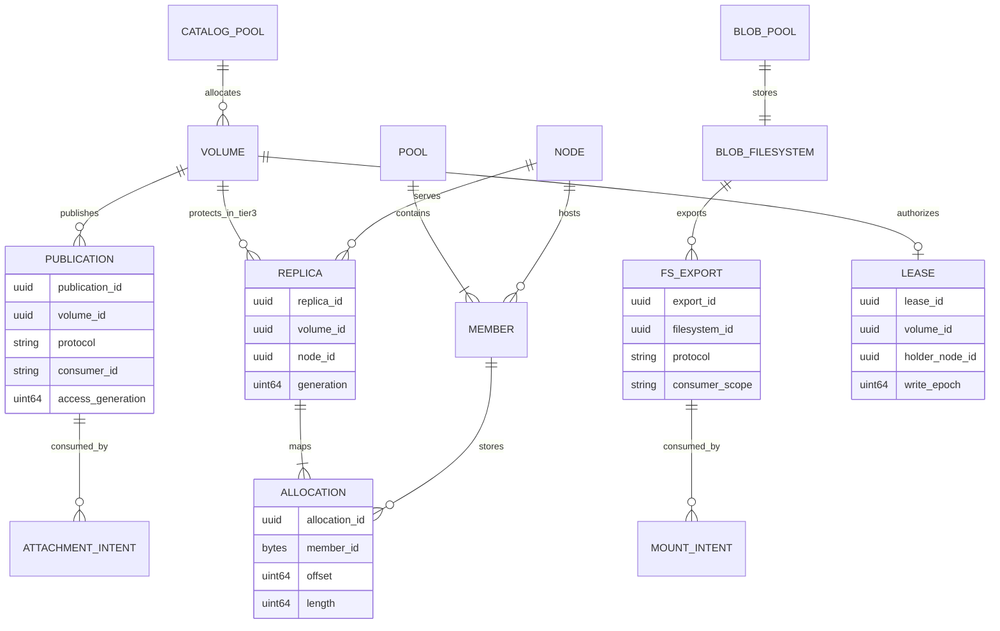
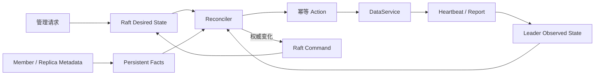

# 领域模型

> 状态：本地 Pool/Catalog/Blob 与部分控制面 schema 当前存在；统一产品生命周期为目标

## 数据模型边界

| 模型 | 资源 | Frontend | Pool data mode |
| --- | --- | --- | --- |
| Block | Catalog Volume | 标准 NVMf、iSCSI | Catalog |
| Filesystem | BlobFilesystem | NFS、FUSE | Blob |

一个 Pool 实例只使用一个 data mode。Catalog Volume 不是 BlobFilesystem 中的文件；BlobFilesystem 也不叠加在某个对外发布的 Catalog Volume 上。跨 frontend 共享仅允许在同一模型内，例如同一 BlobFilesystem 的 NFS/FUSE 生命周期必须显式互斥或按未来并发契约管理，不能无声明并发挂载写入。

## 核心实体

| 实体 | 职责 | 当前持久位置 |
| --- | --- | --- |
| Pool | Member 集合、data mode、容量与默认保护边界 | 本地 v3 metadata；Tier 3 另有控制面 Pool |
| Member | 独立物理介质身份、geometry、slot 与故障状态 | Member headers/control records |
| Catalog Volume | 固定逻辑 block address space 与 extent mappings | 本地 Catalog；Tier 3 metadata intent 部分存在 |
| BlobFilesystem | inode/blob/COW filesystem graph | Blob stores on Blob Pool 或 regular Blob file |
| Endpoint | 本地 desired export lifecycle | endpoint registry/file store |
| Publication | 对 consumer 的协议中立发布身份、access generation 与 locator | 目标统一模型；当前 endpoint 是局部前身 |
| AttachmentIntent | consumer 对 Volume/publication 的持久期望 | qtr/PVE/CSI adapter 目标状态 |
| MountIntent | consumer 对 BlobFilesystem/export/mount 的持久期望 | 平台 adapter/CSI 目标状态 |
| NodeRegistration | 节点身份、services/control/NVMf endpoint、能力和故障域 | Tier 3 Raft 状态机 |
| MemberRegistration | 持久 Member 与控制面 Pool/Node 的绑定 | Tier 3 Raft 状态机 |
| ReplicaPlacement | Volume Replica 的目标 Node、角色和 generation | schema 当前存在；mutation 为目标 |
| ReplicaAllocation | Replica 在 Member 上不重叠的 extent/range | schema 当前存在；mutation 为目标 |
| VolumeLease | primary holder、lease ID、write epoch 和授权边界 | 当前不存在 schema；完整协议为目标 |
| Observation | incarnation、heartbeat、容量、路径、Replica position 和健康 | 当前 leader 内存；现有切片仅覆盖 Node/Member |
| ReconciliationAction | desired/observed/facts 差异产生的幂等动作 | 派生任务；结果按需提交 Raft |
| VolumeAttachment | consumer 到目标 storage Node 的绑定 | storage-side 占位 schema；mutation 为目标 |

## 关系



当前 control `VolumeAttachment.target_node_id` 引用的是 storage `NodeRegistration`，缺少 qtr/PVE/CSI host、publication identity 和 protocol session，因此只是 storage-side 占位 schema。它与 adapter 持久化的 `AttachmentIntent` 不同，不能被描述为 managed qtr attachment 已定义或接通。

## Publication

Publication 是协议中立的 block resource，至少包含：

```text
publication_id
volume_id
consumer_id / host_id
protocol = nvmf | iscsi
access_mode
access_generation
locator
lifecycle_state
```

- NVMf locator 包含 transport、address、NQN 和 NSID；controller/qpair 是 observation。
- iSCSI locator 包含 portal、IQN 和 LUN；session/device 是 observation。
- 稳定 serial/NGUID/UUID/WWID 用于把发现结果绑定回 Volume/publication。
- 协议 fallback 可以为同一 attachment intent 创建新的 publication generation，但不能留下两个有效 exclusive writer。

当前 endpoint registry 已表达 endpoint/pool/volume/frontend 和 NVMf locator，并持久化 desired state；它还不是完整的 consumer-bound Publication API。

## Filesystem Export 与 Mount

NFS export 与 FUSE mount 都引用稳定 BlobFilesystem/Pool identity：

- NFS export path、server address 和 client mount path 是 locator。
- FUSE mount point、process PID 和 `/dev/fuse` fd 是 observation。
- NFS/FUSE 必须在打开时验证 Pool data mode 为 Blob。
- 当前 NFS FSAL 只接收一个 member path；多成员 Pool identity 与组装尚未进入其接口。

## 容量与保护

- Member topology 只描述容量与介质故障边界。
- Pool default protection 和 per-Volume override 描述目标副本策略。
- `desired_replica_count`、`current_replica_count` 和 migration phase 必须独立。
- 新 Member 先 joining；容量可先发布而不改变已有 Volume protection。
- 迁移先 copy/verify/publish 新 layout，再释放旧 allocation。
- Tier 1 完成要求多独立物理盘，但不等于所有数据模型自动获得同一种副本保证。

## Consumer Intent

平台 adapter 在任何外部副作用前持久化 management/lifecycle intent：

```text
operation_id
resource_id
consumer_id
host_or_node_id
requested_access_mode
preferred_protocols
publication_or_export_id?
observed_attachment_or_mount?
```

qtr/PVE 的 block intent 最终映射到 libvirt/QEMU disk。CSI Controller intent 映射到 Zettide Volume/publication；CSI Node intent 映射到 host session/device 或 filesystem mount。CSI handle 不能替代 Zettide resource ID。稳定 operation ID 用于 management/lifecycle mutation 及其未知结果恢复；普通读、heartbeat、observation sample 和逐 I/O 请求不因此获得 operation ID。

## Tier 3 扩展

Tier 3 为 Catalog Volume 增加 ReplicaPlacement、ReplicaAllocation、VolumeLease、write epoch、committed position 和 repair state。标准 host-facing Publication 仍保持独立 access generation；它不使用 Replica generation 或 write epoch 代替 consumer fencing。

## Desired、Observed 与 Persistent Facts



- Desired 回答系统应该是什么；Observed 回答当前 leader 最近观察到什么；Persistent Facts 回答节点重启后介质仍能证明什么。
- Heartbeat 丢失只产生 suspicion，不能删除 registration、提升 primary、改变 publication authority 或宣告数据丢失。
- Observation 不能静默覆盖 desired state 或介质 facts；任何写权限或持久拓扑变化都必须经过对应持久 mutation。

## 正交状态

Volume 至少使用三个正交字段，不能把 repair phase 塞进生命周期或把副本数直接当作可写性：

- `lifecycle_state`：Provisioning、Active、Deleting、Failed。
- `availability_state`：Healthy、Degraded、ReadOnly、Unavailable。
- `operation_phase`：None、Fencing、Recovering、Repairing。

Availability 由当前 protection policy 的 read/write threshold 参数化。单副本 profile 在一个合格 Replica 就绪时可以是 `Active + Healthy`；默认三副本 profile 修复第三份时可以是 `Active + Degraded + Repairing`。对外优先报告 Unavailable、ReadOnly、Degraded、Healthy，并单独报告 operation phase。

## 核心不变量

1. Pool data mode 决定可用数据模型和 frontend，不允许跨模型打开。
2. Tier 1 合格多 Member Pool 中，只有经准入确认的独立物理盘才算独立 Member 故障域；分区、LVM 映射、loop/regular file 或同一底层盘的多个路径不得冒充独立故障域。
3. Volume/Filesystem/Publication/Export/Consumer identity 不由路径或网络地址推导。
4. Exclusive Publication 的 access generation 单调增加。
5. 同一 attachment intent 的协议 fallback 不产生第二个有效 writer。
6. 增加 Member 不隐式改变已有 Volume protection policy。
7. 未完成 copy/verify 的 Replica 不计入 current protection。
8. Desired、observed 和 on-media facts 不能相互静默覆盖。
9. Tier 3 Volume write epoch 与 host publication generation 分离。
10. 所有 management/lifecycle mutation 使用稳定 request/operation ID；同 ID 不同语义返回冲突。
11. 一个 Replica 只属于一个 Volume；allocation 映射到一个或多个不重叠 Member extent。
12. Tier 2 local protection copy 使用合格的不同本地物理盘；正式 Replica resource 在 Tier 3 使用不同 Node 故障域。
13. Tier 3 primary 必须是当前 placement 中的合格 Replica，且只能使用满足 policy 的 quorum。
14. 同一 Tier 3 Volume 至多一个有效 primary lease；write epoch 单调增加且不复用。
15. Replica generation 在重建后变化；旧 generation endpoint 不得重新加入 placement。
16. Repairing/Stale Replica 不参与 current protection、读写 quorum 或 primary 候选集合。
17. Placement 变更先建立并验证新保护，再撤销仍承担 quorum 的旧 Replica。
18. Raft apply/restore 确定、原子且无外部副作用；ID、时间、随机值和 placement 结果在 proposal 前确定。
19. Tier 3 Publication access generation 由 Raft 权威状态单调推进；DataService 只安装匹配当前 authority 且不低于本机最高 generation 的版本。

## 当前差距

当前 `zettide` 已有 BlobFilesystem/FUSE 多成员路径、NFSv3 单成员路径、Catalog/extent mapping、endpoint registry/daemon 和标准 NVMf TCP/RDMA export。统一 Publication、consumer-bound access generation、iSCSI target、qtr/PVE/CSI intent 与多前端真实多盘 gate 尚未完成。

`zettide-control` 的 Volume 仍是固定 3/2/1 `PROVISIONING` metadata intent；Replica/Allocation/Attachment schema 没有 mutation，placement、lease、epoch enforcement 和 reconciliation 尚未实现。

当前 NodeRegistration 是 create-only，保存 stable Node ID、cluster binding、services/control/NVMf endpoint、failure domain、capability bits、protocol version、注册时间和 revision；不保存 heartbeat、容量或在线状态。MemberRegistration 使用介质原生 16-byte Member ID，绑定 control Pool、hosting Node 和 16-byte local set ID，并保存 slot、birth topology digest、metadata/data capacity 与 extent size；设备路径、当前 authority、使用量和健康属于 observation/facts。

当前 create-only Register/Get/List 已覆盖 Node 和 Member。CreateVolume 保存 Pool、容量、固定 3/2/1 参数、`Provisioning + Unknown + None`、初始 generation/write epoch、revision 和 resource version，不执行 placement、extent reservation 或 DataService RPC。DeleteVolume 要求 expected resource version，只允许无 Replica/Attachment 引用时删除，并永久保留有界 tombstone；名称可复用，Volume ID 不复用。

状态机当前使用 Pool/Node/Member/Volume 共享的全局 request history 和 v5 snapshot，并兼容读取 v2 Pool-only、v3 Pool/Node、v4 Pool/Node/Member snapshot。NodeObservation 当前只含 Node incarnation/sequence、接受时间、leader term、Member presence 和可选 extent capacity；相同 ordering tuple 的相同语义可重放，不同语义或回退冲突。Observation 5 秒后 stale，leader/term 切换和 snapshot restore 时清空，不进入 WAL/snapshot，也不覆盖 registration。
