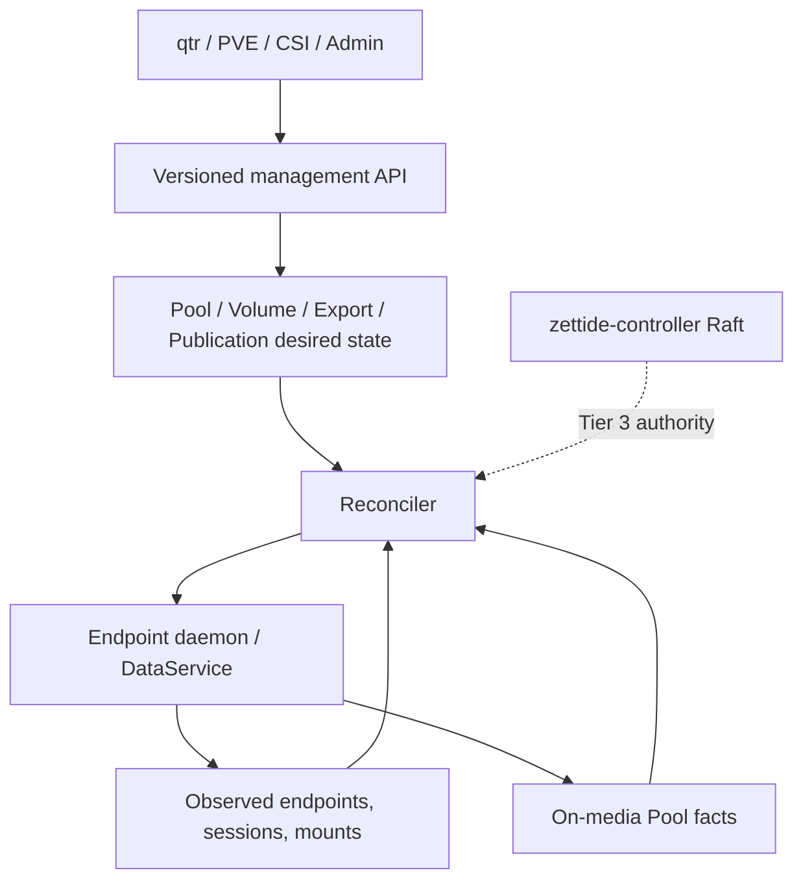
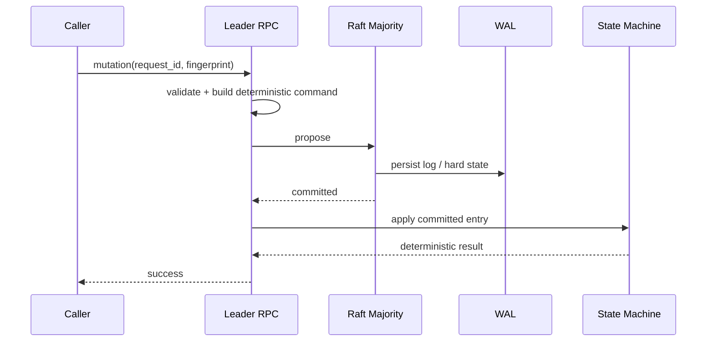

# 控制面

> 状态：单节点 endpoint control 当前部分存在；Tier 3 Raft metadata 当前部分存在；统一 lifecycle/reconciliation 为目标

## 两级控制边界

Tier 1/2 单节点控制面负责 Pool、Catalog Volume、BlobFilesystem export、publication 和 consumer lifecycle。它不要求把每个状态写入 Raft。当前最接近该边界的是 endpoint daemon：

- owner-only Unix control socket；
- versioned request format；
- 持久 endpoint desired state；
- restart reconciliation；
- Catalog Volume 到标准 NVMf TCP/RDMA、iSCSI 或 vhost-user-blk export。

它尚未提供统一 Pool/Volume API、consumer-bound Publication/access generation、NFS/FUSE lifecycle 或外部虚拟化 adapter，因此只能标为部分。

Tier 3 的 `zettide-controller` 负责跨节点权威状态，并通过 Raft/WAL/snapshot 复制。当前两级控制面尚未端到端接通。

## 目标结构



## API 资源

| 资源/API | 当前状态 | 目标责任 |
| --- | --- | --- |
| Pool | `CreatePool`、`GetPool`、`ListPools` 当前 | Tier 1/2 data mode/member lifecycle；Tier 3 placement resource |
| Volume | `CreateVolume`、`GetVolume`、`DeleteVolume` 当前 metadata intent | Catalog capacity/protection；Tier 3 Replica、primary、write epoch |
| Node | `RegisterNode`、`GetNode`、`ListNodes` 当前 create-only | capability update、isolation、unregister、failure-domain eligibility |
| Member | `RegisterMember`、`GetMember`、`ListMembers` 当前 create-only | member lifecycle、capacity allocation、quarantine |
| Heartbeat | `ReportHeartbeat`、`GetHeartbeat` 当前 leader-local | Replica/path/lease/repair observation |
| Placement/Allocation | durable schema 当前、无 mutation | reserve/move/tombstone Replica extents |
| Lease | 当前无 schema/RPC | pending grant、activation、renew、revoke、epoch |
| Filesystem | Blob identity 与 export eligibility 当前局部存在 | NFS/FUSE lifecycle；不由 block Replica schema 推导 |
| Publication | endpoint primitives 当前局部存在 | protocol、consumer、access generation、locator、Raft republish authority |
| Attachment | storage-side 占位 schema，无 mutation | adapter intent、host session/device、libvirt 与 caller-directed republish |

当前 endpoint control 是另一条单节点 API：versioned owner-only Unix request，管理持久 endpoint desired state。每个 Pool 当前最多一个 endpoint，registry 最多 1024 个 endpoint；没有 consumer/access generation，也不是 consumer-bound Publication API。Catalog backend 当前可建立标准 NVMf、iSCSI 和 vhost endpoint/export primitive；NFS/FUSE lifecycle 和平台 attachment 不在该 API 中。

## 幂等与恢复

每个 management/lifecycle mutation 使用稳定 request/operation ID 和覆盖所有语义参数的 fingerprint：

- 相同 ID、相同语义返回原结果；
- 相同 ID、不同语义返回 conflict；
- timeout/连接失败后查询或使用原 ID 重试；
- intent 在第一个外部副作用前持久化；
- observed state 不能覆盖 desired state 或介质事实。

当前 endpoint registry 和 `zettide-controller` 各自在局部实现了持久 desired state 或 request ID 幂等，但尚无共享 API。

在 `zettide-controller` 中，Pool、Node、Member、Volume 共享全局 request-ID 域；相同 ID 即使跨资源类型重用也按 fingerprint 冲突。状态机保存最终 apply response，以便响应丢失后返回原结果。Heartbeat 的 incarnation/sequence ordering tuple 是 observation 去重键，不等同于 management operation ID。

## Raft 写入与读取



- 成功必须来自 committed entry 的本地 apply 结果；proposal 入队、leader append 或 grpc-lite send 成功均不能提前确认。
- ID、时间、随机数、placement 选择和其他非确定输入必须在 proposal 前产生并写入 command。
- Apply 和 snapshot restore 必须确定、原子且无外部副作用。业务冲突编码为确定性结果；不能让外部 RPC、介质操作或 wall clock 进入 apply。
- 权威读由 leader 执行 ReadIndex quorum barrier，等待本地 `applied_index >= read_index` 后读取内存 view 并返回 revision。Follower stale read 若未来提供，必须显式标注一致性和 applied revision。

## Publication Control

目标 Publication API 返回协议中立字段与协议 locator：

```text
publication_id
volume_id
consumer_id
protocol
access_mode
access_generation
stable_device_identity
locator
```

NVMf-first 选择发生在 adapter policy 与服务 capability 交集。只有显式允许 fallback 时才改用 iSCSI。Fallback 不是把原 session 当成同一 transport，而是通过同一 attachment intent 协调新的 publication generation，并确保旧 exclusive path 已撤销或 fenced。

DataService/endpoint daemon 必须持久化最高 installed access generation。Tier 3 时 Raft 保存 publication authority；本地只能安装与当前 authority、primary lease 和 Volume epoch 匹配的 generation。

## Managed Attachment

qtr/PVE block adapter 的目标顺序：

1. 持久化 attachment intent、operation ID、Volume ID、host/VM/disk identity 和协议偏好。
2. 请求幂等 Publish；将 publication ID、generation、stable device identity 和 locator 原子绑定到 intent。
3. NVMf 路径创建/连接受管 controller，iSCSI fallback 执行 discovery/login。
4. 按 NGUID/UUID/serial 或 SCSI serial/WWID 验证设备，不信任 `/dev/...`。
5. 修改 libvirt/QEMU attachment。
6. 重启后比较 intent、publication、controller/session/device 与 libvirt XML 并收敛。
7. Detach 先持久化 detaching，确认 VM 不再使用，再 disconnect/logout，最后 Unpublish。

qtr/PVE 属于外部仓库；本仓库只冻结上述 managed contract，不维护或验证其当前实现状态。

## Filesystem Control

- NFS：Export intent 绑定 BlobFilesystem identity、client scope、read/write mode 和 export generation；NFS server/export path 是 locator。
- FUSE：Mount intent 绑定 BlobFilesystem identity、host identity、mount mode 和 mount point；PID/fd 是 observation。
- 当前静态 FUSE CSI Node service 直接管理 regular Blob file mount；目标 CSI filesystem lifecycle 将 Controller publication 与 Node mount 分开，但不创建新的存储语义。
- 未冻结多 writer 契约前，控制面不得让 NFS 与 FUSE 对同一 BlobFilesystem 形成未协调可写并发。

## Tier 3 Raft

当前 `zettide-controller` 已实现 Pool/Node/Member/Volume metadata、request history、ReadIndex、leader-local heartbeat、WAL/snapshot 和静态多 voter 恢复。CreateVolume 只提交固定 3/2/1 `PROVISIONING` intent，不执行 placement 或 I/O。

目标 mutation 必须由 leader 构造确定性 command，经 quorum commit 和 apply 后才返回成功。Heartbeat 只提供 observation；leader 切换后清空，不能授予 primary、publication 或 Replica 写权限。

Reconciler 读取一致 revision，合并 observation/on-media facts，生成带 expected generation/revision 的幂等 action；长时间 migration/repair 不阻塞 Raft apply。

## Registration 与 Heartbeat

NodeRegistration 和 MemberRegistration 经 Raft 持久化；endpoint、capability、failure domain、geometry 等权威变化不能由 heartbeat 静默覆盖。当前 heartbeat 只在 leader 内存保存 Node incarnation/sequence、接受时间、leader term、Member presence 和可选 extent capacity。

- `ReportHeartbeat` 先经 ReadIndex，在 driver callback 中校验 Node/Member registration binding、capacity geometry 和当前 term，再原子替换 observation；`GetHeartbeat` 同样通过 ReadIndex。
- 相同 incarnation/sequence 与相同 payload 可重放；相同 tuple 不同 payload或 ordering 回退返回 conflict。
- 推荐 1 秒上报，5 秒 stale。Store 限制 10,000 Nodes、10,000 Member observations、每次最多 256 Members。
- Observation 不进入 WAL/snapshot，leader/term 变化和 snapshot restore 后清空；DataService 必须重新上报。
- Replica positions、路径健康、lease observation 和 repair progress 尚未进入当前协议。

这种 durable registration/ephemeral observation 分离避免 heartbeat 放大 Raft 日志，也保证短暂失联不会删除持久 identity。

## Reconciliation

1. 对一个一致 revision 读取 desired state。
2. 合并当前 leader observed state 和 Node/介质 persistent facts。
3. 生成带 resource ID、generation、expected revision 的幂等 action。
4. 通过 grpc-lite 下发 DataService，在 action queue 中执行。
5. 验证结果和前置 revision 仍成立。
6. 需要改变 placement、lease、epoch、publication 或 eligibility 时提交新的 Raft command。

同一 Volume 的 authority change 必须串行化。慢节点、长迁移或 repair 不能阻塞 Raft apply。

## 背压与安全停止

RPC、proposal、ReadIndex、heartbeat、endpoint action、migration 和 repair queue 均有数量/字节上限。超载返回明确错误；未知结果不等于失败；无法验证 generation 或 authority 时保持 endpoint closed。

- grpc-lite callback 只解码、做基础校验和有界入队；不得执行阻塞业务逻辑。
- Raftor event loop 由单一 driver 驱动，不并发重入；state-machine apply 按日志顺序串行。
- Heartbeat 可覆盖同 Node 旧样本，不得无限排队；deadline 必须贯穿排队和执行阶段。
- grpc-lite 不自动 retry、load balance 或 mTLS；调用方保留相同 request ID 处理 timeout/连接失败。

## 恢复

1. 读取并验证稳定 cluster/node identity。
2. 打开 WAL；存在持久状态时必须按 restart，禁止 fresh bootstrap 覆盖。
3. 加载最新有效且兼容的 snapshot，原子 restore 状态机。
4. 重放 snapshot index 后连续 WAL，校验 committed/applied/last index。
5. 追平 committed/applied 后才提供一致性服务，并先作为 follower 加入。
6. 成为 leader 后从空 heartbeat view 重新收集 observation 并启动 reconciliation。

生产配置必须使用持久 `data_dir`。当前 v5 snapshot 保存 Pool、Node、Member、Volume 和全局业务幂等记录，兼容读取 v2/v3/v4；socket、heartbeat 和临时 action 不进入 snapshot。

## 当前差距

- 无统一 Tier 1 Pool/Volume/Publication/Export API。
- endpoint daemon 无 consumer-bound access generation、NFS/FUSE 管理和 platform consumer identity；iSCSI/NVMf 仍是 export primitive。
- qtr/PVE 的 managed adapter 不属于本仓库；当前 CSI 只有静态 FUSE Node service，无 Controller/block/NFS managed lifecycle。
- `zettide-controller` 已有 placement、Replica/Allocation mutation、primary authority 状态机与
  leader-only reconciler，生产入口也已启用 DataService RPC client；file data-node 已闭环 fence、
  empty-frontier recovery 与 readiness admission，但用户数据复制、failover/repair 验证和 publication
  lifecycle 尚未闭环。
- 当前控制 RPC 不具备生产级双向认证与授权。
