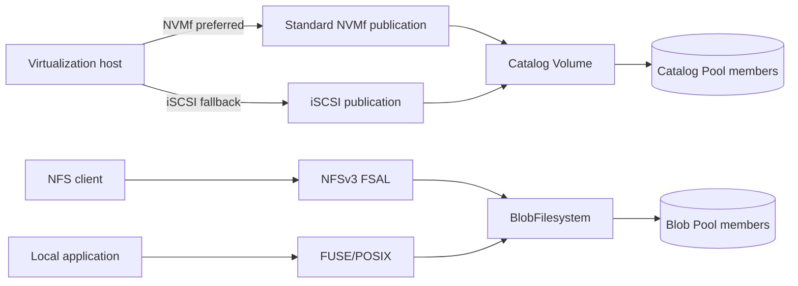
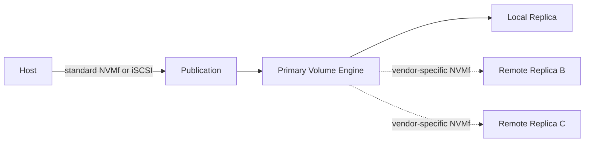

# 数据面

> 状态：FUSE 多成员当前；NFSv3 单成员、标准 Catalog NVMf TCP/RDMA 与 iSCSI 部分；Tier 3 Replica path 为目标

## Tier 1 数据路径



四个 frontend 都是 Tier 1 基线，但成熟度不同。单 data node 失效会使其服务不可用。

## 标准 Host-facing NVMf

当前 `CatalogNvmfExport` 已把 Catalog Volume backend 组合为 provider bdev、NVMf subsystem、namespace 和 TCP/RDMA listener。Endpoint daemon 可按持久 desired state 创建 export，并返回 NQN/NSID/address locator。

该路径使用标准 NVMe block semantics，适合 Linux host 通过内核 NVMe initiator 发现 block device。Volume/publication identity 必须通过稳定 namespace identity 与 control result 验证；NQN、NSID、controller name 和 `/dev/nvme...` 只是 locator/observation。

当前缺少：

- qtr managed controller connect/disconnect 与 libvirt reconciliation；
- consumer-bound publication/access generation；
- 多真实物理盘 Catalog Pool 的完整产品 E2E；
- resize/discard/flush/restart 等 Tier 1 统一 gate。

因此标准 NVMf 是首选方向且已有部分实现，但不是已交付 managed backend。

当前 endpoint 是 endpoint/export primitive：registry 持久化 endpoint/pool/volume/frontend desired state，daemon 为 Catalog backend 建立 NVMf subsystem、namespace 和 listener。每个 Pool 当前只能有一个 endpoint，registry 最多 1024 个 endpoint；它没有 consumer-bound Publication API、consumer identity 或 access generation，不能据此宣称 managed attach/fencing 已完成。

## iSCSI Fallback

iSCSI 访问相同 Catalog Volume block model，但使用独立 target/LUN、session、stable SCSI identity 和 credential lifecycle。Zettide 当前已封装 SPDK shared iSCSI service、per-Catalog target/LUN export、endpoint locator/lifecycle，并提供 `iscsi-catalog-fio` 自动化 profile。该 profile 是 focused export/data-integrity gate，不包含 consumer-bound Publication generation、managed host attachment 或真实多物理盘 Tier 1 总 gate。

iSCSI 用于兼容不适合 NVMf 的 host/platform。Fallback 不改变 Volume 数据语义，也不允许 NVMf 与 iSCSI 同时写同一 exclusive publication。IQN/LUN 可以稳定，但 Volume ID、publication ID 与 serial/WWID 才是恢复依据。

## NFS

当前 `FSAL_ZETTIDE` 以 in-process C ABI 调用同步 Zig NFS backend，不经过 FUSE/VFS/IPC。它支持 NFSv3，并有真实 NFS-Ganesha RPC gate；当前只打开 regular Blob file 或一个 Blob Pool Member，不组装多成员 Pool。

NFS stable write 必须完成 BlobFilesystem durability barrier 后确认。Export path、client mount path 和 server socket 不是 filesystem identity。NFSv4 state、NLM、ACL、xattr、quota 与多成员 Pool export 当前均不在实现范围。

## FUSE

当前 foreground FUSE/POSIX frontend 可打开 regular Blob file 和多成员 raw Blob Pool。它是当前唯一已存在的多成员 filesystem frontend。Mount point、PID 和 fd 是运行时状态；Pool/BlobFilesystem identity 与介质 authority 才是恢复依据。

`serve dufs` 是外部 HTTP/WebDAV 便利适配，不是四个 Tier 1 baseline frontend 之一，也不改变底层 FUSE 数据路径。

## Pool 与 Protection

Catalog 与 Blob Pool 都应由多个独立物理磁盘组成。当前本地 replicated/scheduled paths 与未来 per-Volume protection lifecycle 不等价：

- Member 数量不直接证明某个 Volume 的 current protection；
- 在线迁移必须 copy、verify、publish 后才能提升保护；
- 同一 data node 内多副本只能覆盖经验证的设备故障；
- 单节点进程、PCIe domain、电源或主机故障仍在共同故障边界内。

当前本地数据路径的具体语义必须与未来 Tier 2/3 保证分开：

- 使用 regular file 或 Linux block fd 执行 positional I/O，可打开一个本地 Member 或三个本地 Member。
- 三成员 write/sync 尝试所有 `ReplicaEndpoint`；任一失败后 writer 进入 sticky freeze，后续写保持失败，不自动降级继续。
- 三成员 read 至少找到两个 byte-identical 结果才返回；这不是 Tier 3 的任意健康单副本读取。
- Writable reopen 完整比较副本数据；发现差异 fail closed，不自动选择时间戳、不自动修复。
- multi-Volume Catalog、extent mapping、catalog data lease 和 writable backend 是库级当前能力；它们不等同于 per-Volume online protection migration。

## 可选 Frontend

vhost-user-blk 已有 Catalog export library lifecycle，可作为同机优化方向，但不替代 Tier 1 标准 NVMf/iSCSI gate，也不改变 Volume identity/protection semantics。

## Tier 3 内部 Replica NVMf

Tier 3 在 host-facing publication 之后增加 Volume Engine：



内部 Replica 的网络协议和 NVMf vendor-specific command 尚未实现。当前共享
`write_service` 提供 node-local participant：它校验 authority、sequence、history、range
和 payload digest，将最多 1 MiB payload 持久化为单一未决 PREPARE，接受两个不同
Member 的 canonical attestation certificate，先持久化 COMMIT 决定，再写入并同步本地
Replica extent，最后推进 applied frontier。标准 NVMe command 不携带这些证据，因此
不能直接把当前标准 NVMf export 当成 Replica transport implementation。

Data-node daemon 已组合持久 participant catalog、首次 PREPARE 前的 immutable
Replica/canonical-Member binding、完整 active Replica/backend identity 校验、4 KiB 对齐
file apply，以及 normal admission、certified replay、Replica mutation 和 durable fence
append 共用的 per-placement gate。启动在开放 server 前发现 catalog 并完成已持久 COMMIT
replay；replay 携带旧 authority，可被不同或更高 durable fence 拒绝。非空本地 history
不会继续伪装成 empty-frontier recovery evidence。

当前 file snapshot 每次原子替换完整的单未决状态，只用于 crash-ordering 和协议测试，
不是最终流式 journal。controller reconciliation 现已从三个 active placement/allocation
推导 bytewise-canonical Member set，并通过内部 `ConfigureWriteParticipant` control RPC 在
初始 authority proposal、readiness 和稳定 authority inspection 前，将同一 immutable set
持久配置到三个 data node。配置必须匹配完整 active Replica 与 backend digest；catalog
先于 participant file binding 持久，启动可补完该 crash window，PREPARE/COMMIT 也不能
惰性创建未配置 participant。payload mutation 仍未暴露到 management listener；
certificate attestation 尚无网络认证、remote target handler 或 primary coordinator。
因此这些控制面与本地组合测试仍不等于三节点 quorum success。

目标 vendor-specific command 至少携带：

```text
volume_id
replica_generation
write_epoch
write_sequence
range
payload_checksum
operation = PREPARE | COMMIT
```

Replica target-owned metadata 保存 `max_accepted_epoch`、journal、applied/committed position 和 certificate，普通 namespace write 不得覆盖它们。Session 绑定 primary Node、Volume、Replica generation 和 epoch。

每个 Replica 至少具有：

- stable Replica ID、Volume ID、Node ID，以及一个或多个带 generation 的 ReplicaAllocation；
- Replica generation、NVMf subsystem/NQN、namespace ID 和 transport endpoint；
- `max_accepted_epoch`、applied position、committed position、dirty ranges 和恢复 manifest；
- Healthy、Degraded、Rebuilding、Offline 或 Stale 状态。

Namespace 由 DataService 创建和撤销，外部客户端不能自行取得 Replica 写权限。数据区映射为 namespace LBA；journal、epoch、recovery frontier 和 certificate 位于 target-owned metadata 区。

目标 epoch-bound session barrier 为：

1. 将 namespace/session 置为 quiescing，拒绝旧 session 的新写入。
2. 撤销旧身份并断开旧 controller/qpair。
3. Drain 已经接收的旧 I/O，并 flush 到满足准入要求的持久介质。
4. 持久化更高 `max_accepted_epoch` 和 recovery frontier。
5. 只为匹配 `(volume, replica generation, primary node, epoch)` 的新 session 开放 Replica 写权限。

Transport reconnect 和 Replica restart 都不能清除该 barrier。动态 ACL 或 Host NQN 单独不是充分 fencing；具体 vendor command、session context、metadata layout 和 SPDK request handler 必须在实现 ADR 冻结。

## Tier 3 提交

默认 3/2 profile 的目标流程：

1. Primary 验证 lease/epoch 并分配 sequence。
2. 至少两个合格 Replica 持久化相同 prepare/data。
3. Primary 形成列出 Replica/digest 的 commit certificate。
4. 至少两个持有 payload 的 Replica 持久化 certificate。
5. Primary 才向 host-facing frontend 确认成功。

进入内存、transport queue 或设备易失缓存不算 durable ack。Repairing/Stale Replica 不参与 quorum。首版每 Volume 同时只允许一个 unresolved sequence；更高吞吐流水线需要独立 ADR。

完整两阶段证据规则如下：

1. Primary 检查 holder 本地 lease window、当前 epoch、placement revision 和 Replica eligibility，在 epoch 内分配单调 sequence。
2. `PREPARE` 携带 range、payload、checksum、Replica generation 和 epoch；Replica 校验 session gate，持久化 data/prepare record，返回 digest。
3. 至少两个 durable prepare attestations 才能形成列出具体 Replica/digest 的 commit certificate。
4. `COMMIT` 只发送给已持有匹配 payload 的 Replica；certificate holder 必须同时持有它证明的 prepare/data。
5. 同一 certificate 在两个 Replica 持久化后才形成 quorum commit，推进 committed position，并允许向 host frontend 返回 success。

设备准入必须证明所选 bdev 的 Flush/FUA、volatile write cache 和断电保护语义。SPDK completion 或“不支持 Flush 时返回成功”的行为不能单独证明持久性；不能证明 durable barrier 的设备不得计入 quorum。

单份 certificate 只是 recovery candidate。Recovery quorum 观察到 candidate 时必须先 write-back 第二份再纳入 certified history；完全看不到的孤立 candidate 从未满足 success，并由更高 epoch recovery frontier 淘汰。首版同时只允许一个 unresolved sequence：无 candidate 时可在持久化新 frontier 后丢弃 prepare；有 candidate 时必须补证并物化。流水化多个未决 sequence 需要显式 commit frontier 和 quorum ABORT record。

## Tier 3 读取

Primary 从当前 generation 且 applied position 不落后于所需 committed position 的合格 Replica 中选择读取源：

- 优先本地 Replica；失败后可通过内部 NVMf 选择健康远程 Replica。
- Rebuilding、Stale、checksum 失败或落后 Replica 不返回权威数据。
- 正常 read 不要求同时读两个 Replica，但切换源必须证明已追平 certified committed boundary。
- 校验失败时隔离故障范围并切换合格源；无法证明边界时暂停读取，而不是猜测。

## NVMf 与 Journal 边界

NVMf 只提供远程块 transport，不能单独回答 quorum 是否持久、重试语义、断线 position、failover 尾部或 rebuild range。因此标准 host-facing NVMf 和内部 transport 都不等于复制协议；Tier 3 仍需要 vendor-specific commands、replication journal、positions、dirty ranges、commit evidence、integrity summary 和崩溃恢复规则。

当前 v3 control journal 记录 Pool membership/topology history，不是 Volume 数据 replication journal，也不能替代两阶段证据。iSCSI 同样只作为 host-facing block transport，不决定 placement、epoch、quorum 或 storage failover。

## 当前差距

四前端尚未形成真实多盘统一 gate；外部 managed NVMf-first/iSCSI-fallback attachment、consumer access generation、NFS 多成员、Tier 2 migration 和 Tier 3 vendor-specific Replica protocol 均未完成。当前任何局部 export、benchmark 或 synthetic/loop test 都不能被描述为 Tier 1 完成或生产可用。
