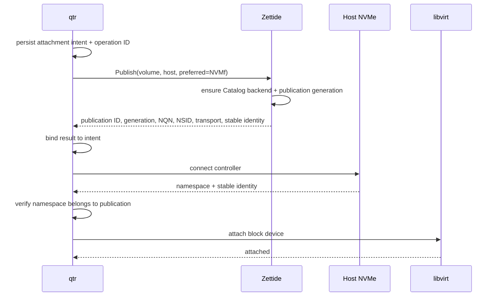
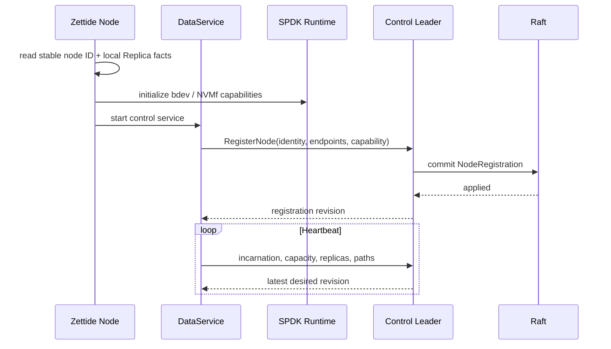
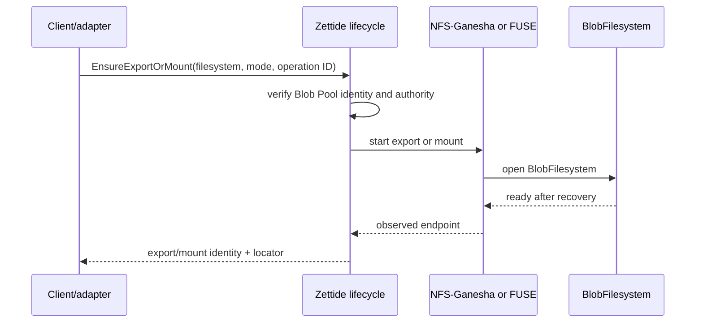
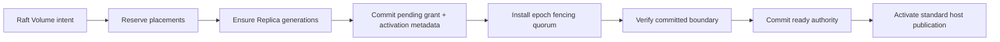

# I/O 与控制流程

> 状态：FUSE、NFS 单成员、endpoint daemon 与标准 NVMf export 有当前路径；managed consumer 与 Tier 3 流程为目标

## 通信边界

| 流量 | 协议/接口 |
| --- | --- |
| Host 到 Catalog Volume | 标准 NVMf TCP/RDMA 首选；iSCSI fallback |
| NFS client 到 BlobFilesystem | NFSv3 当前部分实现 |
| 本地应用到 BlobFilesystem | FUSE/POSIX |
| Adapter 到 Zettide lifecycle | 目标 versioned management API |
| Tier 3 services/control/node RPC | grpc-lite |
| Tier 3 Replica I/O | 目标 vendor-specific NVMf，不是标准 publication |

## qtr Managed NVMf Attachment



qtr 重启后观察 publication、controller/namespace/device 和 libvirt XML，不机械依赖旧 `/dev/...`。Detach 顺序是 persist detaching、remove libvirt use、disconnect controller、Unpublish。

## iSCSI Fallback

只有 capability/policy 允许时，NVMf 无法使用才进入 fallback：

1. 保留同一 attachment intent 与 operation lineage。
2. 撤销或 fence 未完成的 NVMf publication generation。
3. 请求 iSCSI publication，绑定新的 locator 与 stable SCSI identity。
4. discovery/login 后验证 serial/WWID，再 attach libvirt。
5. 恢复时只允许一个 protocol generation 处于 exclusive active。

qtr 当前仅有手动外部 iSCSI discovery/login/logout/device discovery，不具备上述自动 fallback。

## Tier 3 Node Registration 与 Heartbeat



Registration 经 Raft 持久化；heartbeat 是当前 leader 的易失 observation。Leader 切换后 Node 保持 stable identity，但必须向新 leader 重新上报。Heartbeat/path loss 只产生 suspicion，不授予或转移写权限。

## Filesystem Flow



当前 FUSE 可组装多成员 Blob Pool；NFS FSAL 只打开单成员。未来 NFS 多成员必须传递完整 Pool member set 或稳定 Pool resolver，不能把一个 member path 当成整个 Pool identity。

## Tier 2 Online Migration

1. 持久化目标 protection 与 migration ID。
2. 将新 Member/extent 标为 joining，不计入 current protection。
3. Copy 当前 authoritative ranges，同时记录并重放增量写入。
4. Verify identity、generation、checksum 与最终 boundary。
5. 原子发布新 layout/current protection。
6. Drain 并释放旧 allocation。

中断后从持久 phase 恢复；不能因 desired state 已改变就提前报告保护达成。

## Tier 3 Volume Provisioning

当前只实现 `PROVISIONING` metadata intent。目标流程是 Raft 预留 Volume/placements/allocations，DataService 幂等 `EnsureReplica`，至少达到 policy threshold 后分别完成 lease grant metadata、holder local window、Replica epoch fencing、committed-boundary recovery，最后才开放 host-facing publication。



完整 provisioning 约束：

1. Leader 在 proposal 前选择故障域、Member extents 和初始 primary，通过 Raft 条件预留 Volume、ReplicaPlacement、ReplicaAllocation、generation 和初始 epoch。
2. Allocation 包含 allocation ID、Member ID、offset、length 和 generation。Raft reservation 防止控制面重叠；Node local catalog 再做第二道持久无重叠检查，冲突时拒绝而不自行改选范围。
3. `EnsureReplica` 以 Replica/allocation ID 和 generation 幂等，原子验证 identity/geometry并写 local catalog。部分失败时 reservation 保留，由 reconciler 重试或显式 tombstone 后重新放置。
4. 删除 Replica 先撤销 namespace/session，再持久化 generation tombstone 并进入 quarantine；只有控制面确认旧 generation 不再可达且 local catalog 已更新，extent 才可重用。
5. 达到 policy threshold 后，Raft 提交 pending grant；holder ACK nonce 前启动本地 monotonic lease window，leader 再提交 activation metadata。此时只表示 grant 握手完成，不表示数据路径已可写。
6. Policy fencing quorum quiesce/drain/flush 旧 session，持久化 `max_accepted_epoch`；随后收集 manifest、合并 certified history、write-back candidate 并物化连续 committed prefix。
7. 控制面验证 holder window 仍有效、fencing quorum 和 recovery boundary 均成立，提交 ready/authority；共置 publication target 安装匹配 generation/ACL/credential 后才最终开放 host write。

## Tier 3 Write

```mermaid
sequenceDiagram
    participant H as Host frontend
    participant P as Primary
    participant A as Replica A
    participant B as Replica B
    participant C as Replica C

    H->>P: block write / flush
    P->>P: check lease + epoch; assign sequence
    par vendor PREPARE
        P->>A: metadata + payload
        A-->>P: durable digest
    and vendor PREPARE
        P->>B: metadata + payload
        B-->>P: durable digest
    and vendor PREPARE
        P->>C: metadata + payload
        C-->>P: digest or timeout
    end
    P->>P: form certificate
    par vendor COMMIT
        P->>A: certificate
        A-->>P: durable
    and vendor COMMIT
        P->>B: certificate
        B-->>P: durable
    end
    P-->>H: success
```

Host frontend 可以是标准 NVMf 或 iSCSI；内部箭头才是 vendor-specific Replica NVMf。第三副本落后时进入 dirty/repair state。

## Tier 3 Failover 与 Republish

1. Heartbeat/path loss 只产生 suspicion。
2. Leader 先从当前 placement、registration、当前 incarnation observation 和 certified-history 可恢复性选择 preliminary candidate；heartbeat 存活本身不构成 eligibility。
3. Raft 提交 higher Volume epoch、new primary 和 pending grant；holder ACK nonce 前启动本地 monotonic window，leader 提交 activation metadata。该 metadata 仍不开放写。
4. Replica fencing quorum quiesce 旧 internal controller/qpair，拒绝新旧 epoch 写，drain/flush 已接收 I/O，并持久化 `max_accepted_epoch`。
5. Fencing 完成后收集 final manifest，合并 certified history，write-back 单份 candidate 和新 recovery frontier，物化并校验连续 committed prefix。
6. 控制面确认 grant local window 未过期、fencing quorum 与 recovery boundary 有效，再提交 primary ready authority；Volume Engine 此后才可开放 Replica write。
7. 若 publication target/host/path 变化，另行推进 publication access generation；generation 版本号本身不 fencing，必须撤销旧 ACL/credential/controller/session、drain 可达 target，并在新 target 持久化 installed generation。
8. 新共置 target 安装标准 NVMf 或 iSCSI publication；指定 qtr/PVE/CSI host 重建 controller/session、验证 stable identity 并 reconcile attachment。

Volume epoch fencing 与 publication generation fencing 是两个 barrier。标准 host-facing NVMf controller 不携带 Volume epoch；iSCSI command 同样不携带，因此都不能跳过 publication generation。

候选必须属于当前 placement、Registration 有效且未被管理隔离、新 leader 已收到当前 incarnation heartbeat、能从 recovery quorum 重建完整 certified history、已物化目标 position，并完成 higher-epoch fencing quorum。

## Tier 3 Replica Rebuild

1. 校验 Volume ID、Replica ID、allocation 和 generation；旧实例标记 Stale/Rebuilding。
2. 从 read/write quorum 和 failover candidate set 移除目标，固定 placement revision、epoch 和权威 committed boundary。
3. 比较 journal position、dirty ranges 和数据摘要；journal 覆盖时增量追赶，否则范围或全量 copy。
4. 重放 rebuild 期间新增的 certified writes。
5. 校验 checksum/summary 和最终 committed position。
6. 以新 generation 或 caught-up state 上报 Ready。
7. Reconciler 通过 Raft mutation 将其重新加入 current protection；Ready observation 本身不授予资格。

## CSI 映射

- `CreateVolume/DeleteVolume` 映射 Zettide Volume lifecycle。
- `ControllerPublish/UnpublishVolume` 映射 block Publication 或 filesystem Export authority。
- `NodeStage/UnstageVolume` 映射 NVMf controller/iSCSI session 或 NFS mount preparation。
- `NodePublish/UnpublishVolume` 映射 pod-visible bind mount/device exposure。

每一步使用 CSI request identity 与 Zettide resource ID 建立幂等映射，不增加独立数据 path。
