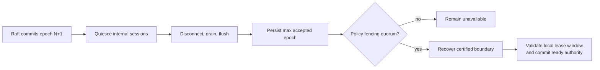

# 一致性与 Fencing

> 状态：本地 authority/write freeze 与 Raft 基础当前存在；managed publication fencing 和 Tier 3 fencing 为目标

## 一致性分层

| 对象 | 权威 | 语义 |
| --- | --- | --- |
| Pool/Catalog/Blob local facts | on-media headers/catalog | crash recovery 与 fail-closed open |
| Endpoint desired state | endpoint registry store | 单节点 restart reconciliation |
| Adapter attachment/mount | persistent intent + observations | 幂等收敛 |
| Publication access | publication ID + access generation | 单 consumer generation |
| Tier 2 migration | local catalog + migration journal | desired/current 分离 |
| Tier 3 metadata | Raft state machine | committed mutation + ReadIndex |
| Tier 3 data | primary + Replica quorum | 默认 3/2 durable commit |

## Raft Mutation 范围

以下权威变化必须经 Raft commit 并在 leader 本地 apply 后成功：Pool/Volume lifecycle、Node registration/isolation、Member binding、Replica placement/generation、allocation、primary、Volume epoch、lease grant/renew/revoke、修复后 eligibility，以及 Tier 3 publication authority。Heartbeat、路径/session 存活和 repair progress 是 observation，不直接产生权限。

Leader 在 proposal 前固定 ID、时间、nonce、placement 和 fingerprint；apply/restore 不读取 wall clock、不发 RPC、不操作介质。权威读取使用 ReadIndex。控制面 metadata 顺序不替代数据面 commit evidence。

## Publication Fencing

Publication access generation 与 Volume write epoch 分离。前者隔离 host consumer，后者在 Tier 3 隔离 storage primary。

共同规则：

1. 持久化更高 publication generation 的 desired authority。
2. 旧 target 可达时 quiesce，停止接收新 I/O，drain/flush 已接收 I/O。
3. 撤销旧 host credential/ACL/controller/session。
4. 持久化 target 最高 installed generation。
5. 只为匹配 consumer、access mode 和 generation 的新 path 开放 I/O。
6. Adapter 验证 stable device identity 后才 attach。

未知响应不得创建第二个可写 publication。

Publication generation 的数值变化本身不是 fence。安全切换必须同时满足：Raft/本地 desired authority 已推进、旧 target 可达时完成 quiesce/teardown/drain、旧 ACL/credential/controller/session 被撤销、新 target 持久化最高 installed generation，并只为匹配 consumer/access mode/generation 的 path 开放。旧 target 不可达时，不能伪造 drain 成功；Tier 3 必须先依赖旧 primary lease window 结束和 Replica quorum 的 higher-epoch barrier。

## 标准 NVMf Publication

标准 NVMe command 不携带 Zettide publication generation。Generation 必须绑定到 target-side publication context、allowed Host NQN/credential 和 controller lifecycle：

- 撤销旧 Host access 并断开旧 controller/qpair；
- drain target 已接收请求，再关闭 namespace/subsystem access；
- initiator reconnect 不自动恢复旧 generation；
- NQN/NSID 与 `/dev/nvme...` 不作为 authority；
- Host NQN 本身可伪造，不能单独承担恶意环境认证。

当前标准 NVMf export 有 Host NQN/allow-any-host 配置和 export lifecycle，但没有 consumer-bound generation fencing，因此该目标尚未完成。

## iSCSI Publication

普通 iSCSI command 同样不携带 Zettide generation。Target 将 generation 绑定到 initiator ACL/credential 和 session context。切换时撤销旧 ACL/credential、quiesce/drain session、logout/terminate connection，再安装新 generation。

iSCSI 的 IQN/LUN、SCSI serial/WWID、CHAP 与 session recovery 细节继续单独定义，因为它们无法由 NVMe controller 语义替代。当前 Zettide 已有 target/export primitive，但没有 consumer-bound generation、CHAP lifecycle 或 managed session recovery。

## Filesystem Access

- FUSE local permission 由 mount owner、mode、UID/GID、`allow_other` 和 SELinux 共同约束。
- NFS export 由 client scope、export access mode、NFS credential mapping 和 server policy 约束。
- 未定义共享写协议前，同一 BlobFilesystem 的多个可写 NFS/FUSE access 必须被拒绝或由明确 single-writer authority 串行化。
- NFS stable reply 与 FUSE `fsync` success 都必须满足 BlobFilesystem durability contract。

## Tier 3 Lease 与 Epoch

目标 primary grant 至少包含 Volume、holder Node、lease ID、write epoch、placement/grant revision、activation nonce 和 duration。Pending grant 本身不可写；holder ACK 后从本地 monotonic deadline 计时，leader 再提交 activated state。控制面失去 quorum 后不续租，holder 在安全窗口结束前停止。

Lease 限制自主运行时间，但不替代 Replica fencing quorum。

更完整的顺序与约束：

- Holder 只在当前 grpc-lite stream/incarnation 接受最新 pending grant，并验证 Volume、holder、epoch、placement/grant revision 和一次性 nonce。
- Holder 在发送 activation ACK 前启动本地 monotonic deadline；leader 验证 nonce 和 revision 仍为当前值后提交 activation metadata。延迟只缩短本地 window，不能重获完整 duration。
- Raft 中的 activated 状态只证明 grant handshake 已提交，不证明 fencing quorum、certified boundary 或 publication fence 已完成；这三项完成前 Volume 仍不可写。
- Lease 不依赖跨主机 monotonic clock 可比较，也不以 wall-clock `expires_at` 作为唯一安全依据。暂停、漂移、续期窗口和提前停止余量必须形成可测试预算。
- 未激活/过期 grant 不可重放；leader 切换后未完成 activation 的 grant 重新协调。失去 Raft quorum 时不授予、不续期、不 failover，holder 只在已获得的本地安全窗口内运行并提前停止。

## Tier 3 Replica Barrier

内部 Replica NVMf 使用 vendor-specific commands，把 Volume/Replica generation、epoch、sequence 与 checksum 交给 target state machine。Target-owned metadata 不可由普通 namespace write 修改。当前 daemon 已组合 backend-neutral node-local participant：immutable Replica/set genesis、单未决 PREPARE payload、canonical two-witness certificate、COMMIT-before-apply、完整 active Replica file apply、startup replay，以及 normal admission/replay/Replica mutation/durable fence append 共用 gate 均有 focused test。Replay 携带其原 authority 且不恢复 lease，不同或更高 durable fence 会拒绝 replay。尚未实现 controller canonical-set 配置、transport session/auth、认证 attestation、跨节点 coordinator 与 recovery quorum。它与当前标准 host-facing NVMf export 无关。

## Tier 3 Commit Evidence

默认 3/2 profile 中，success 要求两个 Replica 持久化相同 prepare/payload，随后两个持有 payload 的 Replica 持久化相同 commit certificate。单份 certificate 是 recovery candidate；观察到后必须 write-back 到第二份再纳入 history。Recovery quorum 看不到的孤立 candidate 不满足 success。

Repairing/Stale Replica 不参与 quorum。进入内存、NVMf queue 或 volatile cache 不是 durable ack。更低 protection override 只能声明其实际 threshold 能证明的保证。

相同 `(epoch, sequence)` 的 retry 必须具有相同 range/checksum，否则是协议冲突。默认 profile 的 crash window：

| 崩溃点 | 恢复结论 |
| --- | --- |
| 少于两个 durable prepares | 未提交，不能保留为 success |
| 已有 prepare quorum、无 durable certificate | 未提交，按新 recovery frontier 丢弃 |
| Recovery quorum 观察到一份 certificate candidate | 客户端结果可能 unknown；先 write-back 第二份再纳入 history |
| Certificate 已在两个 payload holder 持久化 | 已达到 success 条件；响应丢失也必须保留 |
| Recovery quorum 完全看不到 certificate | 未达到 success；孤立旧 candidate 在新 frontier 后 stale |

首版每个 Volume 同时最多一个 unresolved sequence。只有显式 commit frontier 和 quorum ABORT record 才允许进一步流水线化。恢复合并两个幸存 Replica 的 certified histories 并集并验证连续性，不能要求某一个 Replica 原先独占完整历史。

## Lease 到期与在途 I/O

- Holder 到期或提前停止点后不接收新写入，不在旧 lease 下继续 retry。
- 已形成 quorum commit 的写入不回滚；未形成 evidence 的 I/O 返回 failure 或 unknown。
- 续租响应未知时不能假设已延长，必须按原本地 deadline 停止。
- Read 只有在能选择追平权威 committed boundary 的 Replica 时继续，否则暂停。

## Protection Override 验证

本章默认 3/2。任何 override 都必须显式定义 replica count、read threshold、durable write threshold、fencing threshold、candidate eligibility、commit evidence、recovery quorum 和允许的故障集合，并通过 crash/partition/device-durability 测试。数据协议未验证的 profile 不得 Active，也不得沿用“2/3”文案宣称不存在的保证。

## 不变量

1. 一个 exclusive attachment 同时最多一个有效 publication generation。
2. NVMf controller 与 iSCSI session reconnect 都不能绕过 generation。
3. Publication generation 与 Volume write epoch 不互相替代。
4. Tier 3 同一 Volume 同时最多一个可写 epoch。
5. Replica `max_accepted_epoch` 永不回退。
6. Heartbeat、路径可达和 session 存在都不授予写权限。
7. 已确认 Tier 3 write 必须有 policy quorum 的持久 evidence。
8. 无法证明 drain、fence 或 authority 时保持 unavailable。

## 当前差距

当前没有外部虚拟化 managed attachment、consumer-bound NVMf/iSCSI generation、统一 filesystem access authority 或完整 Tier 3 数据面。Volume lease/write epoch、Replica persistent fencing 与 daemon-owned node-local participant/fence gate 已有基础，但尚无 controller canonical-set 配置、网络 participant、认证/quorum coordinator、certified recovery 或 managed Publication fencing。现有 iSCSI target/export primitive 不执行 Publication generation fencing。
