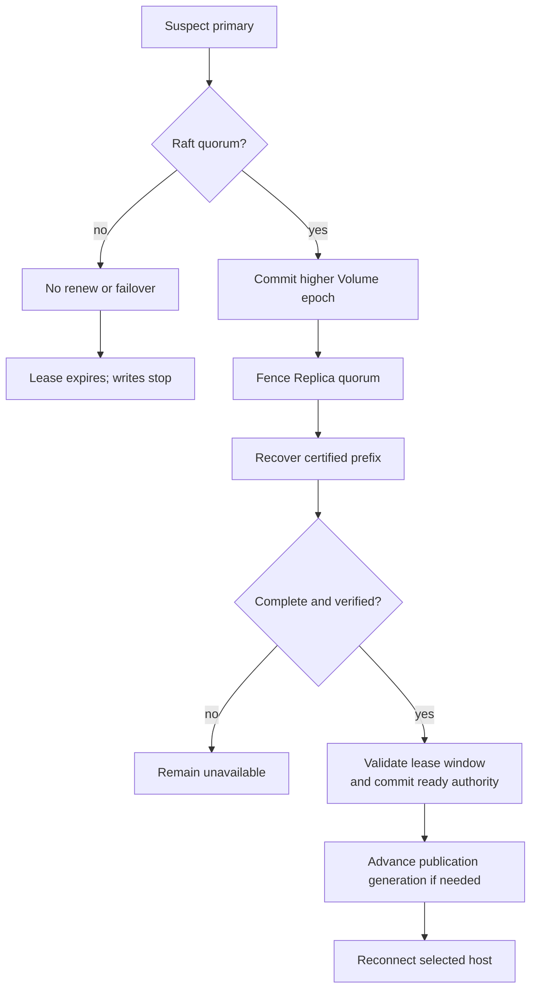

# 故障与恢复

> 状态：本地格式、endpoint desired state 与 Raft 恢复有部分基础；统一 frontend 与 Tier 3 自动恢复为目标

## 恢复优先级

1. 不让同一资源出现两个有效 writer。
2. 不丢失按协议已确认的数据。
3. 不把路径、时间戳或孤立副本误当权威。
4. 先恢复安全服务，再恢复保护与性能。

Heartbeat 丢失只是故障怀疑，不是转移写权限的充分条件。

## 正交状态模型

Volume lifecycle、availability 和 operation phase 分开报告。默认 3/2 profile 示例：

| Availability | 含义 | 可写 |
| --- | --- | --- |
| Healthy | 三个 Replica 合格且 authority/lease 有效 | 是 |
| Degraded | 两个 Replica 合格，仍满足 2/3 durable write | 是 |
| ReadOnly | 可证明权威 committed boundary，但不能形成写 quorum | 否 |
| Unavailable | 无法证明权威状态或达到 read/fencing threshold | 否 |

| Operation Phase | 含义 | 与 Availability 的关系 |
| --- | --- | --- |
| None | 无控制操作 | 使用正常 availability |
| Fencing | quiesce/drain 并安装更高 epoch | 暂时 Unavailable |
| Recovering | 合并 certified history 或追赶 candidate | 暂时 Unavailable |
| Repairing | 至少一个 Replica 重建 | 通常 Degraded；其余 quorum 可继续写 |

`lifecycle_state` 另行表示 Provisioning、Active、Deleting、Failed。Protection override 的 availability 由自身 read/write/fencing threshold 计算，不能机械套用 3/2。

## Tier 1/2 故障矩阵

| 故障 | 安全行为 | 恢复依据 |
| --- | --- | --- |
| 单 Member I/O/校验失败 | 按 current protection 降级、只读或冻结；不按 desired count 假装健康 | Pool authority、layout、verified data |
| endpoint daemon 崩溃 | 关闭 export；重启读取 desired state 并 reconcile | endpoint ID、Pool/Volume ID、persisted state |
| NVMf controller/path 丢失 | VM I/O 暂停；不改用未验证 namespace | attachment intent、publication generation、stable NVMe identity |
| iSCSI session 丢失 | VM I/O 暂停；不复用碰巧相同设备路径 | intent、generation、serial/WWID、session observation |
| qtr/PVE 重启 | 先观察 publication/controller/session/libvirt，再收敛 | stable Volume/publication/consumer IDs |
| NFS server/FSAL 重启 | 恢复 BlobFilesystem 后再开放 export | filesystem/Pool identity、stable file handles |
| FUSE 进程退出 | mount 失效；不得把未完成 unmount 当 clean close | Pool authority、filesystem recovery、mount intent |
| 在线迁移中断 | 未验证目标不计入保护；按 phase 重试或回滚 | migration ID、generation、copy/verify boundary |
| 整个 Zettide node 失效 | 所有本节点 frontend 不可用 | 恢复原节点；Tier 1/2 不承诺 storage failover |

同机部署中，虚拟化 host 故障与 Zettide node 故障是同一主机故障域；独立节点部署中，host 与 data node 分离，但 data node 仍是单点。

## Protocol Recovery

### 标准 NVMf

Reconnect 前验证 publication generation、NQN/NSID 与 stable namespace identity。旧 controller 尚可达时先 disconnect/drain；不可达时不能仅因 initiator 看不到它就宣称 fenced。Tier 1 单节点恢复依赖原 target authority；Tier 3 republish 另需 Volume epoch barrier。

### iSCSI

恢复使用 portal/IQN/LUN 重新发现，并用 serial/WWID 绑定 publication。CHAP/ACL revision、session persistence 和 device mapper 状态需要单独 reconcile；这些细节不能由 NVMf controller recovery 替代。

### NFS/FUSE

BlobFilesystem 完成 on-media recovery 后才重新 export/mount。NFS stable file handle 必须拒绝 foreign/stale identity。FUSE stale mount point 需要受控清理，不能把目录存在视为 mount healthy。

## Tier 3 Failover

Primary failover 与 host publication recovery 是独立步骤。仅 host path 故障不必切换 primary；data node loss 通常同时触发 Volume epoch 与 publication generation barrier。

## Tier 3 故障矩阵

| 故障 | 服务影响 | 安全行为 | 恢复条件 |
| --- | --- | --- | --- |
| 一个 secondary 失效 | 默认 profile 降级运行 | 从 quorum/candidate set 移除，记录 dirty ranges | 恢复或重建并验证第三 Replica |
| Primary 失效 | I/O 暂停 | Raft 提升 epoch，Replica quorum fencing | control quorum、可恢复 history、fencing quorum |
| Primary 与控制面隔离 | lease window 内有限运行 | 无法续租后提前停止 | 恢复控制链路或安全 failover |
| Primary 只能访问一个 Replica | 写入停止 | 单副本 completion 不确认 | 恢复满足 write threshold 的路径 |
| Control follower 失效 | 通常无影响 | 剩余 Raft quorum 继续 | follower 重启追赶 |
| Control 失去多数派 | metadata 不可变，lease 最终停止 | 不续租、不 failover | 恢复原集群多数派 |
| Leader 切换 | heartbeat view 清空 | 从 durable state 恢复，重新观测 | ReadIndex 和当前 incarnation heartbeat |
| Replica checksum 错误 | 降级或停止 | 隔离 Replica/范围 | 从合格 certified source 重建并校验 |
| Replica 数据分歧 | Recovering/Unavailable | 不按时间戳、路径或单副本猜测 | 合并 certified histories 并验证连续 prefix |
| NVMf path/qpair 中断 | I/O 暂停或降级 | unknown completion 不算 durable ack | 重连并核对 epoch/generation/position |
| 同时永久丢失两个 Replica | 超出默认保护范围 | 单幸存副本不自动提升 | 人工恢复或找回足够 commit evidence |
| WAL 尾部撕裂 | 单 voter 恢复延迟 | 只截断可证明未完成尾部 | snapshot + 连续有效 WAL prefix |
| WAL 中段/snapshot 损坏 | voter fail closed | 不跳过记录、不 fresh bootstrap | 从健康 voter 受控重新同步 |
| Publication path/qtr host 失效 | 对应 VM I/O 暂停 | 推进 publication fencing；不无条件切 primary | 当前 primary 安装新 generation，指定 host reconnect |

## Tier 3 Repair

Repairing Replica 不参与 read/write quorum。固定 placement revision、epoch 与 committed boundary 后执行增量或全量 copy，重放新增 commit，校验 checksum/summary，最后以新 generation 或 caught-up state 原子加入 current protection。

默认 3/2 profile 的 recovery quorum 合并 certified histories。单份 certificate candidate 要先 write-back；冲突 checksum、断裂 prefix 或证据不足时自动恢复停止。

## Candidate 与 Recovery Manifest

Candidate 必须属于当前 placement、registration 有效且未管理隔离、新 leader 已收到当前 incarnation heartbeat、能从 recovery quorum 恢复完整 certified history、已物化并校验目标 position，并完成 higher-epoch fencing quorum。仅 heartbeat、最低延迟或本地最新时间戳都不足以获得 eligibility。

每个 Replica manifest 至少包含 Volume/Replica ID、generation、placement revision、`max_accepted_epoch`、各 epoch committed/applied position、commit evidence、range checksum/Merkle-style summary，以及 dirty/corrupt ranges。必须在 fencing quorum 已阻止旧 epoch 新写并 drain 旧 I/O 后收集 final manifest。

默认 profile 中，每个向客户端确认的 certificate 原本存在于两个 payload holder，因此任意两个 Replica 的 recovery quorum 必然观察到至少一份。恢复取 certified histories 并集，验证 `(epoch, sequence, range, checksum)` 连续性；单份 candidate 先 write-back 第二份，再复制/物化到新 primary。Recovery quorum 看不到的孤立 candidate 没达到 success 条件，由新 epoch frontier 淘汰。冲突 checksum、断裂 prefix 或证据不足时保持 Unavailable。

## qtr/PVE/CSI Republish

1. 区分 storage primary 故障与 publication/consumer path 故障；仅后者不无条件切 primary。
2. Primary 失效时先完成 Volume epoch、Replica fencing 和 certified-boundary recovery。
3. Adapter 在副作用前持久化 republish intent；目标 compute host 由调用方/平台决定，Zettide 不承担 VM 调度。
4. 推进独立 publication access generation。旧 target 可达时 quiesce/drain 并撤销 ACL/credential/controller/session；不可达时不能伪造 drain，必须依赖步骤 2 隔离旧数据路径。
5. 新共置 target 持久化 installed generation，只在 authority、active local lease window、Volume epoch 和 recovery boundary 匹配时开放；adapter 验证 stable identity 后恢复 attachment。
6. VM 是否启动、迁移或恢复由 qtr/PVE/CSI 上层生命周期决定。

## Control Recovery

`zettide-controller` 按以下顺序恢复：

1. 验证 durable cluster/node identity。
2. 加载最新完整、兼容且校验通过的 snapshot。
3. 原子恢复 application state 和 membership。
4. 重放 snapshot index 后连续 WAL，校验 applied/committed/last index。
5. 作为 follower 启动并与集群同步；追平前不提供一致性服务。
6. 成为 leader 后从空 heartbeat view 重新收集 observation 并 reconciliation。

有持久状态的节点不得 fresh bootstrap 覆盖，WAL 中段损坏不得静默跳过。Heartbeat/socket/action 不从 snapshot 恢复，也不凭旧 observation 授予权限。

## RPO/RTO

Tier 1/2 只按当前 frontend、Pool protection 与 durability gate 声明保证，不承诺 data node failover。Tier 3 目标中，Raft quorum 已提交 metadata 与默认 3/2 quorum 已确认 data 在单 Replica 故障下目标 RPO 为零。

响应丢失的 write 可能已提交：certificate 已在两个 payload holder 持久化时必须保留，客户端应以原 identity 查询/重试；没有 quorum evidence 的单副本或 prepare-only 尾部不受保护。Recovery quorum 观察到一份 candidate 时结果为 unknown，并在 write-back 后保留。Tier 3 同时永久丢失两个 Replica 超出默认单故障保证。

本文不承诺固定 RTO。恢复时间包含格式扫描、frontend reconnect、migration/repair，以及 Tier 3 的故障检测、旧 lease 安全停止、Raft commit、manifest、fencing、certified-boundary recovery 和 session 重建。恢复可写服务与恢复完整 protection 是两个独立时间点。

## 当前差距

当前没有外部虚拟化 managed recovery、consumer publication generation、managed iSCSI session recovery、多成员 NFS recovery、统一 migration journal、Tier 3 quorum manifest/merge 或自动 repair。控制面 authority failover 已有三节点进程重启 E2E；daemon 在 server 启动前从 participant catalog 发现并 replay 已持久化的单份 COMMIT candidate，且非空本地 history 会阻止 empty-frontier recovery。Backend-neutral coordinator journal 能保存 fixed-witness intent、certificate 和 partial COMMIT progress，供同 state directory 重启后继续 exact retry，但它未接入 daemon/network，也不提供 replacement-coordinator recovery。当前仍未把 candidate write-back 到 recovery quorum、合并 certified histories 或接入 failover reconciler。现有 iSCSI export lifecycle 和 focused fio gate 不覆盖 consumer/session reconciliation。
