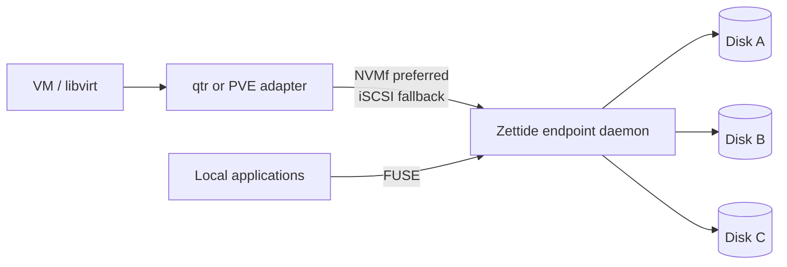
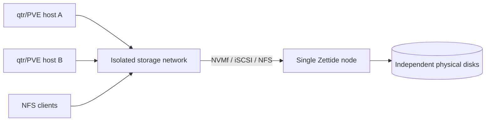
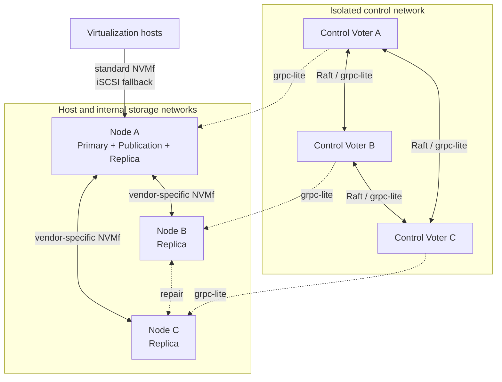

# 部署与网络

> 状态：两种 Tier 1 拓扑为冻结目标；FUSE 与部分 endpoint/NFS 组件可运行，但无统一部署方案

## 同机接管

Zettide 与虚拟化平台同机，但仍通过标准 host-facing protocol 表达 managed block publication。同机默认基线是 loopback NVMf/TCP；只有 NIC/provider、memory registration、initiator/target 和 transport 端到端验证通过后才启用 RDMA。未来可增加受控同机优化，但不能因同机就退回不稳定 `/dev/...` identity。FUSE 用于 BlobFilesystem 本地访问，不访问 Catalog Volume。

物理盘由 Zettide 独占，不能同时被 host filesystem、LVM、其他 target 或另一个 Zettide instance 打开。

## 独立单节点

该拓扑分离 compute 与 storage host，但仍只有一个 Zettide node，不提供 storage failover。多个 host 可以使用不同资源；同一 exclusive Volume 不能因此成为 multi-writer。

## Tier 1 网络平面

| 平面 | 流量 | 约束 |
| --- | --- | --- |
| Management | lifecycle API、diagnostics | 仅管理员与受管 adapter |
| Block storage | 标准 NVMf TCP/RDMA、iSCSI | host allowlist、隔离、稳定低抖动 |
| Filesystem | NFS | client scope、export policy、与租户公网隔离 |
| Local | FUSE、owner-only control socket | Unix permission、service ordering、SELinux |
| Tenant/business | VM/app traffic | 不直接访问 management/internal ports |

NVMf TCP 是首选兼容基线；RDMA 在端到端 NIC/provider/transport 验证通过时提供高性能路径。iSCSI 是 block protocol fallback，不是 NVMf transport fallback。协议切换必须显式重建 publication generation。

## Tier 3 网络增量

Host-facing storage network 与内部 Replica fabric 具有不同 identity、ACL 和 observability。内部 RDMA 可使用 InfiniBand、RoCE 或兼容 iWARP；SPDK 统一称为 `RDMA` transport。无 RDMA 时是否允许内部 NVMf/TCP 是独立 Tier 3 决策，不影响 Tier 1 标准 NVMf TCP publication。

参考部署使用奇数 control voter 并跨独立故障域。默认 3/2 的三个 data Replica 必须跨三个合格 Node 故障域；首版 publication 与 primary 共置。Control network、host-facing storage network 和 internal Replica fabric 可以共享物理链路，但逻辑 identity、ACL、credential 和 telemetry 必须分离。

## 隔离与 QoS

共享交换机/NIC 时使用 VLAN/VRF、QoS 和防火墙隔离 management、Raft/control、host block、NFS、internal Replica 和 tenant traffic。业务突发不得饿死 Raft heartbeat/lease renewal、同步 Replica commit 或 NFS stable write。只暴露每个平面需要的 endpoint；tenant 网络不得直接访问 services/controller/internal Replica port。

Control path 可达不表示数据 path 可用。分别观测 grpc-lite/heartbeat、每个 NVMf/iSCSI path、RDMA qpair、NFS path、介质健康和 host session；不能用一个综合“node up”位替代路径独立事实。

## RDMA 准入与 Transport 切换

Registration/observation 记录 NIC、provider、address、MTU/routing 和端到端 transport capability。RDMA 可以是 InfiniBand、RoCE 或兼容 iWARP；SPDK 都配置为 `RDMA` transport，iWARP 不是独立 SPDK transport，也不是普通 TCP fallback。

- RDMA memory registration 必须在实际 buffer、memlock/hugepage、IOMMU/device binding、provider 和权限组合上验证；仅发现 RDMA NIC 不算准入。
- Host-facing 和 internal path 都只有端到端 initiator/target I/O、Flush/FUA 和重连测试通过后才声明 RDMA 可用。
- Transport 切换必须关闭/隔离旧 connection，建立新 connection，并重新验证 epoch、generation、position 和 stable identity。
- 两个 transport 的 duplicate completion 不得计为两个 Replica ack；一次在途 I/O 不透明迁移 transport。
- 切换 transport 不改变 primary、Volume epoch、publication generation 或 committed boundary；这些 authority 另行推进。

## 节点要求

- 多个 Member 必须映射多个独立物理磁盘，记录 serial/WWN、geometry 与稳定 by-id identity。
- SPDK 路径需要匹配的 device binding、hugepage/reactor/CPU 与权限规划；当前 endpoint daemon 的 no-PCI/no-huge 配置不代表生产部署配置。
- NFS-Ganesha FSAL 需要固定兼容版本和受控 module/config lifecycle。
- FUSE service 需要 `/dev/fuse`、mount namespace、UID/GID 与 unmount ordering。
- Control state、endpoint desired state 与数据介质分别持久化。
- 同一 Pool 不得由 FUSE/NFS 与 Catalog endpoint 以错误 data mode 打开。

DataService/Tier 3 Node 至少持久化 stable Node ID/cluster binding、Member/Replica identity 和 generation、Replica `max_accepted_epoch`、journal/positions/recovery manifest，以及本机最高 installed publication generation、access mode 和 ACL/credential revision。Control `data_dir`、endpoint desired state 和数据介质是不同持久边界；不得把临时 socket、device path 或 heartbeat 当作可恢复 identity。

## 启动顺序

Tier 1/2：

1. 扫描并验证所有显式 Member identity、geometry、data mode 和 authority。
2. 恢复 Catalog/Blob metadata 与 pending migration。
3. 恢复 endpoint/export desired state 与最高 access generation。
4. 启动 SPDK、NFS-Ganesha 或 FUSE runtime，但先保持 access closed。
5. Reconcile publication/export/mount 与授权。
6. 平台 adapter 验证 identity 后恢复 attachment。

Tier 3 启动顺序：

1. 验证 services/controller/storage/host 网络隔离；按实际路径完成 TCP/RDMA capability 和 memory-registration gate。
2. 启动保留既有持久状态的 control voters，恢复 WAL、snapshot、membership 和 Raft quorum；禁止 fresh bootstrap 覆盖。
3. 选出 leader并完成 ReadIndex；leader heartbeat view 从空开始。
4. DataService 恢复 stable identity、Replica generation/epoch/manifest 和最高 installed publication generation，在取得当前 authority 前保持 publication/Replica write closed。
5. 启动 SPDK、NFS-Ganesha/FUSE 所需 runtime，但先不开放未验证 access。
6. Node registration/heartbeat 上报 current incarnation、Member/Replica/path facts，reconciler 比较 desired/observed/facts。
7. Tier 3 Volume 完成 pending grant/local window、Replica fencing quorum、certified-boundary recovery 和 primary ready authority。
8. Primary 建立 epoch-bound internal Replica session；共置 target 验证 publication authority、Volume epoch、lease window 和 installed generation，安装 ACL/credential。
9. Adapter reconnect 并验证 stable identity 后恢复 host I/O；后台再恢复第三 Replica 和完整 protection。

不得先开放 host write，再等待 control authority、fencing 或 recovery。Tier 1/2 启动同样必须先恢复 Pool/Catalog/Blob facts、endpoint/export desired state与最高 generation，再 reconcile frontend。

## 可观测性

| 领域 | 必需状态 |
| --- | --- |
| Pool | Member identity、physical-disk mapping、authority、data mode |
| Catalog | Volume、extent、current protection、migration phase |
| NVMf publication | transport、NQN/NSID、controller、generation、errors |
| iSCSI publication | portal/IQN/LUN、session、generation、credential revision |
| NFS | export ID、client scope、stable write latency、FSAL errors |
| FUSE | mount identity、mode、operation errors、clean/ungraceful close |
| Adapter | intent、protocol selection、device identity、libvirt state |
| Tier 3 | Raft、lease/epoch、Replica position、fencing、repair |

“业务可写”和“完整 protection 已恢复”必须分别报告；`Active`、`Healthy`、`Repairing` 也不得折叠为单一状态。

## 当前差距

当前没有统一 systemd/deployment manifest、防火墙模板、外部虚拟化 managed adapter、consumer-bound iSCSI deployment、NFS 多成员配置、真实四前端多盘 gate 或生产硬件准入。现有 iSCSI/NVMf component tests、CSI kind profiles 与 endpoint daemon 不构成完整部署方案。
