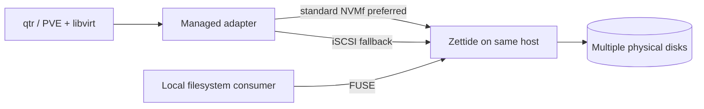
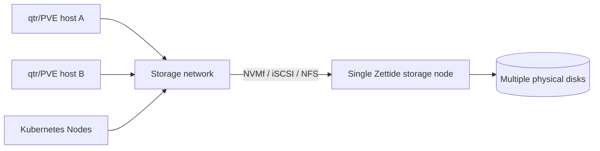

# 虚拟化与 CSI

> 状态：消费者契约为目标；qtr 当前仅有手动外部 iSCSI initiator

本章集中定义消费者优先级、部署拓扑、adapter contract、协议选择和生命周期映射。各平台复用 Zettide 的 Volume、BlobFilesystem、Publication 和 Export 语义，不拥有独立数据一致性模型。

## 消费者层级

| 层级 | 消费者 | 交付关系 |
| --- | --- | --- |
| Tier 1 阻塞性一等消费者 | qtr | 原生 managed backend 是 Tier 1 完成门槛 |
| 一等后续产品目标 | PVE 与其他虚拟化平台 | 优先于 CSI，但不阻塞 Tier 1 |
| 次级集成目标 | CSI | 不阻塞 Tier 1/2；复用既有 frontend/lifecycle |
| 独立 profile | TxFS shared qcow2 | 面向 shared-file VM disk，不替代 Catalog block publication |

“一等后续”表示产品方向和架构契约是一等公民，不表示其实现必须早于 Tier 1 qtr gate。

## 部署拓扑

### 同机



同机仍使用稳定 Publication/Attachment identity。Loopback transport、kernel controller/session 和 `/dev/...` 都是可重建 observation。Zettide 独占物理盘；virtualization service 不直接打开 raw Member。

### 独立单节点



该拓扑允许多个 host 使用不同资源，但不提供 storage node HA。Tier 3 才能在 storage node 故障后 republish。

## 数据模型与协议选择

| 请求 | 首选 frontend | Fallback/替代 | 数据模型 |
| --- | --- | --- | --- |
| VM block disk | 标准 NVMf TCP/RDMA | iSCSI | Catalog Volume |
| CSI block volume | 标准 NVMf TCP/RDMA | iSCSI | Catalog Volume |
| Network filesystem | NFS | 无隐式 block fallback | BlobFilesystem |
| Local filesystem | FUSE | 无隐式 network fallback | BlobFilesystem |

选择规则：

1. Adapter 从 storage capability、host capability 与 policy 交集选择 protocol。
2. qtr 默认请求 NVMf；只有 policy 允许且 NVMf 不可用时选择 iSCSI。
3. TCP/RDMA 是 NVMf transport 选择，不是 NVMf 与 iSCSI 之间的 publication identity。
4. Block 与 filesystem request 不互相 fallback。
5. Protocol switch 必须推进或替换受控 Publication generation，不能留下两个 active exclusive paths。

## Adapter Contract

所有 virtualization adapter 至少实现：

```text
EnsureVolume(spec, operation_id) -> volume_id
Publish(volume_id, host_id, access_mode, preferred_protocols, operation_id)
  -> publication_id, access_generation, protocol, locator, stable_device_identity
ObservePublication(publication_id)
Unpublish(publication_id, expected_generation, operation_id)
Attach/Detach platform resource
Reconcile(intent, provider observation, host observation)
```

核心要求：

- 在 Publish/connect/libvirt 副作用前持久化 intent。
- 在 `EnsureVolume` 前持久化 management intent；即使响应未知，也能用相同 operation ID 和 provider observation 收敛到原 Volume。
- 相同 operation ID 重试不创建新资源。
- 用 stable device identity 验证 namespace/LUN，不信任 path。
- Persisted intent 至少记录 backend/provider identity、Volume spec/ID、consumer、host、publication 和 generation。
- Detach 先停止 VM 使用，再 disconnect/logout，最后 Unpublish。
- 不把 provider timeout 解释为 mutation 一定失败。
- Adapter 不选择 Tier 3 storage primary，也不绕过 publication authority。

所有 adapter 的稳定身份绑定和 secret 边界统一遵循[安全边界](10-security.md)，平台配置不得把 secret 或 locator 当作 resource identity。

## qtr Contract

### 当前事实

qtr 当前可以注册外部 iSCSI backend、扫描 target、login/logout 并发现 Linux block device。该流程由操作者显式驱动，storage backend 与 VM disk path 相互独立。qtr 当前没有：

- Zettide provider/Volume identity；
- managed NVMf controller；
- Publish/Unpublish API client；
- persistent attachment intent；
- protocol fallback policy；
- qtr/Zettide/host/libvirt restart reconciliation。

### Tier 1 目标

qtr schema 保存 Zettide backend/provider、Volume ID，以及由稳定 VM identity 与
VM 内 disk ID 组合出的 consumer ID。Pool 是 provider 侧的容量/策略资源，不是
VM 配置或 disk attachment identity；VM 不能用 Pool ID 代替 Volume/consumer
identity。qtr 在调用 `EnsureVolume` 前先持久化包含 backend、Volume spec 和
consumer 的 management intent。Attach 默认执行 Publish(NVMf)、connect
controller、验证 NGUID/UUID/serial、attach libvirt；需要 fallback 时先协调旧
generation，再执行 iSCSI Publish、login、验证 serial/WWID 和 attach。

qtr 重启后读取 intent，并分别观察 Zettide Publication、host controller/session/device 与 libvirt XML。它只修复差异，不无条件重复 connect/login/attach。

同机与独立节点使用相同 contract；区别只在 locator、network policy 与 failure domain。

## PVE Plugin Target

PVE plugin 目标复用同一 Zettide provider contract，并映射 PVE storage lifecycle：

- allocate/free image 映射 Catalog Volume lifecycle；
- activate/deactivate 映射 Publish/Attach 与 Detach/Unpublish；
- resize 映射 Volume resize 与 host rescan；
- migration preparation 仅适用于同一稳定 Volume 在源/目标 host 场景中持续可达；plugin 只协调目标 host publication，不自行复制 storage data，也不把换 Volume 当作 migration；
- snapshot/clone 只有 Zettide 明确定义后才暴露 capability；
- error 与 status mapping 不把 path existence 当作 storage health。

Plugin 不通过 shell 拼接 unmanaged `nvme`/`iscsiadm` 命令替代 durable intent；必要的 host tool invocation 由受管 helper 执行并可观察。

## CSI Target

CSI 是 lifecycle adapter，不是第五种 frontend。

### Block Volume

- `CreateVolume/DeleteVolume` 映射 Catalog Volume。
- `ControllerPublishVolume/ControllerUnpublishVolume` 映射 host-bound Publication authority。
- `NodeStageVolume/NodeUnstageVolume` 映射 NVMf controller 或 iSCSI session/device。
- `NodePublishVolume/NodeUnpublishVolume` 映射 pod-visible block device/bind mount。

### Filesystem Volume

- Controller lifecycle 映射 BlobFilesystem identity 与 NFS Export/FUSE local eligibility。
- Network filesystem 的 NodeStage 使用 NFS mount。
- FUSE 只用于 Zettide 与 workload 同 Node 且权限/namespace contract 明确的 local filesystem path。
- NodePublish 只暴露已 stage 的 mount，不绕过 Zettide recovery。

### CSI 身份与幂等

- CSI `volume_id` 编码或引用稳定 Zettide resource ID，不包含 secret 或 locator。
- Controller service account 与 Node identity 分别授权。
- `node_id` 映射稳定 host identity，不只依赖可伪造名称。
- CSI retry 使用相同 Zettide operation mapping。
- CSI topology 表达可达性/部署位置，不虚构 Tier 1 storage HA。

身份绑定、credential 存放、轮换、日志脱敏和 fail-closed 要求同样见[安全边界](10-security.md)；Kubernetes Node 名称、service account、Host NQN、IQN、UID/GID 或网络可达都不能单独替代 storage-side authorization。

### CSI Capability 与共享写规则

- `CreateVolume`、`ValidateVolumeCapabilities`、Controller publish 和 Node publish 都必须校验 requested access mode、block/filesystem capability、frontend、topology 和 host capability；不支持或与既有 Volume 冲突的请求必须明确拒绝，不能静默降级或改写 access mode。
- snapshot、clone 和 expansion 在对应 Zettide lifecycle、crash recovery 与平台测试完成前不得广告 capability；收到相关请求时返回不支持。
- 在共享写协议、锁、cache、fencing 和恢复 profile 冻结前，拒绝 `MULTI_NODE_MULTI_WRITER`、RWX 或任何等价 multi-node writer 请求。
- NFS/FUSE 只能按已经授权和验证的单写者或只读 profile 发布；不得让多个 Node 通过 NFS、FUSE 或二者组合形成未协调并发写。

## 状态矩阵

| 集成 | NVMf | iSCSI | NFS | FUSE | Managed lifecycle |
| --- | --- | --- | --- | --- | --- |
| qtr 当前 | 无 | 手动外部 initiator | 无 | 普通本地 file path，不是 Zettide managed contract | 无 |
| qtr Tier 1 目标 | 首选 | fallback | 可作为未来 filesystem consumer | 同机 local filesystem | 必需，阻塞 Tier 1 |
| PVE 目标 | 首选 | fallback | filesystem storage target | 同机可选 | 一等后续目标 |
| CSI 目标 | block 首选 | block fallback | filesystem network | filesystem local | 次级、非阻塞 |

## Republish 边界

Tier 3 storage failover 后，Zettide 可为调用方指定的 host 激活更高 publication generation。qtr/PVE/CSI adapter 在该 host 重建 path。选择 host、迁移/重启 VM 或重调度 pod 属于 compute/orchestrator policy，不由 Zettide storage 自动决定。

## 完成门禁

qtr Tier 1 gate 必须覆盖同机与独立节点、NVMf-first、iSCSI fallback、unknown response、consumer crash、endpoint restart、device renumbering、detach interruption 和错误 identity。PVE/CSI 分别有自身平台认证 gate，但不能替代四前端真实多物理盘存储 gate。
