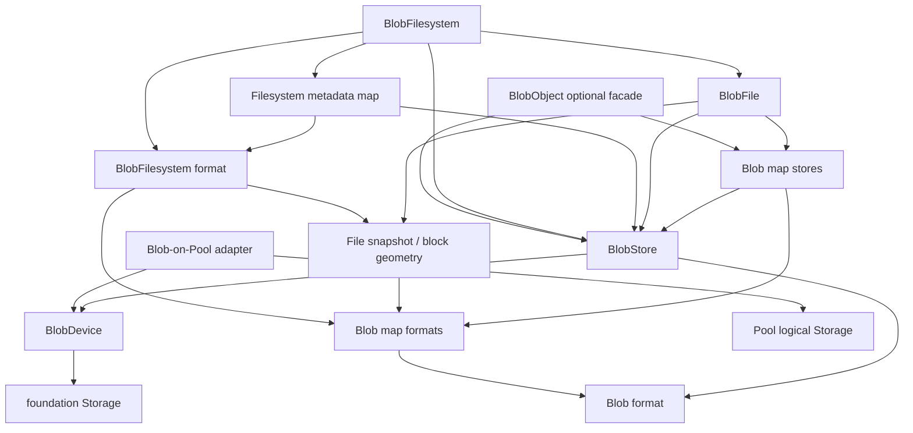

# Blob 与 BlobFilesystem 归属

> 状态：源码已迁入 `libs/storage-engine/`，Pool/Blob production 边界已解除；内部 format/runtime 细分仍按本文执行

本文细化 storage engine L2 的 immutable Blob store、copy-on-write maps、sparse Blob file 和
BlobFilesystem。Pool/Member/Catalog 的边界见
[Pool、Member 与 Catalog 归属](pool-member-catalog-map.md)。

## 结论

1. BlobDevice、BlobStore、Blob maps、BlobFile 和 BlobFilesystem 都属于
   `libs/storage-engine`，且当前 production import graph 无环。
2. BlobDevice 是 foundation Storage 上的 owned、aligned、bounded adapter；它不是 OS block
   device，也不能创建 file 或选择 io_uring/SPDK backend。
3. BlobStore 是 append-only immutable blob allocator 与 A/B authority owner；BlobFilesystem 的
   durability 建立在它的 staged/committed 和 `commitAuthority` 语义上。
4. `blob_filesystem_format.zig -> blob_file.zig` 是 format 到 runtime 的反向依赖。必须把
   block geometry 和 persisted file snapshot 提取到 format/value module。
5. `blob_object.zig` 是独立 append-only logical object facade，当前仅被 benchmark/root 使用；
   它可以随 engine 迁移，但不是 BlobFilesystem 的必要依赖或默认 facade。
6. Pool core 只提供 authority-bound logical Storage。Blob-on-Pool adapter 负责 Blob geometry、
   BlobDevice/Store/Filesystem 组合；不得保留 `Pool -> blob_format`。
7. `blob_filesystem_adapter.zig`、NFS adapter、FUSE 和 `filesystem_target.zig` 分属后续
   backend-neutral API、frontend 和产品 composition 步骤，不进入本步骤的 Blob core root。

## 当前规模与方向

当前 Blob 领域约由以下有向链组成：



禁止方向：

- format/value module import mutable runtime；
- Blob core import Pool implementation、Linux/SPDK、endpoint 或 frontend；
- Pool core import Blob format/runtime；
- BlobFilesystem correctness 根据 transport telemetry 改变；
- generic filesystem backend import Blob private map/store types。

## Blob Storage 与格式文件

| 当前文件 | 首轮目标 | 说明/动作 |
| --- | --- | --- |
| `blob_device.zig` | `blob/device.zig` | 保留 Storage region、alignment、full-read/batch/sync/owned close；`createFile` 移到 file adapter |
| `blob_format.zig` | `blob/format/store.zig` | Blob header、arena geometry、BlobRef、payload checksum；保持 A/B offset 和 unit geometry |
| `blob_store.zig` | `blob/store.zig` | immutable append、digest verification/cache、staging、authority selection 和 durable commit |

### BlobDevice 边界

保留：

- 成功 `init` 后拥有传入 Storage；
- `region_offset/capacity/io_alignment` validation；
- aligned non-empty I/O、exact read、batch translation；
- `syncData`、full `sync` 和 close ownership。

移出或降级为可选 diagnostics：

- `createFile` 和 `std.Io.Dir`；
- concrete `TransportKind` 名称；
- transport stats pass-through；
- backend selection、device eligibility 或 endpoint identity。

BlobDevice 与 `storage_window.zig` 都提供 bounded view，但语义不同：BlobDevice 额外强制 buffer、
length 和 offset alignment，并把 short read 视为错误。首轮不合并二者；可在 Storage contract
稳定后以组合方式复用 bounds 逻辑，不能丢失 Blob alignment 约束。

### BlobStore durability 不变量

`Store.create/open` 在成功和失败路径都消费 BlobDevice；`Store.close` 最终关闭它。迁移必须保持：

1. create 按 A header、data sync、B header、full sync 的顺序建立初始 authority；
2. append 只增加 staged units，不提前扩大 committed frontier；
3. `commitAuthority` 先 `syncData`，再写另一 header slot，最后 full sync；
4. commit 任一步失败后 Store 保持 frozen；
5. authority root 必须位于 staged frontier 内；
6. open 在 A/B candidate 中按现有 sequence/geometry/corruption 规则选择；
7. `discardStaged` 不能回退 committed units。

transport telemetry 不是上述正确性 contract 的组成部分。

## Blob map、Object 与 sparse File

| 当前文件 | 首轮目标 | 说明/动作 |
| --- | --- | --- |
| `blob_map.zig` | `blob/format/map.zig` | fixed-key BlobRef B-tree page codec、PageRef 和 digest |
| `blob_map_store.zig` | `blob/map_store.zig` | generation-bound COW map build/lookup/range/applyBatch |
| `blob_object_format.zig` | `blob/format/object.zig` | append-only Object head A/B codec |
| `blob_object.zig` | `blob/object.zig` advanced facade | logical blob append/read/commit；不由 BlobFilesystem 依赖 |
| `blob_file.zig` | 拆为 `blob/format/file.zig` 与 `blob/file.zig` | persisted Snapshot/block geometry 下沉；mutable sparse state、pending map 和 prepare/accept/abort 留 runtime |

### File format 反向依赖

当前 `blob_filesystem_format.zig` 使用：

- `blob_file.block_size`；
- `blob_file.Snapshot`。

`blob_filesystem/reservations.zig` 也只为 `block_size` import 整个 `blob_file.zig`。处理：

- 建立低层 file format/value module，拥有 stable `block_size` 和 `Snapshot`；
- `Snapshot` 保持 `generation`、`logical_size`、optional map root 的现有内存和 wire 语义；
- `blob_file.zig` 依赖并可兼容 re-export 这些值；
- BlobFilesystem format 和 reservation helper 只依赖 file format/value，不 import runtime State。

这只是依赖反转，不得改变 inode encoding 或 snapshot validation。

### BlobFile transaction 不变量

`blob_file.State` 是 mutable sparse-file working state，不是 format type。必须保持：

- committed/readable frontier 与 staged blobs 分离；
- pending block upsert/remove 在 generation-bound COW map 中发布；
- `prepareSnapshot` 可重复返回同一 prepared snapshot；
- prepare 失败或 map publish 不确定时按现有规则 freeze/rollback；
- `acceptSnapshot` 只接受完全匹配的 prepared snapshot；
- `abortSnapshot` 只丢弃本次 checkpoint 后的 staged units；
- truncate、hole、allocated-byte 和 zero-read 语义不变。

`blob_object.zig` 与 BlobFile 可共享 Blob map/store，但不能为了减少文件数而合并：前者是
append-only logical blob sequence，后者是 byte-addressable sparse file。

## BlobFilesystem format 与 metadata map

| 当前文件 | 首轮目标 | 说明/动作 |
| --- | --- | --- |
| `metadata.zig` | `filesystem/metadata.zig` | persisted POSIX-like Metadata、Patch、relatime；CRC32C 算法依赖显式注入 |
| `name_profile.zig` | `filesystem/name_profile.zig` | persisted profile/version 与 portable Unicode preparation；显式 utf8proc dependency |
| `blob_filesystem_format.zig` | `filesystem/format.zig` | root/inode/dentry/orphan/reservation codec 与 key construction；改依赖 file format value |
| `blob_metadata_map.zig` | `filesystem/format/metadata_map.zig` | variable key/value B-tree page codec |
| `blob_metadata_map_store.zig` | `filesystem/metadata_map_store.zig` | filesystem metadata COW map build/lookup/prefix/batch |
| `blob_filesystem/prepared_name.zig` | `filesystem/prepared_name.zig` | profile-aware canonical lookup key 与 preserved spelling |
| `blob_filesystem/reservations.zig` | `filesystem/reservations.zig` | generic sorted interval contains/merge/clip；只依赖 file block geometry |

### Format 规则

- `blob_format`、map codecs、filesystem format 和 metadata codec 可依赖 CRC32C；
- `name_profile` 可依赖 pinned utf8proc；
- format 不能依赖 allocator-owning Store、mutable File State、Filesystem mutex 或 frontend handle；
- name normalization 不能使用 host locale；
- profile ID、Unicode version、utf8proc version、lookup key 和 preserved spelling 必须保持兼容；
- metadata map page generation、owner/reference digest、canonical key order 和 reserved-zero 校验不变。

## BlobFilesystem runtime

| 当前文件 | 首轮目标 | 说明/动作 |
| --- | --- | --- |
| `blob_filesystem.zig` | `filesystem/filesystem.zig` | namespace、inode lifecycle、file I/O、reservation、orphan recovery 和 authority transaction |

该文件目前约 3.6k LOC，但首轮迁移不要求立即拆成多个 package。先保持一个内聚 domain module，
只提取已经确认的 format/value 反向依赖。module root 稳定后可在不改变 public facade 的前提下
按以下内部职责细分：

- namespace/dentry/link/rename；
- inode metadata 和 runtime retain/pin；
- file I/O、dirty file 与 reservations；
- metadata mutation accumulator；
- authority publication 和 orphan recovery。

### Filesystem ownership

`Filesystem.format/open` 明确“包括失败在内”消费 BlobStore。`Filesystem.close`：

- writable 且 dirty 时先尝试 sync；
- deinit dirty files、runtime references、pins 和 cache；
- 最终关闭 owned BlobStore/BlobDevice/Storage；
- 返回第一项 sync/close error。

adapter 不能同时保留第二个 Store owner，也不能在失败后重复 close 已消费的值。

### Filesystem publication 不变量

保持当前 transaction 顺序：

1. 取得 filesystem transaction lock 并检查 writable/frozen；
2. dirty files `prepareSnapshot`，把 snapshot 写入 inode mutation；
3. generation-bound metadata map `applyBatchAt`；
4. 写入新的 filesystem root blob；
5. 检查 reservation/mutation capacity；
6. BlobStore `commitAuthority` 发布新 root；
7. 成功后切换内存 root/authority 并 clear dirty files；
8. publication 前失败时 discard staged checkpoint；publication outcome 不确定时 freeze。

不能把 inode、dentry、file-data 或 root 的发布拆成多个可独立可见的 commit。

其他必须保持的 filesystem 语义：

- inode generation 和 stale-reference 检查；
- hard link/nlink、directory parent 和 rename cycle 规则；
- unlink-open inode 的 orphan record 与 reopen recovery；
- file retain/pin 生命周期；
- fallocate reservation accounting；
- portable name collision 与 spelling 保存；
- read-only open 不执行 mutation；
- writable reopen authority fallback 和 corruption rejection。

## Pool 集成

目标依赖为 `Blob-on-Pool adapter -> Pool public data Storage -> Member Storage`。

建议首轮 composition：

```text
PoolMemberSet
  -> authority-bound logical Pool Storage
  -> Blob data-mode requirements validation
  -> BlobDevice.init(Storage, region, alignment)
  -> BlobStore.create/open
  -> BlobFilesystem.format/open
```

处理规则：

- Blob domain 提供 minimum logical capacity、allocation/blob alignment 和 format eligibility；
- Pool provisioning 只消费显式 data-mode requirements；
- Pool logical Storage 不检查 Blob header；
- Blob adapter 检查 `.blob` mode、scheduled layout 和 Blob geometry；
- Catalog mode 不能误走 Blob adapter；
- Pool authority/fencing 变化必须通过 logical Storage/claim lifecycle 使上层 I/O 失败或关闭。

`v3/pool_data_storage.zig` 的 production path 已删除 Blob minimum/chunk validation，只保留
logical region bounds；Blob header create/open 继续由现有 Blob Store adapter 验证。该文件中直接
import BlobDevice/Store/Filesystem 的场景暂作为 integration-style test，后续随目录迁移进入独立
Blob-on-Pool test root。

## 后续区域归属

| 当前文件 | 后续归属 | 原因 |
| --- | --- | --- |
| `blob_filesystem_adapter.zig` | [storage-engine L3 path adapter](filesystem-api-map.md) | 把 native BlobFilesystem 适配为 path/handle port |
| `filesystem_backend.zig` | [storage-engine L3 path port](filesystem-api-map.md) | frontend-neutral path/handle operation contract |
| `nfs_blob_adapter.zig` | [storage-engine L3 identity adapter](filesystem-api-map.md) | stable handle/identity 语义不同于 path facade |
| `nfs_filesystem.zig`、`nfs_handle.zig` | NFS contract/value | 不进入 Blob core |
| `linux_fuse.zig` | FUSE platform adapter | Linux frontend |
| `filesystem_target.zig` | CLI/node composition | 组合 Pool、Blob、format options、file/device lifecycle |
| `dufs_server.zig` | frontend supervisor | process/socket lifecycle |

`metadata.zig` 可被 backend-neutral/NFS contract 复用，但其唯一实现归属仍是 engine filesystem
persisted value；NFS adapter 不应复制 wire codec。

## Public facade

storage-engine 首轮 Blob/Filesystem facade 建议只公开：

- Blob data-mode requirements；
- BlobStore create/open 和必要状态；
- BlobFilesystem format/open/close/sync 与 native inode API；
- Blob-on-Pool composition；
- advanced namespace 下的 BlobObject、raw map 和 format inspection。

不要继续从 package root 平铺导出每个 map-store scratch、test fault type 或 transport-specific
telemetry。frontend 应在步骤 7 以后依赖 filesystem port，而不是直接操作 BlobStore。

## 测试迁移矩阵

| Test root | 应覆盖 | 禁止依赖 |
| --- | --- | --- |
| Blob format | headers/refs/maps/object/file snapshot golden、corruption、reserved bytes | mutable runtime、file/SPDK/frontend |
| BlobStore | custom/in-memory Storage、A/B authority、staging、sync faults、digest verification | Pool/SPDK/FUSE |
| Blob maps/files | COW generations、batch mutation、snapshot prepare/accept/abort、holes/truncate | frontend/endpoint |
| BlobFilesystem | namespace、metadata、file I/O、rename/link/orphan/reservation、authority fallback | FUSE/NFS/SPDK |
| file adapter integration | BlobDevice file create/reopen、short/corrupt storage | Pool/SPDK |
| Blob-on-Pool integration | unprotected/replicated/scheduled Pool、reopen、fencing、mode mismatch | endpoint/frontend |
| backend adapter integration | generic filesystem port conformance | Blob private format access |

当前大量 in-source tests 通过 `BlobDevice.createFile` 创建临时文件。拆 root 时需把纯逻辑测试改用
custom/in-memory Storage，file reopen/corruption 场景放入显式 adapter integration root，避免
portable engine unit root 因测试便利重新依赖 file backend。

## 后续实施前置项

- [ ] 提取 file block geometry 和 persisted Snapshot，消除 format -> BlobFile runtime；
- [ ] `BlobDevice.createFile` 移到 file adapter；
- [ ] transport diagnostics 与 Blob correctness API 分离；
- [ ] BlobStore/Map/File/Filesystem 建立独立 portable test roots；
- [ ] Blob-on-Pool adapter 接收 Pool logical Storage 和 data-mode requirements；
- [ ] `pool_data_storage.zig` 的 Blob imports/test 移到正确领域；
- [ ] frontend/backend adapters 不进入 Blob core root；
- [ ] format、authority publication、orphan recovery 和 name-profile compatibility tests 保持通过。

本步骤只冻结归属和拆分方向，不修改磁盘格式、CLI 或运行时行为。
