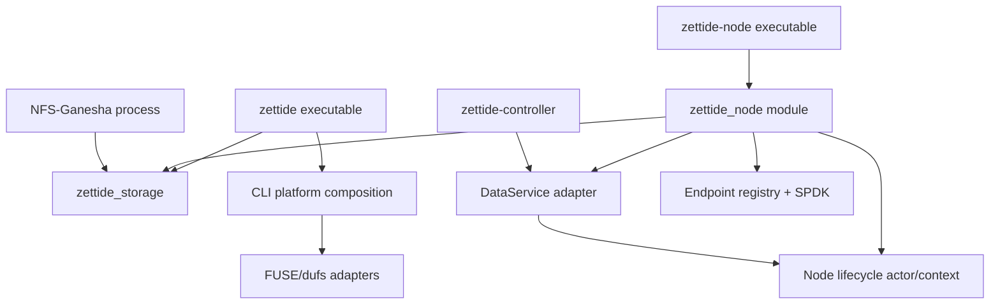

# CLI 与 Node 产品 Composition 归属

> 状态：目录、named roots、consumer 与 component test boundaries 已落地；CLI compatibility facade 与完整 `zettide-node` daemon wiring 待完成

本文细化 L5 产品入口。engine 区域见前述 storage/Pool/Blob/filesystem 文档，managed endpoint 见
[Endpoint Lifecycle 与 Daemon 归属](endpoint-lifecycle-map.md)，进程决策见
[ADR-0001](../../decisions/0001-storage-node-naming-and-process-model.md)。

## 结论

1. `zettide` 保持现有 executable name 和 operator CLI compatibility；它不是 storage engine module root。
2. CLI 继续拥有显式、由调用者控制生命周期的 offline inspect/plan/format/check、foreground FUSE mount
   和 dufs convenience adapter。
3. managed Pool/Catalog/SPDK/DataService lifecycle 最终只由 `zettide-node` 拥有。CLI 不新增长期
   authoritative daemon 能力。
4. `zettide endpoint serve` 是迁移期 compatibility entry，node parity 前保留；最终移除或转发需独立
   release decision。
5. `node_main.zig` 与 `node_data_service.zig` 当前是未接入 build 的 prototype，不代表已经存在
   `zettide-node` 产品边界。
6. DataService adapter 不自己拥有另一套 Pool/endpoint state。所有 RPC、local control 和 shutdown 进入
   同一个 node lifecycle actor/context。
7. CLI 和 node 都可以依赖 public `zettide_storage` facade；二者不得通过旧 `zettide` mega-module 获得
   隐式 FUSE、SPDK、endpoint 或 RPC 能力。
8. 首轮只提取一个 storage-engine package。CLI/node 内部可以有多个 module roots，但不借本步骤拆成多个
   published Pool/Catalog/Blob packages。

## 目标进程与 module 关系

禁止：

- `zettide_storage` import CLI parser/printer、signal、grpc-lite、SPDK、FUSE 或 node config；
- CLI import `services/node` runtime 来执行 offline/foreground operations；
- node import FUSE/dufs 或 NFS-Ganesha FSAL；
- DataService handler 直接创建独立 Pool/Registry/SPDK runtime；
- CLI foreground path 与 node 同时 writable-open 同一物理 resource；
- 继续把所有源码通过 `services/node/root.zig` 平铺为单个 public module；
- 为了移动目录重命名 CLI commands、flags、output fields、executable 或 endpoint API。

## 文件归属

| 当前文件 | 首轮目标归属 | 说明 |
| --- | --- | --- |
| `services/node/main.zig` | `zettide` CLI entry | command dispatch、help、stdout/error behavior |
| `services/node/cli/common.zig` | CLI presentation helpers | metrics、UUID、target classification presentation |
| `services/node/cli/pool.zig` | CLI Linux Pool composition | device parsing、plan/create/inspect、foreground mount |
| `services/node/filesystem_target.zig` | product target composition | 按 consumer 拆为 CLI/NFS/node adapters，不进入 backend-neutral API |
| `services/node/root.zig` | temporary compatibility facade | 拆 root 后删除或缩到迁移 shim，不再作为 engine root |
| `services/node/node_main.zig` | `services/node` executable entry | config、signal、startup/readiness/shutdown |
| `services/node/node_data_service.zig` | `services/node` DataService adapter | grpc-lite decode/encode、status mapping、handler registration |
| `libs/data-service-contracts/` | shared protocol package | controller/node 共用 values、proto 和 authority lease contract |

CLI platform code 可以继续位于产品目录，但 build 必须显式注入所需 adapter。源码物理移动顺序不能先于
module dependency 切断。

## `zettide` CLI 命令归属

### Offline Blob commands

| Command | Owner | 目标依赖 |
| --- | --- | --- |
| `format` | CLI | file target adapter + public Blob format API |
| `info` | CLI | read-only target opener + public Blob inspection view |
| `check` | CLI | read-only target opener + engine traversal/check API |

保持 two-step destructive format flow：inspect plan/token -> `--confirm` apply。新 file 需要 `--size`；已有
file 不接受 size。`legacy-raw` 仍是 default name profile，`portable-v1` 保持 opt-in。

当前 CLI 直接读取 `Filesystem.blobs.header`、`Filesystem.root` 等内部字段。拆 facade 时改为 public
inspection values/methods，不能把 private Blob structs 暴露为长期 CLI dependency，也不能改变既有 output。

### Linux device/Pool commands

| Command | Owner | 目标依赖 |
| --- | --- | --- |
| `device inspect` | CLI Linux adapter | block-device preflight adapter |
| `pool plan-create` | CLI Linux composition | public Pool provision values + Linux planner |
| `pool create` | CLI Linux composition | confirmation plan + Pool provision + Blob initialization |
| `pool inspect` | CLI Linux composition | read-only Pool open + authority/status views |
| `pool mount` | CLI foreground frontend | exclusive Pool open + BlobFilesystem + FUSE |

`cli/pool.zig` 当前通过 `zettide.v3.*` 访问 private modules。目标改为：

- Pool/Member/Catalog/Storage values 从 `zettide_storage` public facade 取得；
- `linux_pool_plan`、`linux_block_device` 和 raw storage opener 从 CLI Linux adapter 取得；
- FUSE 从显式 frontend module 取得；
- output formatting 留在 CLI。

`openRawPoolSet` 的 ownership 保持：逐设备 exclusive/writable open，检测 duplicate device，随后
PoolMemberSet 在 success/failure 两条路径都消费 supplied Storage。目录移动不能改变 close semantics。

### Foreground frontends

| Command | Owner | 目标依赖 |
| --- | --- | --- |
| `mount` | CLI foreground | Blob file target + path port + libfuse adapter |
| `unmount` | CLI foreground | `fusermount3` compatibility adapter |
| `serve dufs` | CLI supervisor | Blob file target + private FUSE session + external dufs |

这些命令的 lifetime 由 invoking user/process 拥有；它们不注册到 node desired state。FUSE/dufs 细节见
[FUSE、NFS 与 dufs Frontend 归属](frontend-map.md)。

### Transitional endpoint command

`endpoint serve` 当前仅在 Linux + `-Dspdk=true` build 可用，并调用 endpoint daemon composition。它在迁移
期间保持命令行参数、runtime directory、control socket、state file 和 readiness output。

最终允许的处理只有两种，需单独决策：

1. wrapper/alias 到 `zettide-node` compatibility mode；
2. 在已公告 release 中移除。

不能长期保留一个与 `zettide-node` 并行争用 Pool/SPDK runtime 的第二 daemon。

## CLI compatibility surface

以下作为迁移兼容 gate：

- executable：`zettide`；
- top-level commands：`format`、`info`、`check`、`mount`、`unmount`、`device`、`pool`、`serve`、
  `endpoint`；
- 当前 subcommands、flag spelling、default values、`--` dufs passthrough；
- confirmation token workflow；
- stdout 中由 tests/automation 消费的 labels、IDs、metrics 和 ready messages；
- Linux-only command 在 unsupported platform 的明确 failure；
- SPDK command 的 compile-time capability check；
- foreground signal/teardown 和 exit status。

CLI 是 operator API，但不是远程 control-plane API。后续 online managed operation 应调用 DataService 或同一
node-local compatibility adapter，不能自行打开 node-owned disk。

## CLI presentation 与 domain API

`cli/common.zig` 当前同时引用 FUSE Metrics、Storage TransportStats、filesystem target classification 和
Linux UID/GID。拆分原则：

- presentation helpers 可以依赖 value-only public structs；
- FUSE metrics printer 与 FUSE build 同 root；
- Pool transport metrics 只接收 public transport stats value；
- UID/GID discovery 留在 platform CLI；
- target classification 由 product adapter 返回 public classification enum；
- printer 不应 import 整个 `zettide` facade。

engine 不负责 stdout text、human size formatting、confirmation prompts 或 process UID discovery。

## `zettide-node` 产品边界

最终每个 managed storage node 运行一个 `zettide-node`。一个 process owner 组合：

- stable Node identity；
- per-process boot identity；
- DataService RPC server；
- Member/Replica/Pool/Catalog local lifecycle；
- authority/fencing state；
- endpoint desired/observed reconciliation；
- one SPDK runtime 和 shared protocol services；
- node config、readiness、health、telemetry、signal 和 drain。

它不拥有：

- foreground FUSE/dufs；
- NFS-Ganesha process/FSAL runtime；
- controller Raft state；
- CLI offline format workflow。

### Node context

建立一个明确的 node-owned context/actor，至少持有：

- allocator/std.Io 和 validated config；
- stable Node ID、boot ID；
- storage/Pool manager；
- authority/lease manager；
- Endpoint Registry；
- optional SPDK runtime/services；
- shutdown/readiness state。

DataService handlers、local control adapter 和 background reconciliation 借用该 context。context 必须比全部
servers、endpoint locators、Pool leases 和 SPDK handles 活得更久。

## 当前 node prototype 状态

`node_main.zig` 当前：

- 只接受 `--listen host:port`；
- block SIGINT/SIGTERM；
- 创建 DataServer、start、记录 local address；
- `sigwait` 后执行 5-second graceful shutdown；
- 不加载 storage config、Pool、endpoint、SPDK 或 stable Node ID。

`node_data_service.zig` 当前只注册：

- `IdentifyHolder`；
- `StagePrimary`；
- `InspectPrimary`。

共享 proto 声明的 Ensure/Inspect/DeleteReplica、FenceReplica、RecoverPrimary、MarkPrimaryReady 等 methods
尚未接通。未注册 method 不能在文档或 readiness 中宣称已实现。

prototype State 当前：

- 启动时生成 UUIDv7-compatible boot ID；
- 用 mutex 保护 process-memory authority map；
- 按 Volume ID 保存 staged binding 和 primary lease Runtime；
- 不持久化 stable Node identity/authority state；
- 不访问 Pool/Catalog 数据；
- InspectPrimary 总是报告 current_active=false/current_admitting=false，只判断 candidate freshness。

迁移时不能把 boot ID 当 stable Node ID，也不能让 DataServer 继续创建自己的孤立 State。boot identity 由
NodeContext 创建一次并注入 adapter；authority methods 调用同一 lifecycle manager。

## DataService adapter boundary

DataService adapter 只负责：

- protobuf decode/validation；
- protocol values 到 node commands/query 的转换；
- grpc status mapping；
- response encode；
- graceful server lifecycle。

它不负责：

- 直接选择物理 path；
- 自己 open Pool/Volume；
- 创建独立 Endpoint Registry/SPDK runtime；
- 绕过 authority/fencing manager 修改 engine；
- 持久化另一份 desired state。

`libs/data-service-contracts` 是 controller/node 共同协议包，不依赖 storage engine 实现。node adapter 可以同时
依赖 contracts 和 engine public values，但 engine 不能依赖 generated protobuf/grpc-lite。

## Node startup 与 readiness

目标 startup 顺序：

1. parse/validate config，确保 runtime/state directories 安全；
2. block termination signals，再创建任何 worker/server thread；
3. load/create stable Node identity，生成本次 boot ID；
4. 初始化 node lifecycle actor 和 durable local stores；
5. discover/open configured Member/Pool resources；
6. 启动 optional SPDK runtime/shared services；
7. 初始化 Endpoint Registry 并 reconcile desired state；
8. 启动 local compatibility control adapter；
9. 注册并启动 DataService；
10. publish ready/health。

Endpoint 单项 reconcile failure 可以作为 observed failed state 存在，但 Node 只有在 core actor、stores 和
DataService 可服务时才 ready。startup 任何阶段失败必须反向 unwind。

## Node shutdown

目标 shutdown 顺序：

1. 标记 draining，停止发布 ready；
2. 停止接受新的 DataService/local-control mutation；
3. graceful drain in-flight RPC 和 actor commands；
4. 停止 background reconcile；
5. Endpoint Registry shutdown，关闭 exports；
6. 释放 Catalog leases、Pool/Member runtime；
7. 关闭 shared protocol services、controllers 和 SPDK runtime；
8. flush/close durable local stores；
9. join servers/workers，释放 NodeContext；
10. restore process signal state 并退出。

若 endpoint/Pool/SPDK close 失败，不能继续释放其 owner。必须 retry、保持 drain 或 fail-stop；不得仅记录
warning 后形成 use-after-free。

## CLI 与 node resource mutual exclusion

CLI foreground commands 和 node 都可能打开 Member/Pool。约束：

- managed node 运行时，offline format/create 禁止作用于其资源；
- writable Pool mount 要求 exclusive device ownership；
- inspect/check 默认 read-only，但不能绕过 backend 要求的 exclusive/open policy；
- endpoint compatibility daemon 与 node 必须互斥；
- future CLI managed commands 通过 DataService 或同一 local actor，不直接访问 disk；
- owner conflict 应返回明确 error，不以“最后启动者获胜”处理。

## Module roots

目录迁移与主要 named roots 已落地；CLI/DataService 的进一步 composition 仍按下表推进：

| Root | 内容 | 显式 dependencies | 状态 |
| --- | --- | --- | --- |
| `zettide_storage` | L0-L3 engine facade | std、CRC32C、utf8proc；无 product/runtime | 已落地并有独立 package/test |
| CLI compatibility root | parser/printer/dispatch + frontend facade | `zettide_storage` + selected file/Linux/frontend adapters | 保留旧 `zettide` import，仅限现有 CLI |
| CLI Linux adapter surface | device plan/raw/FUSE/dufs | Linux/libfuse/process APIs | 文件已归 `services/node`，尚未单独命名 root |
| `zettide_node` | endpoint/SPDK lifecycle 与未来 NodeContext | `zettide_storage` + selected platform modules | named root 已落地；完整 NodeContext 待实现 |
| node DataService root | grpc adapter | `zettide_node` commands/queries + generated proto + grpc-lite | 待接入根构建 |
| node SPDK surface | runtime/exports | SPDK/DPDK + `zettide_storage` public facade | 已由 `zettide_node` 导出，SPDK 链接仍为显式 option |

旧 `zettide` module 可以短暂作为 tests/CLI migration shim，但：

- 不再被称为 core 或 storage engine；
- 新代码禁止 import；
- 每批 consumer 迁移后删除对应 re-export；
- 不能用 shim 隐藏 cyclic dependency。

## Build 状态与目标

当前根 build：

- 通过 `libs/storage-engine/build.zig:addComponent` 接入独立 `zettide_storage` package；
- 安装 `zettide-storage-engine` library，并提供 `test-storage-engine`；
- 注册 `zettide_node` root，并提供 `test-node` 与 `test-module-roots`；
- engine root 只注入 CRC32C/utf8proc，不导出 Linux/FUSE/SPDK/RPC；
- `createCoreModule` 仅以 `services/node/root.zig` 构建 legacy product compatibility facade，
  其测试由 `test-compatibility` 隔离；
- legacy facade 仍注入 `linux_c`、`spdk_c`，可选链接 FUSE/SPDK；
- 仍只安装 `zettide` executable；node root 已暴露 prototype source，但尚未生成 proto、链接
  grpc-lite 或构建 `zettide-node`；
- Windows gate 同时编译 portable storage root 与 legacy CLI，macOS gate直接编译 portable storage root。

目标 build：

- 单独构建/安装 `zettide` 和 `zettide-node`；
- `zettide-node` executable name 固定，不使用 `zettide-data`/`zettide-storage`；
- engine unit root 不注入 Linux/FUSE/SPDK/RPC；
- CLI 只链接实际命令需要的 adapters；
- node 只链接 configured capabilities，绝不链接 FUSE/dufs/NFS；
- generated DataService proto 和 contracts 显式传入 node adapter；
- cross-compile gate 至少覆盖 portable engine 和 non-SPDK CLI surface；
- SPDK capability 保持 Linux-only explicit option。

## 测试迁移矩阵

| Gate | 覆盖 |
| --- | --- |
| `tests/cli.sh` | format/info/check、confirmation、name profile、stable output |
| Linux block/physical Pool tests | device inspect、plan/create/inspect、exclusive ownership、partial create |
| FUSE/dufs tests | foreground mount/unmount、metrics、signal/child cleanup |
| scheduled Pool tests | CLI profiles、device count、transport metrics、reopen |
| endpoint daemon smoke | compatibility entry、SPDK capability、ready/SIGTERM cleanup |
| node DataService unit | decode/status、boot ID、stage/inspect authority、concurrent calls |
| node executable smoke | build/install/name、listen/readiness、SIGTERM graceful drain |
| node composition integration | Pool + endpoint + DataService single owner、startup/restart/shutdown |
| `test-storage-engine` | portable formats、Pool/Catalog、Blob/Filesystem；不链接 node/platform |
| `test-node` | endpoint 与 SPDK adapter/node composition unit tests |
| `test-compatibility` | legacy CLI/FUSE/dufs/NFS/platform facade unit tests |
| `test-module-roots` | engine 无 Linux/SPDK/RPC exports；node 单向依赖 engine |
| Windows/cross check | portable engine 和支持的 CLI commands 可编译 |

命令 output 被多个 shell/automation tests 解析；迁移 tests 时不得只保留“process exit 0”，应继续断言关键
labels、IDs、mount cleanup 和 confirmation behavior。

## 剩余边界工作

- [x] 建立 `zettide_storage` 和 `zettide_node` named module roots；
- [ ] CLI commands 从 mega-module 改用 engine facade 和显式 platform adapters；
- [ ] 为 CLI info/check 补 public inspection API，删除 private field access；
- [ ] `cli/pool.zig` 删除 `zettide.v3.*` imports；
- [ ] 建立 NodeContext/actor，再让 DataService 和 endpoint control 共享；
- [ ] 将 boot ID、authority state ownership 从 DataServer 移到 NodeContext；
- [ ] 根 build 生成 node proto、链接 grpc-lite 并安装 `zettide-node`；
- [x] 合并 endpoint daemon lifecycle 前保持 compatibility entry；
- [x] tests、benchmarks、NFS backend 与 SPDK tests 不再复用完整 `zettide` facade；
- [ ] legacy CLI/core unit root 改用显式 roots 后删除 compatibility facade；
- [x] module boundaries 稳定后再移动 engine 与 node 目录。

本文只定义 CLI/node product composition、module roots 和 process lifecycle；CLI、DataService wire、
磁盘格式和当前运行能力由对应规范与状态页维护。
