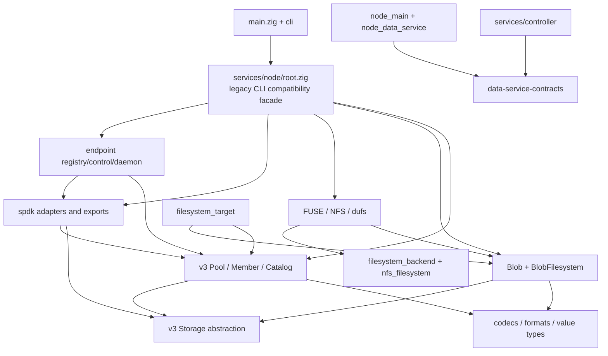
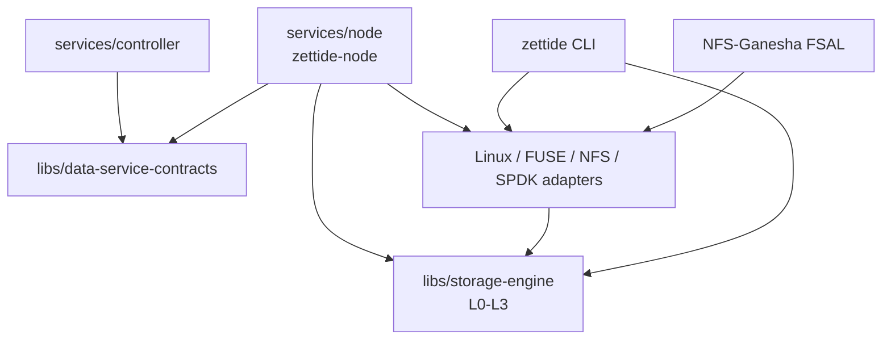

# 组件依赖与分层规则

> 状态：当前规范；package/module roots、源码目录和 consumer/build 边界已落地，完整 NodeContext/DataService daemon composition 待完成

本文定义当前源码编译依赖和运行时组合。已完成的目录迁移不再作为执行计划；后续修改必须保持本文的单向依赖。目标命名与进程边界见
[架构决策 0001](../../decisions/0001-storage-node-naming-and-process-model.md)。首轮迁移后的 package
粒度复评与再次拆分条件见
[架构决策 0002](../../decisions/0002-keep-storage-engine-cohesive.md)。

## 方向约定

本文用 `A -> B` 表示 A 在编译时依赖 B。允许的总体方向是：

```text
product processes / tools
        |
        v
platform and protocol adapters
        |
        v
backend-neutral ports and composition APIs
        |
        v
storage engine domains
        |
        v
storage primitives, codecs, formats and shared value types
```

控制面和数据节点共享 `libs/data-service-contracts`，但控制面不依赖本地存储引擎：

```text
services/controller ----> libs/data-service-contracts
services/node ----------> libs/data-service-contracts
services/node ----------> libs/storage-engine
```

`libs/data-service-contracts` 本身不得依赖 `libs/storage-engine`。

## 当前构建边界

根构建先通过 `libs/storage-engine/build.zig:addComponent` 注册并测试 `zettide_storage`，再注册
`zettide_node`。`build/support.zig:createCoreModule` 只为现有 CLI 构建
`services/node/root.zig` compatibility facade；该 facade 复用 engine/CRC32C module，并仅注入：

- Linux/FUSE C translation module；
- SPDK C translation module；
- 按 target 条件启用的产品平台源码和系统库。

测试分别由 `test-storage-engine`、`test-node`、`test-compatibility` 与
`test-module-roots` 表达，不再用一个 test root 代表全部能力。

`services/node/root.zig` 仍公开 Blob、filesystem、endpoint、SPDK 和整个 `v3`
namespace，并作为 legacy product compatibility facade；它不再拥有 engine declarations，
而是转发新 `zettide_storage` root。新 consumer 不得继续把该 facade 当作存储引擎边界。

当前独立 package 只有：

- `services/controller/`；
- `libs/storage-engine/`；
- `libs/txfs/`；
- `libs/data-service-contracts/`。

根构建从 `libs/storage-engine/src/root.zig` 注册 `zettide_storage`，并从
`services/node/node_root.zig` 注册 `zettide_node`；`test-module-roots` 检查 product/platform
exports 不进入 engine。`node_main.zig` 与
`node_data_service.zig` 仍未形成可安装的 `zettide-node` executable，RPC/proto build wiring
留待后续步骤。

## 当前区域与主要依赖

下表是重构所需的区域级依赖图，不试图替代 Zig 编译器的逐 import 解析。

| 当前区域 | 代表入口 | 当前主要依赖 | 当前消费者 |
| --- | --- | --- | --- |
| Storage abstraction | `v3/storage.zig` | `std.Io`、file/custom backend vtable | BlobDevice、Member、Pool data、SPDK storage adapter |
| Persistent format/value types | `v3/codec.zig`、`member_format.zig`、`blob_format.zig`、`metadata.zig`、`name_profile.zig` | CRC32C、utf8proc、基础值类型 | Pool、Blob、CLI/format planning |
| Pool/Member/Catalog | `v3/root.zig`、`pool_member_set.zig`、`pool_replicated_journal.zig`、`pool_catalog_volume.zig` | storage abstraction、v3 codecs 和 shared data-mode geometry；production path 不依赖 Blob/SPDK | filesystem target、SPDK Catalog backend、CLI |
| Blob/BlobFilesystem | `blob_device.zig`、`blob_store.zig`、`blob_filesystem.zig` | storage abstraction、Blob formats/maps | Blob adapters、filesystem target、CLI、NFS backend |
| Backend-neutral filesystem API | `filesystem_backend.zig`、`nfs_filesystem.zig` | metadata/value types | FUSE、dufs、Blob adapters、NFS ABI |
| Filesystem composition | `filesystem_target.zig` | Blob engine、Pool/Member、format planning、storage abstraction | CLI、NFS backend |
| FUSE/NFS/dufs adapters | `linux_fuse.zig`、`nfs_handle.zig`、`nfs_backend.zig`、`dufs_server.zig`、`services/nfs-fsal/` | filesystem ports、Blob identity adapter、Linux/process/Ganesha APIs | `zettide` CLI、NFS-Ganesha process |
| SPDK adapter/export | `spdk/` | SPDK C API、Pool/Catalog、storage abstraction、endpoint registry | endpoint daemon、SPDK tests/benchmarks |
| Endpoint lifecycle | `endpoint_registry.zig`、`endpoint_control.zig`、`endpoint_daemon.zig` | registry state machine、Unix socket、SPDK exports/runtime | `zettide endpoint serve`；目标 `zettide-node` |
| CLI | `main.zig`、`cli/` | 聚合 `zettide` facade、filesystem target、FUSE/dufs/endpoint | `zettide` executable |
| DataService prototype | `node_data_service.zig`、`node_main.zig` | grpc-lite、generated proto、data-service contracts | 目标 `zettide-node` |
| Controller | `services/controller/` | raftz、grpc-lite、data-service contracts | `zettide-controller` executable |

## 当前依赖图



`ROOT` 的箭头表示聚合公开和测试强制导入，不表示所有叶模块彼此都直接 import。

## 已完成的反向依赖修复与剩余边界

下表保留迁移结果，防止后续重新引入已经解除的反向依赖；它不是待执行的旧目录迁移计划：

| ID | 当前状态 | 原问题 | 剩余方向 |
| --- | --- | --- | --- |
| D1 | 已解除：`pool_replicated_journal.zig` 不再 import SPDK | 原 provider assertions 混在 Pool test | provider status mapping 已迁到 node/SPDK adapter test；完整 bridge integration 继续由专用 gate 补齐 |
| D2 | 已解除：Pool provisioning 改依赖 `data_mode_geometry.zig` | Pool 只读取 `.blob` data-mode geometry | Blob format 从同一低层 contract 重导出原常量，数值不变 |
| D3 | 已解除：Pool data adapter 的 production path 不再 import Blob format | Pool 只验证 logical region 非空且落在 Member data region 内 | Blob size/minimum/header 解释留在上层；跨层 reopen 场景仅存在于 integration-style test |
| D4 | 已解除：`linux_pool_plan.zig` 排除于 engine root | Linux composition 曾混入 engine | 保持 node adapter -> public `zettide_storage.name_profile` 方向 |
| D5 | 已解除目录混层：`filesystem_target.zig` 位于 `services/node` | 产品 composition 曾与 engine 同目录 | 继续作为 tool/node adapter，不进入 storage-engine |
| D6 | 大部分解除：named roots 与 consumer 迁移完成 | mega facade 使 consumer 间接取得全部能力 | legacy facade 只剩现有 CLI，待 CLI 显式 composition 后删除 |
| D7 | 大部分解除：engine 自有 CRC32C/utf8proc build，component tests 分离 | 单 module 注入全部 C/system dependencies | compatibility CLI 仍按 feature 注入 FUSE/SPDK，后续缩到命令级 composition |
| D8 | 部分解除：`zettide_node` root 已建立，DataService executable wiring 未完成 | 目标 service 与可执行边界不一致 | 生成 proto、链接 grpc-lite、建立 NodeContext；禁止 RPC 进入 engine |

D1 的 production reverse import 已移除；D2-D3 通过共享 data-mode geometry contract 解除；
D4 通过 module-root ownership 与 public engine import 解除。后续改动不得重新引入这些依赖。

## 目标分层

### L0：共享 contract 与基础值

包含稳定 ID、digest、authority/fencing contract，以及不拥有 I/O 的纯值/codec contract。

- `libs/data-service-contracts` 保持独立；
- on-media codec 可以属于 storage engine 内部 L0，但不得依赖 service/frontend；
- CRC32C、utf8proc 等算法依赖只注入实际使用它们的 module。

允许依赖：标准库和显式算法依赖。
禁止依赖：Pool runtime、BlobFilesystem、SPDK、FUSE、RPC server、CLI。

### L1：存储抽象与持久格式

包含随机访问 storage port、geometry、Member/Blob/Catalog format codec 和共享 layout 值。

允许依赖：L0。
禁止依赖：产品进程、endpoint、frontend、SPDK export、DataService。

平台 storage 实现作为 adapter 接入。普通 file backend 可保留为基础 adapter，但
Linux block/io_uring/SPDK 不得成为 portable root 的隐式依赖。

### L2：存储引擎领域

首轮共同位于 `libs/storage-engine`：

- Pool、Member、authority、journal；
- Catalog、Volume backend、extent mapping；
- BlobDevice、Blob stores、BlobFilesystem。

允许依赖：L0-L1，以及同 package 内经过公开 root 暴露的领域 contract。
禁止依赖：SPDK、endpoint daemon、FUSE、NFS-Ganesha、dufs、CLI、grpc-lite、controller。

Pool 与 Blob 的共同约束必须位于显式 data-mode contract 中。不得让 Pool core import
BlobFilesystem 实现，也不得让 Blob core import endpoint/SPDK。

### L3：backend-neutral ports 与 engine adapters

包含：

- POSIX/filesystem operation ports；
- BlobFilesystem 到通用 filesystem/NFS view 的 adapter；
- endpoint backend port；
- storage-engine public facade。

允许依赖：L0-L2。
禁止依赖：进程信号、CLI parsing、监听 socket；具体 SPDK/FUSE runtime 仍属于 L4。

NFS 的 identity-oriented API 与通用 POSIX backend 可以保持两个 contract；它们不需要为了
“统一接口”而丢失 stable-handle 或 protocol-specific 语义。

### L4：平台与协议 adapter

包含 Linux block/io_uring、FUSE、NFS C ABI、dufs supervisor、SPDK runtime/provider/export。

允许依赖：L0-L3 和对应平台/第三方 API。
禁止依赖：controller 内部 state machine；不得把平台类型泄漏回 L1/L2 public API。

### L5：产品 composition

包含：

- `zettide` CLI；
- `zettide-node` daemon、DataService、endpoint reconciliation；
- `zettide-controller` daemon。

L5 负责 allocator/thread/process lifecycle、信号、socket、配置、RPC 和 adapter 组合。
服务之间只通过版本化 contract/RPC 交互，不跨目录 import 对方内部源码。

## 目标依赖图



不得增加 `ENGINE -> PLATFORM`、`ENGINE -> NODE`、`ENGINE -> CONTROLLER` 或
`CONTRACTS -> ENGINE` 边。

## Import 与构建规则

1. **跨 package 只用公开 module 名。** 禁止 `../../libs/...` 或 `../../services/...` 源码相对
   import；路径只允许出现在 build wiring 中。
2. **生产模块不为测试引入上层依赖。** 需要 SPDK/FUSE/daemon 的测试放在独立 integration
   test root，不在 engine 源文件顶层 import 上层 adapter。
3. **portable root 不条件导出整个 OS 层。** OS-specific module 由 node/tool build 显式创建；
   `builtin.os.tag` 不能替代清晰 module boundary。
4. **接口由被依赖层拥有。** Storage vtable 由 engine foundation 拥有；SPDK 实现该接口。
   Endpoint backend port 由 node composition 拥有；具体 Catalog/SPDK backend 实现它。
5. **格式依赖与 runtime 依赖分开。** on-media format 可依赖 checksum/Unicode 算法，不能依赖
   process、RPC 或 export runtime。
6. **一个资源只有一个 runtime owner。** Pool/Catalog/SPDK endpoint 的进程 ownership 位于
   `zettide-node`；CLI foreground compatibility path 必须显式互斥，不能形成第二 owner。
7. **facade 不隐藏能力依赖。** 消费者若使用 FUSE、NFS 或 SPDK，build target 必须显式声明；
   不因 import `zettide_storage` 自动链接全部平台库。
8. **迁移不改变稳定接口。** on-media format、CLI、endpoint wire API 和 NFS C ABI 的兼容约束
   继续遵守决策 0001。

## 区域归属基线

存储抽象、平台 storage adapter 和持久格式的逐文件结论见
[存储抽象与持久格式归属](storage-foundation-map.md)，Pool、Member 与 Catalog 的领域拆分见
[Pool、Member 与 Catalog 归属](pool-member-catalog-map.md)，Blob 与 BlobFilesystem 的领域拆分见
[Blob 与 BlobFilesystem 归属](blob-filesystem-map.md)，backend-neutral filesystem ports 见
[Backend-neutral Filesystem API 归属](filesystem-api-map.md)，frontend 进程与兼容边界见
[FUSE、NFS 与 dufs Frontend 归属](frontend-map.md)，SPDK ingress/export 见
[SPDK Backend 与 Export 归属](spdk-adapter-export-map.md)，endpoint state/process 见
[Endpoint Lifecycle 与 Daemon 归属](endpoint-lifecycle-map.md)，产品入口与 process composition 见
[CLI 与 Node 产品 Composition 归属](cli-node-composition-map.md)。后续逐区域确认以此表为起点：

| 区域 | 首轮目标归属 | 备注 |
| --- | --- | --- |
| 存储抽象与持久格式 | `libs/storage-engine` L0-L1 | Linux/SPDK 实现留在 adapter 层 |
| Pool/Member/Catalog | `libs/storage-engine` L2 | 先处理 D1-D4 |
| BlobFilesystem | `libs/storage-engine` L2 | 包含 BlobDevice/store/map/filesystem |
| Backend-neutral filesystem API | `libs/storage-engine` L3 | NFS identity view 可保持独立 port |
| FUSE/NFS/dufs frontend | CLI/node platform adapter | NFS-Ganesha 仍是独立进程 |
| SPDK backend/export | `services/node` platform adapter | 不进入 engine portable root |
| Endpoint registry/control/daemon | `services/node` composition | `endpoint serve` 仅迁移期兼容入口 |
| CLI 与 DataService | CLI 与 `services/node` L5 | DataService 不进入 engine |

## 当前边界门禁

以下项目持续约束后续 node/frontend 工作：

- [x] D1 的 SPDK 测试依赖已移出 Pool production module；
- [x] D2-D4 已通过 contract 提取或 composition 重组消除；
- [x] storage engine 有独立 module root，且不导出 endpoint/SPDK/FUSE/RPC；
- [ ] frontend integration tests 全部迁出 legacy root（node boundary test 已独立）；
- [x] `createCoreModule` 仅保留为 compatibility product facade，不再代表 storage/node 全部能力；
- [x] portable storage tests 不链接 FUSE/SPDK；
- [x] 当前 CLI、NFS ABI、non-SPDK 默认构建和 cross-compile gates 仍可构建。

## 维护规则

新增跨层 import 时，review 必须说明源层、目标层和为什么符合上述方向。若确实需要反向
调用，应在较低层定义 port，由较高层实现；不得直接 import 较高层实现。本文随 module root、
目录归属或公开 contract 变化同步更新。
