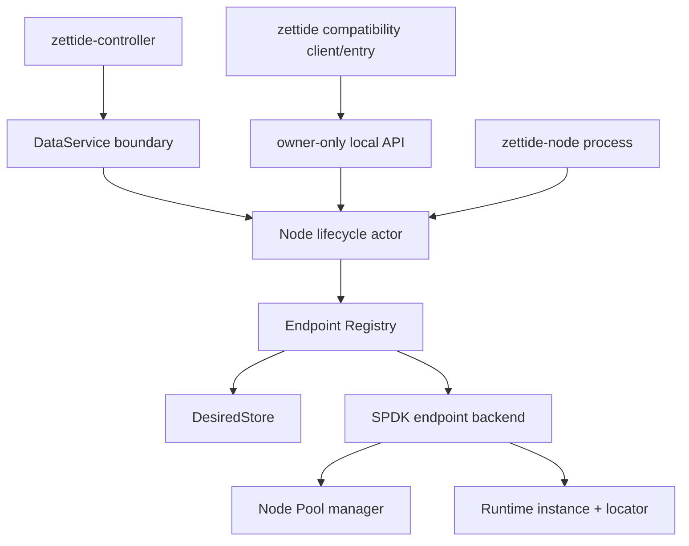

# Endpoint Lifecycle 与 Daemon 归属

> 状态：endpoint 源码已归 `services/node/` 并由 `zettide_node` 导出；Registry 与 DataService 的单 NodeContext actor ownership 待完成

本文细化 managed block endpoint 的 desired/observed lifecycle。SPDK export implementation 见
[SPDK Backend 与 Export 归属](spdk-adapter-export-map.md)，进程命名与最终 owner 见
[ADR-0001](../../decisions/0001-storage-node-naming-and-process-model.md)。

## 结论

1. `endpoint_registry.zig` 是 node-local endpoint lifecycle state machine，属于 `services/node/`，不属于
   storage engine，也不属于 SPDK wrapper 本身。
2. `endpoint_control.zig` 是 Linux owner-only Unix socket compatibility API。它与 DataService 不同，
   不得成为第二套长期产品控制面。
3. `endpoint_daemon.zig` 是当前过渡 composition；其 SPDK runtime、registry、control server、signal 和
   teardown 逻辑最终合并进单个 `zettide-node`。
4. `zettide endpoint serve` 在 node parity 之前保留 CLI、参数和 socket behavior；移除或转发需单独
   compatibility decision 和 release note。
5. desired state 必须在 runtime start 前 durable；release 必须在 runtime stop 前 durable。observed
   runtime handle 和 locator 不写入 state file，process restart 后统一 reconcile。
6. 一个 Registry 只允许单 owner 串行调用。DataService、local socket 和 shutdown 必须汇入同一个 node
   actor/serialization boundary，不能各自持有 Registry。
7. 当前“一 Pool 一个 endpoint”是为避免每个 endpoint 重复 writable-open Pool 的安全限制，不是长期
   domain invariant。引入 node-owned shared Pool manager 前不得放宽。
8. current DataService proto 没有 endpoint RPC。迁移不能假装 local Unix API 已成为 controller API；
   managed endpoint contract 必须单独演进。

## 目标依赖与 owner

禁止：

- storage engine import endpoint Spec、Locator、DesiredStore、Unix socket 或 daemon code；
- endpoint registry import SPDK concrete implementation；它只能依赖 Backend port；
- DataService thread 和 control socket thread 并发直接调用 Registry；
- node 与 compatibility endpoint daemon 同时打开同一 writable Pool；
- local `endpoints.state` 与 controller desired state 各自驱动独立 Registry；
- 将 runtime locator、SPDK handle 或 process-local pointer 持久化；
- release 先 stop runtime、后删除 desired state；
- shutdown 删除 desired state；
- 用 endpoint ID、socket path 或 NQN 替代 Pool/Volume authenticated identity。

## 文件归属

| 当前文件 | 首轮目标归属 | 职责 |
| --- | --- | --- |
| `services/node/endpoint_registry.zig` | `services/node` endpoint domain | Spec/value、DesiredStore port、Backend port、Registry state machine、FileStore |
| `services/node/endpoint_control.zig` | `services/node` Linux compatibility adapter | versioned Unix API、same-UID auth、single request server/client helpers |
| `services/node/endpoint_daemon.zig` | `services/node` composition | CLI option migration、SPDK runtime/services、PoolSource、registry/server/signal lifecycle |
| `services/node/spdk/catalog_endpoint_backend.zig` | node SPDK Backend implementation | authenticated Pool + Catalog export + locator |
| `services/node/main.zig` endpoint branch | `zettide` compatibility entry | 迁移期调用 node endpoint composition |
| `services/node/node_main.zig` | 目标 `zettide-node` entry | 当前只有 DataService；后续接管 endpoint composition |
| `services/node/node_data_service.zig` | node DataService adapter | 当前无 endpoint RPC；不得直接拥有第二个 Registry |

`Frontend`、`Spec`、`Locator` 是 node endpoint values，不导出自 `zettide_storage`。PoolId/VolumeId 虽与
engine identity byte width 相同，也必须通过 node composition 验证 authenticated authority，不能只靠
类型别名宣称合法。

## Endpoint value contract

当前 endpoint Spec 包含：

- 16-byte non-zero Endpoint ID；
- 16-byte non-zero Pool ID；
- 16-byte non-zero Volume ID；
- frontend：`vhost_user_blk=1`、`iscsi=2`、`nvme_of_tcp=3`、`nvme_of_rdma=4`。

runtime Locator 按 frontend tagged union：

- vhost-user-blk：socket path；
- iSCSI：portal、target name、LUN；
- NVMe-oF TCP/RDMA：transport address、service ID、NQN、NSID。

Backend 成功返回的 locator tag 必须与 Spec frontend 一致。所有 locator string 必须是非空有效 UTF-8，
单 component 最长 256 bytes；NVMe NSID 不能为 0。locator strings 是 borrowed runtime values，只在
Backend stop 成功前有效。

这些 values 是 endpoint wire/API compatibility 的源模型，但不是 engine persisted format。新增 frontend
必须同时 version：enum numeric value、desired-state record、control protocol parser/serializer、backend
capability 和 client behavior，不能只添加一个 Zig union tag。

## Registry state machine

### Ports

`DesiredStore` 只提供：

- `load(allocator) -> []Spec`；
- `replace([]const Spec)`，原子替换完整 desired set。

`Backend` 只提供：

- `start(Spec) -> Instance{handle, borrowed locator}`；
- `stop(handle)`，失败时 ownership 保留且允许 retry。

Backend `start` 失败必须不留下 runtime resources。若 start 成功但 locator 无效，Registry 会调用 stop
rollback；当前 rollback failure 是 fail-stop panic，因此 Backend 必须使这条 rollback path 可靠。

### Phases

内部 phase：

- `pending`：desired 存在，runtime 尚未 active；
- `active`：runtime/locator 存在；
- `failed`：desired 存在，但 start 或 shutdown stop 失败；
- `stopping`：desired 已删除，但 runtime stop 尚未成功。

外部 View 只暴露 `pending`、`active`、`failed`；stopping 映射为 failed，并且只有 active 返回 locator。

### Ensure ordering

新 endpoint 的顺序：

1. validate non-zero IDs/frontend；
2. 检查 Endpoint ID idempotency/conflict；
3. 检查当前 Pool ownership 限制；
4. durable replace desired state，加入 Spec；
5. append in-memory entry；
6. Backend start；
7. validate locator；
8. publish active View。

因此 persist 成功而 start 失败时，desired entry 保留为 failed。相同 Spec 的下一次 ensure 可重试 start；
同 Endpoint ID 不同 Spec 返回 conflict。

### Release ordering

release 的顺序：

1. durable replace desired state，先移除 Spec；
2. 标记 `desired=false/stopping`；
3. Backend stop；
4. stop 成功后移除 in-memory entry。

stop 失败时 entry 保留，后续 release 重试 stop，但 desired state 不会被重新添加。不存在的 Endpoint ID
release 当前是 idempotent success。

control API 对 pending teardown 有特殊兼容行为：release 已 durable、但 stop 失败时，因 inspect 已不再
返回 undesired entry，响应是 `released=true, stopping=true`，而不是恢复 desired state。

### Startup reconcile 与 shutdown

Registry init 只 load/validate desired Specs，不启动 runtime。startup 显式调用 `reconcile`：

- 对每个 desired、无 runtime 的 entry 调用 start；
- 单项失败不阻止其他 endpoint；
- 返回 started/failed counts；
- 当前没有内建 periodic retry，重试由 ensure、后续 actor tick 或 process restart 触发。

shutdown：

- 尝试停止所有 runtime，并收集第一个 error；
- desired entry stop 成功后回到 pending；
- undesired/stopping entry stop 成功后移除；
- 不修改 DesiredStore；
- 只有所有 runtime handle 都清除后才能 Registry.deinit。

node shutdown 不能在 registry shutdown 失败后继续销毁 SPDK runtime/Pool manager；必须 retry、报告
fatal drain failure 或保持 process alive，不能制造 dangling handles。

## 当前“一 Pool 一个 endpoint”限制

Registry init 和 ensure 会拒绝重复 Pool ID，即便 Volume ID 不同。这与当前
`CatalogEndpointBackend` 每个 endpoint 都独立 open/close `PoolMemberSet` 相匹配，避免同一 Pool 被重复
writable-open。

目标 node 可以管理多个 Pool/Volume，但放宽为同 Pool 多 endpoint 前必须先引入：

- node-owned、按 authenticated Pool ID 索引的 shared Pool owner；
- endpoint 获取的 borrowed Pool/Catalog lease；
- Volume 级别 publication conflict 规则；
- endpoint stop 不关闭仍被其他 endpoint 使用的 Pool；
- crash/reconcile 和 fencing tests。

在这些条件满足前，`pool_busy` control error 保持兼容。

## Desired-state FileStore format

`endpoints.state` 是 node runtime state format，不是 Pool/Blob 磁盘格式，但仍是 restart compatibility API。

### Header

- magic：8 bytes `ZETENDP1`；
- version：little-endian u16；当前写 version 2；
- record size：little-endian u16；
- count：little-endian u32，最大 1024；
- CRC32C：little-endian u32，覆盖全部 record bytes；
- header size：20 bytes。

### Records

v1 record size 48：Endpoint ID + Pool ID + Volume ID，decode 为 `vhost_user_blk`。

v2 record size 52：

- bytes 0..16 Endpoint ID；
- bytes 16..32 Pool ID；
- bytes 32..48 Volume ID；
- byte 48 frontend numeric value；
- bytes 49..52 reserved，必须为 0。

未知 version、错误 record size/count/CRC、non-zero reserved、unknown frontend、zero ID、duplicate
Endpoint ID 或 duplicate Pool ID 都拒绝 startup，不能部分恢复。

### Durability

replace 必须：

1. encode 完整 desired set；
2. 创建同目录 atomic replacement file；
3. streaming write all；
4. sync replacement file；
5. atomic replace target；
6. sync parent directory。

FileNotFound 等价 empty desired state。不得原地覆写、仅 rename 不 sync directory，或在 runtime operation
成功后再补写 state。

当 managed controller 成为 desired-state source 时，必须明确这份文件的角色：作为同一 Registry 的
node-local durable cache/journal，或由新的 authoritative store 替代。不能让 controller view 与本地 file
各自独立接受 mutation。

## Local control protocol v1

`endpoint_control.zig` 的 wire protocol 是一行 JSON request、一行 JSON response，version 固定为 1。

稳定限制：

- request 最大 4096 bytes；
- response buffer 最大 4 MiB；
- request 必须恰好以一个 LF 结束，不能含 CR/intermediate LF/trailing data；
- unknown JSON fields 拒绝；
- 每个 connection 只处理一个 request；
- read/write deadline 当前 2 秒；
- IDs 是 32 个 hex chars 并且不能全零。

actions：

- `ensure`：要求 endpoint_id、pool_id、volume_id、frontend；
- `inspect`：只允许 endpoint_id；
- `list`：不允许额外 fields；
- `release`：只允许 endpoint_id。

frontend strings 保持：`vhost_user_blk`、`iscsi`、`nvme_of_tcp`、`nvme_of_rdma`。

success response 保持 version、`ok=true`、endpoint/endpoints 或
`released=true, stopping=<bool>` fields。endpoint view 保持 IDs、frontend、state、nullable locator 和
各 frontend locator field names。

稳定 error codes：

- `invalid_request`；
- `not_found`；
- `conflict`；
- `pool_busy`；
- `stopping`；
- `unsupported_frontend`；
- `invalid_spec`；
- `resource_exhausted`；
- `unavailable`。

内部 error name 和 message 可演进，但不能在同一 protocol version 静默改变 code 语义或 JSON shape。

## Unix socket security 与 lifecycle

control server 是 owner-only local API：

- runtime directory 必须是 directory、由 effective UID 拥有且 group/other permission bits 全为 0；
- `<socket>.lock` 以 mode 0600 + nonblocking exclusive file lock 防止双 daemon；
- stale entry 只有在两次 lstat 确认同一 inode 且都是 Unix socket 时才删除；
- socket path 必须小于 `sockaddr_un` 108-byte capacity；
- bind 后 socket chmod 0600；
- accept 后用 `SO_PEERCRED` 要求 peer effective UID 匹配；
- socket/accepted fd 使用 CLOEXEC；writes 使用 `MSG_NOSIGNAL`；
- server thread 是 Registry sole caller，当前串行处理 clients；
- stop shutdown listener 和 active client，join thread 后才关闭 fd/lock；
- deinit 只删除 inode 仍匹配自己创建的 socket，避免删除 replacement entry。

Registry、runtime directory handle 和 allocator 必须比 Server 活得更久。node 内加入 DataService 后，不能让
local Server 继续直接调用 Registry 而 DataService 也直接调用；两者都应投递到同一 actor。

## Current daemon composition

`endpoint_daemon.serve` 当前启动顺序：

1. parse CLI options 和 grouped Pool member paths；
2. block SIGINT/SIGTERM；
3. `dlopen(..., NOW|GLOBAL)` DPDK/SPDK event modules；
4. start one SPDK runtime，关闭 SPDK signal handlers；
5. optional create shared iSCSI service；
6. open/validate runtime directory；
7. build ConfiguredPoolSource；
8. construct CatalogEndpointBackend；
9. load `endpoints.state` and init Registry；
10. reconcile persisted desired endpoints；
11. start `control.sock` server；
12. announce ready 并 `sigwait`；
13. stop/join control server；
14. Registry shutdown；
15. close shared iSCSI service；
16. SPDK runtime stop/destroy；
17. unload dynamic modules 并 restore signal mask。

teardown 必须严格反向。partial startup failure 的 errdefer 同样遵守 export -> registry -> service -> runtime
-> module 顺序；无法安全 cleanup 时当前采用 fail-stop panic，迁移不能把它降级为忽略错误。

CLI/runtime options 当前包括：

- absolute runtime directory；
- reactor mask；
- repeated `--pool-member <pool-id> <path>`；
- NVMe-oF TCP/RDMA listen address/service、host NQN 或 allow-any-host policy；
- iSCSI listen address/service、initiator policy 和 netmask。

这些参数属于 `zettide endpoint serve` compatibility surface，不直接成为 storage-engine options。node config
可以采用不同 representation，但兼容入口必须转换到同一 validated node config。

## 合并到 zettide-node

当前 `node_main.zig` 只启动 DataService，`node_data_service.zig` 只实现 holder/primary authority prototype，
且两者尚未接入根 build；它们没有 endpoint RPC 或 SPDK owner。完整产品边界见
[CLI 与 Node 产品 Composition 归属](cli-node-composition-map.md)。

目标不是让 node 启动一个 endpoint child daemon，而是在同一 process composition 中：

- 一个 signal/shutdown owner；
- 一个 SPDK runtime；
- 一个 Pool manager；
- 一个 Endpoint Registry actor；
- DataService 和 compatibility local socket adapters；
- shared protocol services；
- deterministic startup/reconcile/drain ordering。

DataService 是 controller 到 node 的长期管理边界。由于当前 proto 无 endpoint methods，接通 managed
endpoint 前需要单独 contract plan，至少定义：

- idempotent ensure/release operation identity；
- desired generation/revision；
- Endpoint/Pool/Volume authenticated IDs；
- requested frontend/options/access policy；
- observed state、typed locator 和 retryable failure；
- controller restart/node restart reconciliation；
- fencing/ownership error。

在该 contract 可用前，local Unix v1 API 继续服务 compatibility path；它不能被 controller 当作跨主机 API。

## Build boundary

| Target | 显式依赖 | 不得依赖 |
| --- | --- | --- |
| endpoint registry unit root | std、CRC32C、fake store/backend | SPDK、Unix socket、storage engine |
| endpoint control Linux root | registry public API、Linux socket | SPDK concrete backend、engine |
| node SPDK endpoint backend | registry Backend values、SPDK module、public storage facade | CLI mega-module |
| zettide-node | DataService、registry actor、node config、SPDK composition | FUSE/dufs/NFS-Ganesha |
| zettide compatibility command | node endpoint config/composition adapter | independent authoritative state |
| portable storage engine tests | none | endpoint registry/control/daemon |

当前 `endpoint_registry` 只由 `zettide_node` 与 compatibility CLI facade 导出，不进入
`zettide_storage`；tests/benchmarks 也不再通过 legacy facade 获取它。CRC32C 复用 engine package
提供的共享 module instance；Unix/Linux 与 SPDK dependencies 留在 node/control/backend targets。

## 测试迁移矩阵

| Gate | 覆盖 |
| --- | --- |
| Registry unit | ensure idempotency/conflict、persist-before-start、failed retry、locator validation |
| Registry release/shutdown | persist-before-stop、stopping retry、preserve desired、multi-error drain |
| FileStore golden | v1/v2 bytes、CRC/reserved/version/count、atomic replace、file+directory sync |
| Control parser/serializer | strict v1 requests、all frontends/locators、stable error codes、size/deadline |
| Control security | runtime-dir owner/mode、same UID、lock contention、stale socket/inode protection |
| SPDK endpoint backend | Pool identity、export rollback、locator、retryable close ordering |
| daemon integration | ready/socket/lock、SIGTERM、restart reconcile、no leaked bdev/listener/socket |
| node integration | DataService + local adapter serialization、one runtime/Pool owner、ordered shutdown |
| crash tests | ensure persistence window、release persistence window、state corruption、process kill/restart |

现有 `test-spdk-daemon` 只覆盖无 endpoint 配置的 ready/SIGTERM/socket cleanup。迁移时保留该 smoke gate，
并新增真实 request、restart reconcile、failed stop retry 和 Pool-backed endpoint integration；不能只依赖
unit fake Backend。

## 后续实施前置项

- [ ] 将 registry、control adapter 和 process composition 分成独立 node module roots；
- [ ] Registry 只依赖 Backend/DesiredStore ports，不 import SPDK；
- [ ] endpoint control server 改为向同一 node actor 提交请求；
- [ ] `endpoints.state` v1/v2 golden 和 corruption tests 随文件迁移；
- [ ] SPDK endpoint backend 借用 node-owned Pool manager 后再放宽“一 Pool 一 endpoint”限制；
- [ ] 合并 endpoint daemon 与 DataService 的 signal/runtime/shutdown owner；
- [ ] 为 managed endpoint 设计 DataService contract，而不是复用 local Unix socket；
- [ ] `zettide endpoint serve` 保留兼容 wrapper 直到 node parity 和 release decision；
- [ ] build/test roots 移除 engine 对 endpoint/Unix/SPDK 的隐式依赖；
- [ ] 增加 restart/crash/reconcile 和 multi-endpoint shared-Pool coverage。

本步骤只冻结 endpoint lifecycle、local state/API 和 daemon owner 边界，不修改 endpoint wire API、
`endpoints.state` bytes、CLI 或运行时行为。
