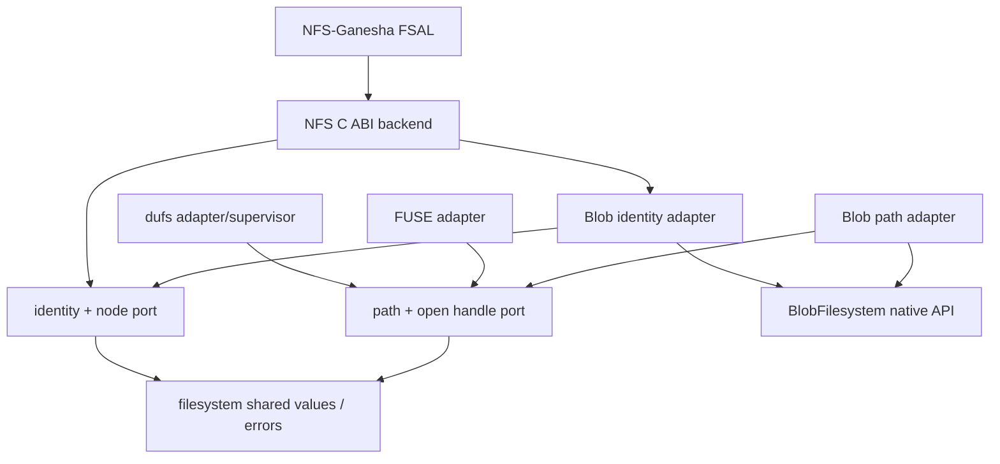

# Backend-neutral Filesystem API 归属

> 状态：两类 port 已归属 `zettide_storage` 且 frontend consumers 使用 public root；更细的 value/codec API 拆分尚未执行

本文细化 storage engine L3 的 filesystem ports，以及 BlobFilesystem 到这些 ports 的 adapter。
BlobFilesystem native domain 见 [Blob 与 BlobFilesystem 归属](blob-filesystem-map.md)。

## 结论

1. 保留两个 backend-neutral contract，而不是强行合并成一个最大公约数：
   - path/handle port 服务 FUSE、dufs 和 CLI-like frontend；
   - identity/node port 服务 NFS stable handle 和 parent/cookie 语义。
2. 两个 port 共享 metadata、node kind、stable identity、space info 和语义错误 vocabulary，
   但可以拥有不同 operation shape。
3. `filesystem_backend.zig` 不应继续使用 C sentinel path，也不应因 import persisted metadata codec
   而要求每个 frontend 链接 CRC32C。
4. `blob_filesystem_adapter.zig` 与 `nfs_blob_adapter.zig` 都属于 storage-engine L3；它们借用已打开
   BlobFilesystem，不拥有或关闭 native filesystem。
5. File/Directory handle 是 move-only owned context；`close` 即使返回错误也必须消费并 destroy
   context。Filesystem view 本身是 borrowed，不提供 close。
6. NFS file-handle wire codec 和 C ABI 仍属于 NFS adapter/frontend，不进入 generic port；稳定字节
   和现有 C ABI 不变。
7. `filesystem_target.zig` 是 Pool/Blob/file/device 产品 composition，不属于 backend-neutral API。

## 两类 port



禁止：

- port import BlobStore/Blob map/Pool/SPDK/Linux/FUSE/NFS C types；
- shared values import persisted checksum codec；
- frontend 直接访问 BlobFilesystem private fields 或 format pages；
- NFS stable handle 通过 path 重新定位对象；
- generic port 返回 errno、NTSTATUS、NFS status 或 C callback type。

## Path/handle port

| 当前文件 | 首轮目标 | 说明/动作 |
| --- | --- | --- |
| `filesystem_backend.zig` | `filesystem/path_port.zig` | backend-neutral path、file handle、directory cursor contract；拆出 shared values，移除 C path shape |
| `blob_filesystem_adapter.zig` | `filesystem/blob_path_adapter.zig` | BlobFilesystem native inode API 到 path/handle port 的映射 |

当前 path port 提供：

- stat by path 和 stat by stable file ID；
- pin/unpin path-independent file identity；
- metadata set/patch；
- mkdir、symlink、FIFO、link、remove、rename；
- special-file read；
- path/file-ID open；
- file read/write/truncate/fallocate/sync；
- directory snapshot cursor seek/tell/sync；
- filesystem sync 和 space info。

### 目标 path value shape

| 当前 shape | 问题 | 目标 |
| --- | --- | --- |
| `[*:0]const u8` path | C/FUSE representation 泄漏到 engine port | 使用 `[]const u8`；C adapter 在边界执行 `span`/NUL validation |
| `[256:0]u8` directory name | sentinel 与固定 storage 混合 | 保留 bounded caller-owned buffer 也可，但公开 slice，不要求 C sentinel |
| `DirectoryEntry.Kind {file,directory}` | symlink/FIFO 被压成 file | 使用完整 shared node kind，frontend 再映射能力 |
| `NodeInfo.identity` + optional `file_id` | 两个 identity 含义不清 | 明确命名为 all-node identity 与 optional path-independent reopen identity，或证明可安全合并 |
| `read_special` | 同时暗示 symlink/FIFO，语义模糊 | 首轮明确为 readlink/special payload capability；不能把 FIFO 当普通可读文件 |

路径必须保持相对/绝对、`/`、`.`、`..`、trailing slash、embedded NUL 和 UTF-8/name-profile
规则的明确验证点。port 不执行 locale normalization；具体 backend 使用其 persisted name profile。

### Borrowed Filesystem 生命周期

`Filesystem` 是 `{context, vtable}` borrowed view：

- 不拥有 adapter 或 native filesystem；
- 所有由它创建的 handle 关闭前，adapter 和 native filesystem 必须存活；
- native filesystem 关闭前，所有 handle、pin 和 directory snapshot 必须释放；
- frontend mount/export owner 负责上述 teardown 顺序。

目标 API 需要通过文档和 owner type 强化该约束；不能给 borrowed view 增加一个会关闭 native
filesystem 的通用 `close`。

### FileHandle 与 DirectoryHandle

现有 move-only 语义保留：

- handle context 由调用时传入的 allocator 创建；
- backend `close` 负责释放 native retain/pin/session；
- vtable `destroy` 负责释放 heap context；
- wrapper 先 poison/消费自身，并用 `defer destroy` 保证 native close 失败时仍释放 context；
- 调用者不得复制 handle 或 close 两次。

后续若增加 debug state 或显式 owner wrapper，不能改变“close on error 仍消费”的行为。

## Blob path adapter

`blob_filesystem_adapter.zig` 当前正确保持 borrowed adapter 边界，并把 Blob inode/generation 编成
16-byte identity。首轮迁移保留：

- identity 包含 inode generation，旧 inode 重用后 stale handle 失败；
- Blob device UUID 参与 path-port identity namespace；
- non-directory open/retain/release；
- directory open 时 retain inode 并持有 immutable snapshot；
- read/write/stat 在 handle generation 上重新验证；
- read-only backend 拒绝 writable open；
- Blob `ReadOnlyFilesystem`、full/name errors 在 engine adapter 层规范化为 protocol-neutral errors。

### Open transaction 拆分缝

当前 path `open_file` 的 resolve/create、retain 和 optional truncate 分成多个 native transaction；
nonexclusive create 对 namespace race 做最多四次重试。这个行为不能被 public API 默认为“原子
POSIX open”。

实施时二选一并通过并发测试固定：

1. 在 native BlobFilesystem 增加一个 transaction-scoped open/create/truncate primitive；或
2. 把 port 明确拆成原子的 namespace create/lookup 与后续 handle open，frontend 显式组合。

无论选择哪种方式，必须保持：exclusive create 不覆盖已有对象、truncate 仅允许 writable、
open handle retain 与 unlink-orphan 生命周期一致、namespace race 不泄漏 retain/context。

## Identity/node port

| 当前文件 | 首轮目标 | 说明/动作 |
| --- | --- | --- |
| `nfs_filesystem.zig` | `filesystem/identity_port.zig` | borrowed stable-node API；去除仅命名上的 NFS 绑定，保留 NFS 所需语义 |
| `nfs_blob_adapter.zig` | `filesystem/blob_identity_adapter.zig` | Blob inode/generation 到 identity/node API 的映射 |

identity port 与 path port 不同：

- `Filesystem` 带 stable `filesystem_id`；
- `Node` 包含 kind 与 16-byte identity；
- root/stat/lookup/parent 都返回完整 NodeInfo；
- read/write/truncate/setattr 以 Node 为目标并验证 stale generation；
- create/link/remove/rename 以 parent Node + name 操作；
- directory cursor 从 caller cookie 开始，并在每个 entry 返回 `next_cookie` 和 NodeInfo；
- 不依赖 path 缓存，也不通过 path 恢复 stable handle。

这些正是 NFS/FSAL 所需语义，因此不能为了“统一接口”改为 path-only facade。

### Identity 与 cookie 规则

- shared `NodeIdentity` 是 opaque 16 bytes；port 不解释 inode/generation layout；
- Blob adapter 当前直接编码 inode+generation，继续拒绝 zero/stale/kind mismatch；
- `filesystem_id` 用于 export/volume scope，不得用 endpoint path 或 mount path 代替；
- directory cookie 是 cursor contract，不等同 persisted inode offset；
- reopen-from-cookie 行为、EOF、invalid cookie 和 snapshot mutation visibility 必须由 conformance test 固定；
- identity port 不负责 NFS wire handle magic/version/checksum。

## Shared filesystem values

当前 `metadata.zig` 同时定义 runtime values 和 CRC32C wire codec。若 path/identity ports 直接 import
该文件，所有 consumer module 都间接取得 format algorithm dependency。

目标拆分：

```text
filesystem/types.zig
  NodeKind
  NodeIdentity
  Metadata
  MetadataPatch
  NodeInfo/SpaceInfo shared fields
  semantic errors

filesystem/format/metadata.zig
  encoded_size/version
  encode/decode/checksum
  -> imports crc32c
```

BlobFilesystem format 使用 metadata codec；ports 和 frontends 只使用 values。为迁移兼容，旧
`metadata.Metadata/Patch/Kind` 可以暂时 re-export 新 value，不改变 field 或 enum wire value。

两个 ports 应共享的最小类型：

- full node kind：file、directory、symlink、FIFO；
- metadata：mode、uid/gid、四种 timestamp、Windows attributes；
- metadata patch；
- opaque node identity；
- size、allocated bytes、nlink；
- filesystem space geometry；
- protocol-neutral semantic errors。

## Error contract

当前 vtables 返回 `anyerror`，Blob adapters 只局部执行 `frontendError/normalizeError`。这使
frontend 可能看到 Blob implementation error，并各自产生不一致 errno/NFS status。

目标规则：

1. engine port 定义有限的语义错误 vocabulary，例如 not-found、stale-handle、already-exists、
   not-directory、is-directory、not-empty、read-only、access-denied、invalid-name/argument、
   no-space、unsupported、I/O/frozen；
2. backend adapter 负责从 native domain error 规范化一次；
3. FUSE、dufs、NFS C ABI 分别把语义错误映射为协议状态；
4. 不把 raw errno 或 Blob-specific error 作为 public contract；
5. `OutOfMemory`、cancellation 和 backend I/O failure 仍保持可区分，不得都压成 invalid argument。

首轮可以继续使用 Zig error union，但测试必须验证 operation 到语义错误的映射。

## Directory 语义

### Path cursor

Blob path adapter 当前在 open 时获取 directory snapshot，并使用：

- cookie 0/1 合成 `.`/`..`；
- cookie 2+ 映射 snapshot entry；
- u32 seek/tell；
- close 时 deinit snapshot 并 release retained inode。

这适合 FUSE handle，但 cookie 只在该 snapshot 生命周期内有效。不得把它宣称为跨 reopen 的
NFS cookie。

### Identity cursor

Blob identity adapter 返回 child NodeInfo 和 explicit `next_cookie`，不合成 path port 的
`.`/`..`，且允许从 caller cookie 打开。NFS C ABI/FSAL 决定 protocol-level dot entry 和
cookie verifier 处理。

两个 cursor 可共享 move-only close helper，但不应共享一个丢失 cookie/identity 语义的 vtable。

## NFS handle 与 C ABI 边界

| 当前文件 | 目标归属 | 规则 |
| --- | --- | --- |
| `nfs_handle.zig` | NFS protocol adapter value | 保持 `ZNFH` magic、version、44-byte encoding、volume UUID 和 CRC32C |
| `nfs_backend.zig`/`.h` | NFS C ABI backend | 依赖 identity port；保持所有 `zettide_nfs_*` symbol/signature |
| `services/nfs-fsal/` | 独立 NFS-Ganesha process module | 只通过稳定 C ABI 调用 backend |

`nfs_handle.zig` 当前为 identity type import `filesystem_backend.zig`。目标改为只 import shared
`NodeIdentity/NodeKind`，避免 NFS wire codec 依赖 path port。它仍属于 NFS adapter，不下沉为
通用 engine persisted format。

## Consumer 归属

frontend 的进程、构建和稳定接口详见
[FUSE、NFS 与 dufs Frontend 归属](frontend-map.md)。

| Consumer | 使用 port | 归属 |
| --- | --- | --- |
| `linux_fuse.zig` | path/handle | Linux FUSE frontend adapter |
| `dufs_server.zig` | path/handle | dufs process/supervisor adapter |
| `nfs_backend.zig` | identity/node | NFS C ABI adapter |
| `services/nfs-fsal/` | C ABI，不直接 import Zig port | NFS-Ganesha 独立进程 |
| `filesystem_target.zig` | 不应作为 port consumer facade | CLI/node target composition |

`filesystem_target.zig` 负责 inspect/format/open Pool 或 regular file、构造 BlobDevice/Store/
Filesystem，并管理 owner lifetime。它可以最终产出 path 或 identity adapter，但不能进入
filesystem port module，也不能让 port import Pool provisioning。

## Public facade

storage-engine L3 首轮建议公开：

- `filesystem.types`；
- `filesystem.path` borrowed Filesystem/FileHandle/DirectoryHandle；
- `filesystem.identity` borrowed Filesystem/Node/Directory；
- Blob path adapter；
- Blob identity adapter。

不从此 facade 导出：FUSE C API、NFS C ABI、Ganesha structures、dufs subprocess、Pool target
planning、Blob private map/store 或 SPDK。

## 测试迁移矩阵

| Test root | 应覆盖 | 禁止依赖 |
| --- | --- | --- |
| shared values | metadata/node/identity/error value semantics | CRC32C codec、Blob runtime、frontend |
| path port ownership | file/directory close-on-error consumes and destroys context | Blob/FUSE/NFS |
| Blob path conformance | paths、open flags、identity、pin/retain、metadata、directory snapshot、readonly/error mapping | FUSE C API |
| identity port ownership | directory close-on-error、filesystem_id/node/cookie shapes | NFS C ABI |
| Blob identity conformance | stale generation、kind mismatch、parent/lookup/link/rename、cookie resume、readonly/error mapping | FSAL/C ABI |
| FUSE integration | lookup/open/unlink-open/rename/readdir/errno | Blob private fields |
| NFS integration | stable handle、readdir cookie、rename/link/setattr/status mapping | path reconstruction |

当前 path port 只有 handle close ownership unit tests，Blob path adapter 有四组 integration tests；
identity port 只有 directory close unit test，Blob identity adapter 没有独立 test block。拆 root 前必须
补齐 identity conformance test，不能只依赖 `nfs_backend` 或 FSAL shell gate 的传递覆盖。

## 剩余边界工作

- [ ] metadata runtime values 与 CRC32C codec 分离；
- [ ] 建立 shared NodeKind/NodeIdentity/NodeInfo/error vocabulary；
- [ ] path API 的 sentinel path 改为 slice，并在 frontend 边界转换；
- [ ] 明确 all-node identity 与 optional reopen identity 的命名/关系；
- [ ] 修复 path directory entry kind 丢失；
- [ ] 冻结 open/create/truncate 的并发原子性 contract；
- [ ] 将 `nfs_filesystem.zig`/`nfs_blob_adapter.zig` 作为独立 identity port/adapter 纳入 engine L3；
- [ ] `nfs_handle.zig` 改依赖 shared identity value，而非 path port；
- [ ] 为两个 ports 建立独立 conformance test roots；
- [ ] FUSE、dufs 和 NFS C ABI 只依赖对应 public port。

本文只定义 backend-neutral API 方向；CLI、NFS C ABI、磁盘格式和 frontend 行为由对应规范维护。
