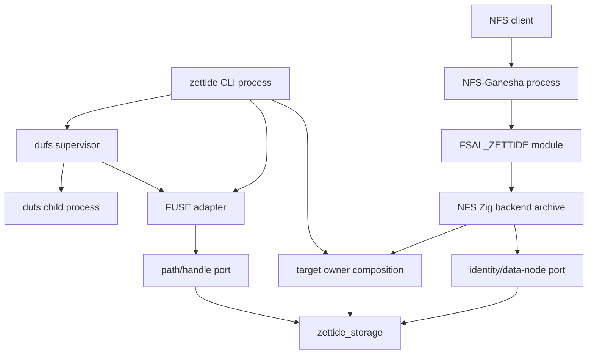

# FUSE、NFS 与 dufs Frontend 归属

> 状态：frontend 源码已归 `services/data-node/`，NFS backend 已移除 mega-module 依赖；CLI/FUSE/dufs compatibility 与 C ABI 保持不变

本文细化 storage engine L3 ports 之上的 Linux/protocol frontends。backend-neutral contracts 见
[Backend-neutral Filesystem API 归属](filesystem-api-map.md)。

## 结论

1. `linux_fuse.zig` 是 Linux/libfuse3 adapter，只属于 `zettide` CLI foreground frontend；不进入
   storage-engine portable root，也不由 `zettide-data-node` 隐式启动。
2. `dufs_server.zig` 是 Linux-only process supervisor：它建立 private FUSE mount、启动外部 `dufs`
   子进程并协调 signal/teardown；不属于 filesystem engine。
3. `nfs_filesystem.zig` 与 `nfs_blob_adapter.zig` 已归 storage-engine L3 identity port/adapter；
   `nfs_handle.zig`、`nfs_backend.zig/.h` 和 `services/nfs-fsal/` 属于 NFS frontend。
4. NFS-Ganesha 保持独立产品进程。FSAL 是进程内 Ganesha module，通过稳定 C ABI 调用静态链接的
   Zig backend；不通过 FUSE、Linux VFS 或 IPC。
5. NFS backend 当前在 Ganesha 进程内直接打开 standalone BlobFilesystem 或单个 Blob Pool Member。
   这意味着该 Ganesha export 是 storage runtime owner；data-node/CLI 不得同时 writable-open 同一目标。
6. 重构必须保持 FUSE CLI 行为、dufs 参数/信号语义、NFS C ABI、44-byte stable handle 和
   FSAL config keys；不能借目录移动顺便升级协议。
7. 所有 frontend build target 显式声明其平台依赖。import `zettide_storage` 不能自动链接 libfuse、
   Ganesha、dufs、Linux signalfd/pidfd 或 NFS backend archive。

## 目标依赖与进程模型

禁止：

- engine import FUSE/NFS/dufs；
- FUSE adapter import Blob private map/store；
- FSAL 直接 import Zig engine internals；
- NFS backend import legacy `zettide` facade（`services/data-node/root.zig`）或 engine `v3` 私有相对路径；
- data-node 与独立 Ganesha/CLI frontend 同时成为同一 Pool 的 writable owner；
- 用 mount path、export path 或 endpoint locator 代替 persisted filesystem identity。

## FUSE frontend

| 当前文件 | 首轮目标归属 | 说明 |
| --- | --- | --- |
| `services/data-node/linux_fuse.zig` | `zettide` CLI Linux frontend module | libfuse low-level adapter、inode/dentry cache、file/directory handles、session lifecycle |
| `services/data-node/fuse_shim.c`/`.h` | FUSE build adapter | 隔离 libfuse C API 和 connection/session helpers |

`linux_fuse.zig` 只能依赖：

- storage-engine path/handle port 和 shared filesystem values；
- explicit `linux_c`/libfuse3 module；
- std allocator/thread/process APIs。

它不应依赖 Pool、BlobStore、Blob format、SPDK、endpoint registry 或 NFS ABI。

### MountState 职责

MountState 是 FUSE session 私有 adapter state，保留以下行为：

- 将 backend opaque identity 映射为 `fuse_ino_t`；
- 维护 inode、dentry/path、lookup count、open count 和 hard-link alias；
- pin/unpin backend path-independent identity，支持 unlink-open 文件；
- 管理 backend FileHandle/DirectoryHandle；
- 映射 metadata、access time policy、statfs 和 Linux errno；
- 管理 optional async read completion 和 drain；
- 处理 FUSE forget、release、releasedir，不能让 backend retain 泄漏。

name/path cache 是 frontend runtime locator，不是 filesystem authority。portable name normalization 后
identity 变化时，cache 必须按 backend identity reconciliation，而不是仅按 spelling 复用 inode。

### Session 生命周期

当前存在两种兼容入口：

- `Session.start`：mount 后启动 FUSE loop thread，供 dufs supervisor 使用；
- `mount`：当前线程阻塞运行 foreground FUSE loop，供 `zettide mount` 使用。

`Session.stop` 必须按顺序：

1. 尚未退出时请求 session exit；
2. join FUSE loop thread；
3. 读取 loop result；
4. drain outstanding async reads；
5. destroy libfuse session；
6. deinit MountState，释放所有 backend handles/pins/cache；
7. 释放 session/state allocation；
8. 最后返回 session failure。

callback 只用于通知 owner loop 已退出，不能在 callback 内抢先释放 Session。native BlobFilesystem
必须比 MountState 和所有 handles 活得更久。

### FUSE 外部兼容

保持：

- CLI mount/unmount 参数和 foreground behavior；
- `default_permissions`、`allow_other`、`ro` mount option；
- libfuse low-level operations set；
- read-only、atime/relatime、writeback-cache 和 sync semantics；
- `fusermount3 -u` compatibility entry；
- Linux errno mapping和 inode/handle lifetime。

`fusermount3` invocation、C sentinel path 和 libfuse structs 都留在 frontend，不进入 engine port。

## dufs frontend

| 当前文件 | 首轮目标归属 | 说明 |
| --- | --- | --- |
| `services/data-node/dufs_server.zig` | `zettide` CLI Linux frontend/supervisor | private mount、child process、signal/pidfd/pipe supervision |

`dufs_server.serve` 当前流程：

1. 用 `dufs --version` preflight external binary；
2. 在 `/tmp` 创建 mode 0700 的随机 private mountpoint；
3. block SIGINT/SIGTERM，建立 signalfd 和 FUSE-exit notification pipe；
4. 通过 `linux_fuse.Session.start` mount backend；
5. 以 private mountpoint 为第一个参数启动 `dufs` child process；
6. poll signal、FUSE exit 和 child pidfd；
7. stop 时先向 child 发 SIGINT，5 秒后 SIGKILL；
8. stop FUSE、reap child、删除 private mountpoint；
9. 区分 user termination、FUSE failure 和 child failure。

这些是 Linux process semantics，不能包装成 storage-engine API。`target_path` 是日志/CLI 上下文，
实际数据访问由已经打开的 filesystem port 提供。

当前 spawn 期间使用 process-global signal handler/atomic flag，因此应继续作为一个 CLI command 的
single supervisor 使用；未经重设计不能在 data-node daemon 内并行启动多个 dufs supervisor。

稳定行为：

- 透传已有 dufs arguments；
- child/FUSE 任一退出都会触发另一侧 teardown；
- partial upload 不因 supervisor teardown 变成已提交 filesystem authority；
- read-only target 必须拒绝上传；
- 正常/错误路径都不能残留 mount、child 或 `/tmp/zettide-dufs-*` directory。

## NFS identity adapter 与 frontend 分界

以下文件属于 storage-engine L3，不是 NFS frontend：

| 文件 | 归属 |
| --- | --- |
| `nfs_filesystem.zig` | identity/data-node port，目标 `filesystem/identity_port.zig` |
| `nfs_blob_adapter.zig` | BlobFilesystem identity adapter，目标 `filesystem/blob_identity_adapter.zig` |

以下文件属于 NFS frontend：

| 当前文件 | 首轮目标归属 | 说明 |
| --- | --- | --- |
| `nfs_handle.zig` | NFS wire value | stable handle magic/version/volume scope/checksum |
| `nfs_backend.zig` | NFS Zig ABI backend | export owner、threaded I/O、locking、C ABI/status conversion |
| `nfs_backend.h` | installed public C ABI | opaque handles、status enum、structs 和 function declarations |
| `services/nfs-fsal/*.c/.h` | Ganesha V13 FSAL module | FSAL operations、access checks、stable-write batching、ABI calls |
| `services/nfs-fsal/CMakeLists.txt` | Ganesha module build adapter | 链接 backend archive 与 Ganesha |

为使归属清晰，可将 Zig backend/header 最终与 `services/nfs-fsal/` 邻接组织；无论物理路径如何，
安装 artifact 名 `libzettide-nfs-backend.a` 和 include path `zettide/nfs_backend.h` 保持兼容。

## NFS stable handle

`nfs_handle.zig` 定义的 wire format 是 frontend compatibility contract：

- encoded size：44 bytes；
- magic：`ZNFH`；
- version：1；
- data-node kind；
- 16-byte volume/filesystem UUID；
- 16-byte backend identity；
- CRC32C over preceding bytes；
- malformed、foreign-volume 和 unsupported kind 拒绝规则。

目录移动不得改变任何字段。它应依赖 shared NodeIdentity/NodeKind value，而不是 path/handle port，
但仍由 NFS frontend 拥有。新版本必须独立 versioning 并保留旧 handle decode policy。

## NFS C ABI

`nfs_backend.h` 是稳定外部接口，必须保持：

- `ZETTIDE_NFS_HANDLE_SIZE == 44`；
- `ZETTIDE_NFS_NAME_CAPACITY == 256`；
- status enum numeric values 0-16；
- data-node kind numeric values 1-4；
- attributes、directory entry、set attributes、filesystem info 的 C layout；
- set-attribute mask bits；
- 全部 `zettide_nfs_*` function symbol、参数和 ownership。

opaque ownership：

- successful `zettide_nfs_export_open` 返回一个 export owner；
- `zettide_nfs_export_close` 消费 export even when native close reports failure；
- directory open 返回的 cursor 必须在 export close 前关闭；
- every output pointer/name length/buffer pair 在 ABI boundary validation；
- Zig panic、allocator pointer 或 `anyerror` 不能跨越 C ABI。

status conversion 先由 identity adapter 形成 protocol-neutral semantic error，再由 NFS backend 固定为
`zettide_nfs_status`，最后 FSAL 映射为 Ganesha `fsal_status_t`。

## NFS backend owner composition

当前 `nfs_backend.zig` 同时承担两层职责：

1. C ABI operation adapter；
2. 按 Target path 检测并打开 standalone BlobFilesystem、regular-file Pool Member 或 Linux block
   device，构造 owner 和 per-export `std.Io.Threaded` runtime。

首轮保留现有 artifact；C ABI operation 不直接 import Pool/Blob private 模块。当前 build 已显式注入
`zettide_storage` 与 CRC32C，file target、Linux block adapter 和 target owner composition 由同一
data-node package 内的 adapter import 提供。

`@import("zettide")` mega-module 和 `zettide.v3.*` private access 已删除。NFS backend target 不因此
链接 FUSE、dufs、SPDK、endpoint daemon、DataService 或 controller。源码内进一步拆出独立
`NfsExportOwner` composition 仍是后续内部整理，不改变 C ABI artifact。

当前只支持 standalone Blob target 或单个 BlobFilesystem Pool Member；multi-member physical Pool
export 仍是未实现能力。本步骤不扩大支持范围。

## Ganesha/FSAL 进程边界

`FSAL_ZETTIDE` 是加载进 NFS-Ganesha 的 module，因此：

- Ganesha process 是该 export 的 runtime owner；
- FSAL 与 Zig backend 同进程、同步函数调用；
- 与 `zettide-data-node` 是独立 process boundary；
- data-node 未来如管理 NFS，只能管理 desired config/process lifecycle，不能同时打开同一 writable Pool；
- crash/restart 后通过 stable handle 中的 filesystem UUID + identity 重新验证对象；
- FSAL 不通过 FUSE、VFS、Unix socket 或 endpoint daemon 访问 storage。

当前 profile 明确为 partial NFSv3：不支持 NFSv4 state、NLM locks、ACL、xattrs、quotas、pNFS 和
multi-member Pool export。不得在文档或 capability response 中宣称这些能力。

### FSAL responsibilities

保持 FSAL C 层职责：

- Ganesha V13 module registration 和 pinned FSAL ABI；
- export config：`Target`、`Writable`、`Stable_Write_Batch_Us`；
- handle host/wire conversion；
- attributes 和 status mapping；
- create/sticky/access checks；
- lookup/readdir/read/write/link/rename/remove/setattr/readlink；
- stable/unstable write 与 commit semantics；
- export/handle/directory allocation 和 release。

stable writes 可以按 arrival order 批量等待并由一次 `zettide_nfs_sync` durable flush 完成，但：

- drained/no-backlog batch 立即 sync；
- wait window 不能让旧请求 starvation；
- `Stable_Write_Batch_Us=0` 只禁用等待，不禁用 stable-write durability；
- sync failure 必须传播给 batch 内请求；
- unstable write 仍由后续 NFS COMMIT 触发 durable sync。

## 构建边界

| Target | 显式依赖 | 不得隐式依赖 |
| --- | --- | --- |
| FUSE module/CLI | path port、linux_c、libfuse3、fuse shim | NFS/Ganesha、SPDK |
| dufs CLI command | FUSE module、Linux signalfd/pidfd/process、external dufs | engine private modules、NFS |
| NFS backend archive | identity port、target owner、libc/libcpp、CRC32C/utf8proc as needed | FUSE/dufs/SPDK/endpoint |
| FSAL module | Ganesha V13、installed NFS header、backend archive | Zig private source imports |
| portable storage-engine tests | filesystem ports/adapters | libfuse、Ganesha、dufs binary |

`nfs_backend_module` 现只注入 `zettide_storage` 与共享 CRC32C module；target composition 通过
同一 `services/data-node` package 内的相对 adapter import 完成，不再注入 legacy `portable_core`。
backend archive 继续使用 PIC、bundle compiler-rt，并保留 static library/header install。

## 测试迁移矩阵

| Gate | 当前/目标覆盖 |
| --- | --- |
| FUSE unit root | atime policy、semantic error 到 errno、identity alias reconciliation、session owner helpers |
| `test-fuse` | real mount/syscalls、unmount、crash/durability、read-only、no leaked mount |
| `test-libfuse` | vendored libfuse syscall compatibility |
| blob/scheduled Pool FUSE fio | data path、reopen 和 throughput/integrity |
| dufs integration | health、upload/download、partial upload、signal teardown、read-only、no leaked mount/child |
| NFS handle unit | canonical 44-byte encoding、CRC、foreign UUID、invalid kind |
| `test-nfs-backend` | Zig direct operations、standalone/Pool target、stable handle reopen 和 C layout/symbol smoke |
| `test-nfs-ganesha` | real NFSv3 RPC、mount/readdir/read/write/rename/link/stable commit/unmount |
| automation NFS/CSI | Ganesha deployment/process integration；不替代 direct ABI tests |

新增 frontend module roots 后，FUSE tests 不编译 NFS/SPDK，NFS backend tests 不链接 libfuse，
portable engine tests 不探测 host mount/Ganesha/dufs。

## 剩余边界工作

- [x] FUSE module 改依赖 public path port/shared values；
- [x] FUSE/dufs 从 storage-engine root 和 data-node root 排除；
- [x] dufs supervisor 保持 CLI-only Linux capability；
- [x] NFS identity port/Blob adapter 移入 engine L3 后，frontend 只依赖公开 facade；
- [x] `nfs_handle.zig` 改依赖 shared identity value，保持 44-byte wire bytes；
- [ ] NFS ABI operations 与 Target owner composition 在源码上分离；
- [x] NFS backend 删除 mega-module 和 private `v3` imports；
- [x] build targets 显式隔离 FUSE、dufs、NFS/Ganesha dependencies；
- [ ] direct ABI static asserts、real FUSE、dufs 和 NFSv3 gates 保持通过；
- [ ] 文档继续标明 NFSv3/单 Member/无锁等能力限制。

本文只定义 frontend 归属和兼容边界；磁盘格式、CLI、NFS ABI 与运行时能力由对应规范和状态页维护。
