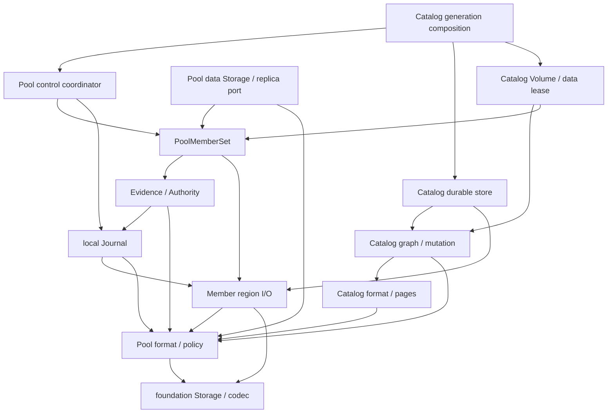

# Pool、Member 与 Catalog 归属

> 状态：源码已迁入 `libs/storage-engine/`，D1-D4 production 反向依赖已解除；领域内部进一步收窄仍按本文执行

本文细化 storage engine L2 中的 Pool、Member、control journal、authority、Catalog 和
Catalog Volume。shared Storage/codec 归属见[存储抽象与持久格式归属](storage-foundation-map.md)。

## 结论

1. Pool、Member、Catalog 首轮都进入同一个 `libs/storage-engine`，但必须保持内部单向依赖，
   不能以“同一个 package”为由继续任意相对 import。
2. Member 是 Pool 持久介质边界：拥有 header、control/metadata/data region 和 region claim；
   它只接收 backend-neutral Storage。
3. Journal/authority/member-set 属于 Pool control domain；Catalog 不参与 authority 选择算法。
4. Catalog 属于 Pool 之上的 data-mode domain：可以依赖 Pool authority、Member claims 和 layout，
   Pool core 不得 import Catalog graph/store/volume 实现。
5. 固定三成员 topology/layout/genesis 路径作为兼容实现保留；动态 Pool 是新 public facade 的
   主路径。格式 decoder 和 reopen 行为不能在重构中删除。
6. `pool_data_storage.zig` 当前实际是 Blob-on-Pool composition。它必须拆成通用 Pool data
   Storage 与 Blob geometry validation，而不是让 Pool core import `blob_format.zig`。
7. SPDK、Linux device planning、路径解析和 file creation 是 adapter/composition，不属于本区域
   portable root。

## 目标内部依赖

禁止反向边：

- `FORMAT -> Member/Journal/Catalog runtime`；
- `Pool authority/member-set -> Catalog graph/store`；
- `Pool/Catalog -> SPDK/Linux/endpoint/CLI`；
- `Pool -> Blob format/runtime`。

Pool format 可以持久化 data-mode feature bit、format version、placement digest 等稳定 wire
identifier。这不等于允许它 import BlobFilesystem runtime。

## Pool format 与 policy 文件

| 当前文件 | 首轮目标 | 说明/动作 |
| --- | --- | --- |
| `v3/member_format.zig` | `pool/format/member.zig` | Member header、A/B selection、feature policy、PoolDataMode wire value；保持 magic 和 feature bit |
| `v3/control_record.zig` | `pool/format/control_record.zig` | control envelope、digest 和 certificate framing；保持确定性 codec |
| `v3/topology.zig` | `pool/compat/topology_v1.zig` | 固定三成员 topology compatibility |
| `v3/layout.zig` | `pool/compat/layout_v1.zig` | 固定三副本 layout compatibility |
| `v3/genesis_payload.zig` | `pool/compat/genesis_v1.zig` | legacy topology/layout genesis payload |
| `v3/pool_topology.zig` | `pool/format/topology.zig` | 动态 member topology、slot/state/quorum |
| `v3/pool_layout.zig` | `pool/format/layout.zig` | protection layout 和 scheduled placement binding |
| `v3/pool_genesis_payload.zig` | `pool/format/genesis.zig` | 动态 Pool genesis payload |
| `v3/member_bootstrap.zig` | `pool/format/member_bootstrap.zig` | joining Member bootstrap evidence payload |
| `v3/membership.zig` | `pool/format/membership.zig` | membership proposal/certificate 和 transition validation |
| `v3/pool_certificate.zig` | `pool/format/certificate.zig` | generation quorum attestation certificate |
| `v3/pool_authority_checkpoint.zig` | `pool/format/authority_checkpoint.zig` | compacted authority snapshot payload |
| `v3/pool_blob_schedule.zig` | `pool/format/data_schedule.zig` | persisted scheduled-data placement plan；首轮保留字节，之后再评估泛化名称 |
| `v3/pool_policy.zig` | `pool/policy.zig` | control quorum、protection profile 和 degraded data access；纯值逻辑 |

`pool_layout.zig` 对 schedule 的依赖仅允许落在稳定 persisted value/codec 上。计划构造、
设备 I/O 和 Blob header 校验不得进入 format module。

## Member 与 local journal 文件

| 当前文件 | 首轮目标 | 说明/动作 |
| --- | --- | --- |
| `v3/member.zig` | 拆为 `pool/member.zig` 与 file adapter | Storage-based create/open、region bounds、claims、freeze/close 属于 engine；`createAt/openAt` 和 parent-directory sync 移到 adapter |
| `v3/journal.zig` | `pool/journal.zig` | 单 Member control ring、scan/history、prepare/append、checkpoint/reclaim |
| `v3/member_set.zig` | `pool/compat/member_set_v1.zig` | 固定三成员 authority/open compatibility；路径型 Location API 留 adapter 或改接 Storage |
| `v3/replicated_journal.zig` | `pool/compat/control_coordinator_v1.zig` | 固定三成员 replicated control coordinator |

### Member portable 边界

保留在 engine：

- `createStorage`、`createPoolStorage`、`createJoiningStorage`、`openStorage`；
- header A/B write ordering、journal-first creation 和 durability barrier；
- control/metadata/data region bounds；
- journal、catalog 和 data exclusive claims；
- read/write/batch/sync、fencing、freeze 和 owned close。

移出 portable Member：

- basename/path validation；
- `std.Io.Dir` location composition；
- regular-file create/open；
- Linux parent directory sync；
- raw block eligibility 或 io_uring/SPDK 选择。

文件 adapter 必须复用 Storage-based API，不能复制 header/journal 创建顺序。

## Dynamic Pool runtime 文件

| 当前文件 | 首轮目标 | 说明/动作 |
| --- | --- | --- |
| `v3/pool_evidence.zig` | `pool/evidence.zig` | 从多 Member history 验证 generation/membership/bootstrap evidence |
| `v3/pool_authority.zig` | `pool/authority.zig` | authority 选择、replay、compacted root 和 administrative recovery |
| `v3/pool_member_set.zig` | 拆为 `pool/member_set.zig` 与 adapter/数据模式验证 | Storage scan、authority/control/data access 属于 Pool；Location open 和 Catalog-specific reopen validation 分离 |
| `v3/pool_replicated_journal.zig` | 拆为 `pool/control_coordinator.zig` 与 `catalog/generation_coordinator.zig` | 当前同时负责 control quorum、membership/bootstrap/checkpoint、Catalog staging 和 data initialization，职责过宽 |
| `v3/pool_provision.zig` | `pool/provision.zig` | 接收 Storage 并构造 Member/genesis；Blob minimum geometry 改由 caller/data-mode contract 提供 |
| `v3/replica_endpoint.zig` | `pool/replica_endpoint.zig` | Member metadata/data backend-neutral port；继续使用 foundation I/O batch types |
| `v3/pool_data_device.zig` | `pool/data_device.zig` | unprotected/replicated logical device 和 write-freeze；不解释 Blob format |
| `v3/pool_data_storage.zig` | 拆分 | PoolMemberSet/claims 到 logical Storage 的通用部分归 Pool；Blob size/alignment/header eligibility 归 Blob-on-Pool adapter |
| `v3/pool_scheduled_data_device.zig` | `pool/scheduled_data_device.zig` | schedule-driven logical Storage；只依赖 Pool schedule/replica port，不依赖 Blob format |

### PoolMemberSet 拆分缝

当前 `pool_member_set.zig` 在 writable open 中同时：

1. 扫描 Member 与 control history；
2. 选择 Pool authority；
3. 计算 control/data availability；
4. 对 Catalog root/pages 做 mode-specific 验证和 repair eligibility。

目标将 1-3 保留为 Pool core。第 4 项由 Catalog open composition 实现，可使用 Pool 所拥有的
可选 data-mode validation port，或由 `CatalogPool.open` 包装已扫描的 PoolMemberSet。无论采用
哪种形式，都必须保持当前行为：Catalog page 损坏的 voter 不能错误进入 writable quorum。

### Control coordinator 拆分缝

`pool_replicated_journal.zig` 当前超过单一 replicated journal 职责：

- 通用 generation prepare/commit；
- membership、member bootstrap；
- authority checkpoint/rollover；
- Catalog graph staging、repair 和 data initialization；
- in-file SPDK provider integration test。

目标 `pool/control_coordinator` 只拥有 control journal quorum 和 authority transition。Catalog
transaction composition 负责先验证/写入 data 与 metadata，再调用 control commit，并处理
unknown outcome/freeze。拆分不能改变“data durable -> catalog durable -> control commit”的顺序，
也不能把 Catalog commit 变成无 fencing 的普通回调。

## Catalog 文件

| 当前文件 | 首轮目标 | 说明/动作 |
| --- | --- | --- |
| `v3/pool_catalog.zig` | 拆为 `catalog/format.zig` 与 `catalog/validation.zig` | Root、VolumeDescriptor、ExtentRun codec 与 Pool-aware semantic validation 分开 |
| `v3/pool_catalog_page.zig` | `catalog/page_format.zig` | typed leaf pages、canonical order、allocator intervals 和 page digest |
| `v3/pool_catalog_graph.zig` | `catalog/graph.zig` | authority binding、cross-page graph/geometry validation |
| `v3/pool_catalog_mutation.zig` | `catalog/mutation.zig` | copy-on-write extent allocation 和 candidate graph 构造 |
| `v3/pool_catalog_store.zig` | `catalog/store.zig` | Member CatalogClaim 上的 A/B root selection、stage/install/repair |
| `v3/pool_catalog_volume.zig` | `catalog/volume.zig` | VolumeMap、CatalogDataLease、read/write/flush 和 authority fencing |
| `v3/catalog_volume_header.zig` | `catalog/volume_header.zig` | LFSDRV2 per-volume header compatibility；保留 random/time 注入方式和 wire bytes |

Catalog 可以依赖 Pool 的：

- authority/topology/layout persisted value；
- Member geometry 和 Catalog/Data claims；
- control commit contract；
- ReplicaEndpoint 或 bounded data-region port。

Catalog 不得依赖 SPDK provider、endpoint name/NQN、FUSE/NFS、CLI 或 node lifecycle。

## 不属于本区域或需要改属的文件

| 当前文件 | 目标归属 | 原因 |
| --- | --- | --- |
| `spdk/catalog_volume_backend.zig` | `services/node` SPDK adapter | 将 CatalogVolumeBackend 适配为 SPDK provider C callback |
| `spdk/catalog_endpoint_backend.zig` | `services/node` endpoint/SPDK adapter | endpoint lifecycle 与 SPDK export composition |
| `v3/linux_pool_plan.zig` | Linux CLI/node device-plan adapter | sysfs/device acquisition 和 user confirmation token 不是 engine domain |
| `v3/file_storage.zig`、`v3/linux_*storage.zig` | platform storage adapter | 只负责产生 Storage |
| Blob format/store/filesystem | [BlobFilesystem 区域](blob-filesystem-map.md) | 只能依赖 Pool public data-region contract，不能被 Pool core import |

## D1-D4 处理决定

### D1：Pool production module import SPDK

SPDK bridge 的完整 ownership 和测试目标见
[SPDK Backend 与 Export 归属](spdk-adapter-export-map.md)。

重构前 `pool_replicated_journal.zig` 顶层 import
`../spdk/catalog_volume_backend.zig`，仅供同文件 provider 场景测试使用。该 production reverse import
及 `ProviderCompletion` helper 现已移除；provider error/status assertions 位于 node/SPDK adapter test。

处理：

- 删除 production module 的 SPDK import 和 `ProviderCompletion` test helper；
- provider 场景迁移到独立 node/SPDK integration test root；
- integration test 通过 `zettide_storage` public module 使用 Pool/Catalog，不用相对路径钻入 engine；
- portable Pool unit test 不注入 `spdk_c`。

### D2：Pool provisioning import Blob format

重构前 `pool_provision.minimumMemberBytes` 和 scheduled option 读取
`blob_format.minimum_device_size`、`blob_size`。现已提取 `data_mode_geometry.zig`；Pool 与 Blob
format 共同依赖该低层 value contract，原 Blob public constants 继续按原值重导出。Pool 不再
import Blob codec/runtime。

### D3：Pool data Storage import Blob format

`pool_data_storage.validateSet` 仍要求 Member 声明 `.blob` data mode，但只验证 logical region
非空且不超出 Member data region；Blob minimum/chunk/header geometry 全部留给上层 adapter。
production path 已不再 import Blob format。Blob Store/Filesystem over Pool 的 reopen 场景保留为
integration-style test，不能成为 production import。

### D4：Linux Pool plan import name profile

`linux_pool_plan.Options` 为兼容既有确认 token，暂时继续携带 `name_profile.Profile`；该文件现已
排除于 engine root，并作为 Linux/node composition adapter 通过 public `zettide_storage` import
该 value type。由此消除了 engine 内的反向依赖且不改变 token；后续目录迁移可再拆通用 device plan
与 Blob format options，但不得在本步骤改变 CLI 确认行为。

## Ownership 与生命周期

重构后必须保持以下 ownership：

- Storage 仅在 Member create/open 成功后转移；失败时 caller 或被调用函数按现有 contract close；
- `PoolMemberSet` 拥有成功收养的 Member/history；`take/adoptProvisionedMembers` 不重新打开设备；
- Journal claim、CatalogClaim、DataClaim 和 coordinator claim 都是 exclusive，release 可重复策略不得改变；
- writable Pool authority 或 commit outcome 不确定时保持 frozen，不能通过 wrapper 吞掉；
- CatalogDataLease 的 generation/history/root binding 在每次 write/flush 前后验证；
- SPDK Worker 只能借用 node-owned Pool，且 provider deletion 完成后才能释放 lease/set。

## 首轮 public facade

storage-engine root 首轮只需提供内聚 facade，不把每个 format 文件平铺为顶层能力：

- Pool：provision/open/recovery、authority、control coordinator；
- Member：Storage-based create/open 与只读 geometry/status；
- Pool data：authority-bound logical Storage；
- Catalog：open/validate/mutate/volume lease/backend；
- compatibility：显式 legacy namespace，供旧磁盘 reopen 和测试使用。

format codec、fault injection、raw claims 和 graph scratch 可以先作为 advanced/internal namespace。
CLI、node 和 SPDK adapter 不应继续依赖 `v3/root.zig` 的全量平铺导出。

## 测试迁移矩阵

| Test root | 应覆盖 | 禁止依赖 |
| --- | --- | --- |
| portable Pool format | header/topology/layout/control golden、corruption、feature policy | file/Linux/SPDK/Catalog runtime |
| portable Member/Journal | memory/custom Storage、A/B、scan、append、reclaim、fault ordering | SPDK/FUSE/endpoint |
| portable Pool runtime | authority selection、quorum、membership/bootstrap/recovery、data access | SPDK provider |
| portable Catalog | page/graph/mutation/store/lease、extent mapping、fencing | SPDK/FUSE/NFS |
| file adapter integration | createAt/openAt、parent sync、legacy reopen | SPDK |
| node SPDK integration | CatalogVolumeBackend provider read/write/flush/reset 和 teardown | engine 私有相对 import |

`pool_catalog_store.zig` 当前未在 `v3/root.zig` 平铺导出，但被其他模块传递编译。拆 root 后必须
给它显式 Catalog test root，避免仅靠传递 import 获得测试覆盖。

## 后续实施前置项

- [x] D1 provider test 移出 `pool_replicated_journal.zig`；
- [ ] Member 的 Storage API 与 file/path API 分离；
- [ ] PoolMemberSet control scan 与 Catalog-specific validation 分离；
- [ ] control coordinator 与 Catalog generation transaction 分离；
- [x] D2 data-mode geometry contract 落地；
- [x] D3 Pool production path 与 Blob format implementation 分离；
- [x] D4 Linux device plan 移出 engine root，并改依赖 public engine value type；
- [ ] legacy fixed-three 与 dynamic Pool 分别有独立 test namespace；
- [ ] Catalog store、volume 和 SPDK provider 各自进入正确 test root。

本步骤只冻结归属和拆分方向，不修改格式、CLI 或运行时行为。
