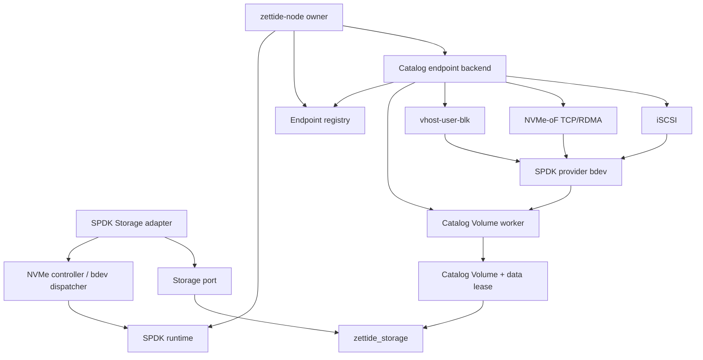

# SPDK Backend 与 Export 归属

> 状态：SPDK 源码已归 `services/node/spdk/`，tests/benchmarks 使用显式 roots；独立 node executable 的 SPDK composition 待完成

本文细化 storage engine 之外的 SPDK platform adapter 和 block frontend。foundation contract 见
[Storage 抽象与持久格式归属](storage-foundation-map.md)，Pool/Catalog lease 见
[Pool、Member 与 Catalog 归属](pool-member-catalog-map.md)。

## 结论

1. 全部 SPDK C/Zig wrapper 属于 Linux node platform，不进入 `libs/storage-engine/`。
2. `spdk/storage.zig` 是 engine `Storage` port 的 SPDK bdev implementation；依赖方向只能是
   `services/node SPDK adapter -> zettide_storage`。
3. `catalog_volume_backend.zig` 是 CatalogVolumeBackend 到 asynchronous SPDK provider bdev 的 bridge，
   不是 Catalog engine 本体。
4. vhost-user-blk、NVMe-oF TCP/RDMA 和 iSCSI 是 block export frontends；它们消费 Catalog Volume，
   不得反向进入 Pool/Catalog。
5. `catalog_endpoint_backend.zig` 是 node endpoint composition：它打开 authenticated Pool、创建 export、
   生成 locator，并实现 endpoint registry backend。
6. `zettide-node` 最终在单进程内拥有一个 SPDK runtime。CLI compatibility daemon 在迁移完成前可以
   使用同一 composition，但不能与 node 同时打开相同 writable Pool 或占用相同 listener/socket。
7. SPDK internal C ABI 不是磁盘或远程 wire format；C/Zig 两侧可成对重构，但 callback ownership、
   thread affinity、geometry、flush 和 retryable teardown semantics 必须保持。
8. 原 Pool production module 对 SPDK 的 test-only 反向 import 已移除；后续 SPDK tests 继续位于 node/integration roots。

## 目标依赖图

禁止：

- storage engine import `spdk_c`、SPDK headers、DPDK、endpoint registry 或 export wrapper；
- Pool/Catalog production module import `catalog_volume_backend.zig`；
- SPDK adapter 通过 `services/node/root.zig` mega-module 访问 engine private files；
- protocol export 绕过 CatalogDataLease 直接持有 Member data Storage；
- endpoint teardown 在 protocol/controller 或 provider bdev 仍 active 时释放 Worker/lease/Pool；
- runtime shutdown 时仍存在 active runtime lease、dispatcher、provider、controller、service 或 export；
- 将 SPDK bdev name、vhost socket path、NQN 或 listener address 当作 persisted Pool/Volume identity。

## 区域分层与文件归属

### Runtime 和 ingress adapter

| 当前文件 | 首轮目标归属 | 职责 |
| --- | --- | --- |
| `spdk/runtime.c/.h/.zig` | `services/node` SPDK runtime | SPDK app thread、reactors、runtime lease、start/stop |
| `spdk/nvme_controller.c/.h/.zig` | node SPDK ingress | attach/detach remote NVMe controller、namespace bdev names |
| `spdk/bdev_endpoint.c/.h` | node SPDK ingress C shim | 在 SPDK thread 打开 bdev、geometry、DMA I/O、remove event |
| `spdk/bdev_dispatcher.c/.h` | node SPDK ingress dispatcher | 将 non-SPDK caller dispatch 到 reactor owner，支持 batched reads |
| `spdk/storage.zig` | node SPDK Storage adapter | 将 dispatcher 实现为 engine `Storage` port |

### Provider 和 protocol export

| 当前文件 | 首轮目标归属 | 职责 |
| --- | --- | --- |
| `spdk/bdev_provider.c/.h` | node SPDK provider shim | 将 external async backend 注册为 SPDK bdev |
| `spdk/provider_bdev.zig` | node SPDK provider wrapper | provider create/delete-wait 和 backend callback contract |
| `spdk/vhost_blk_controller.c/.h` | node vhost frontend shim | vhost-blk controller create/remove/coalescing |
| `spdk/vhost_block_export.zig` | node vhost frontend | provider bdev + controller + socket path owner |
| `spdk/nvmf_tcp_export.c/.h/.zig` | node NVMe-oF frontend | subsystem/namespace/listener lifecycle，支持 TCP/RDMA |
| `spdk/iscsi_export.c/.h/.zig` | node iSCSI frontend | shared service、portal/initiator group 和 per-target export |

### Catalog bridge 和 endpoint composition

| 当前文件 | 首轮目标归属 | 职责 |
| --- | --- | --- |
| `spdk/catalog_volume_backend.zig` | node engine-to-SPDK bridge | lease-bound Catalog Volume worker/provider callback |
| `spdk/catalog_vhost_export.zig` | node export composition | Worker + provider bdev + vhost controller |
| `spdk/catalog_nvmf_export.zig` | node export composition | Worker + provider bdev + NVMe-oF subsystem |
| `spdk/catalog_iscsi_export.zig` | node export composition | Worker + provider bdev + iSCSI target |
| `spdk/catalog_endpoint_backend.zig` | node endpoint backend | PoolSource + export lifecycle + locator |

`vendor/spdk/` 继续是 pinned external source dependency。SPDK public headers 和 pkg-config libraries
只出现在 node/platform build target，不传播到 `zettide_storage` consumers。

## SPDK runtime ownership

`zettide_spdk_runtime` 是 process singleton：

- global process slot 拒绝第二个 active runtime；
- runtime 复制 name、reactor mask、JSON config、vhost socket path 等 options；
- 独立 pthread 调用 `spdk_app_start`，SPDK owner thread 由 app callback 取得；
- 为 dispatcher 按 reactor/core 建立并绑定 SPDK threads，I/O round-robin 分配；
- SPDK signal handlers 显式关闭，由 node process owner 管理 SIGINT/SIGTERM；
- runtime client acquire lease，成功 teardown 后 release；
- active lease 非零时 `stop` 返回 busy，不能强行 `spdk_app_stop`；
- stop 先退出 dispatcher owners，再停止 app、join pthread、调用 `spdk_app_fini`；
- destroy 只允许在 STOPPED 状态释放 runtime memory。

目标 node lifecycle：

1. 解析并验证 SPDK/node config；
2. 启动一个 runtime；
3. attach ingress NVMe controllers，必要时构造 Pool locations；
4. 创建 shared protocol services；
5. 初始化 endpoint registry/backend 并 reconcile desired endpoints；
6. 收到 shutdown 后停止接收控制请求；
7. registry shutdown，按 endpoint 关闭 exports；
8. 关闭 shared iSCSI service；
9. 关闭所有 SPDK Storage/dispatchers，detach ingress controllers；
10. runtime stop + destroy。

任何中间失败都必须反向 unwind 已成功阶段。runtime object、option strings 和 node allocator 必须比所有
runtime clients 活得更久。

## Ingress：SPDK bdev 到 Storage port

`nvme_controller` 负责把 remote NVMe-oF controller attach 为一个或多个 SPDK bdev namespace。
返回的 namespace name 是 runtime locator，只在 controller detach 成功前有效；Pool persisted identity
仍来自 Member header/authority。

`bdev_endpoint` 在指定 SPDK owner thread：

- 以 read-only/writable mode 打开 bdev descriptor 和 I/O channel；
- 固定 capacity、logical block、write unit、alignment、write-cache/flush capability；
- 监听 bdev remove event；
- 提交 read/write/flush，处理 queue-I/O-wait；
- 管理 SPDK DMA buffer；
- 在 close 后释放 channel/descriptor/runtime lease。

`bdev_dispatcher` 将普通 Zig/std.Io caller 调度到 runtime 分配的 SPDK thread。其 owner thread affinity
不能泄漏为 engine requirement。batched read 必须：

- 校验每个 descriptor；
- 在 DMA-capable buffer 可用时走 direct path，否则 bounce；
- 为每项返回独立 status；
- completion 恰好一次；
- close 前 drain outstanding operations。

`spdk/storage.zig` 只实现 engine Storage contract：

- canonical bdev name 用于 runtime `sameIdentity`，不是 persisted identity；
- capacity 和 minimum I/O size 来自 geometry；
- writable open 校验 write unit；
- write-cache bdev 没有 flush support 时拒绝 writable durable Storage；
- read/write 做 bounds 和 alignment validation；
- sync 映射 flush；
- remove、busy、read-only、alignment、I/O 等状态映射为 Storage semantic errors；
- batched async read 上限当前为 32，并统计 direct/bounce telemetry；
- close 先禁止新 async read，再等待所有 completion。

当前 `Storage.close` 的特殊规则必须记录：若底层 C dispatcher close 失败，Zig Storage context 仍被消费，
底层 dispatcher/runtime reference 有意 abandon，不能通过已释放 context 重试。与 export 的 retryable close
不同；后续若要修复，需先修改 Storage ownership contract 和 failure tests。

## Egress：Catalog Volume 到 provider bdev

`catalog_volume_backend.Worker` 持有：

- node-owned `PoolMemberSet` 的 `CatalogDataLease`；
- writable `CatalogVolumeBackend`；
- thread-safe allocator 和 `std.Io`；
- request queue、worker thread 和 completion state。

它将 SPDK provider 的 read/write/flush/reset request 转换为 Catalog Volume operations。规则：

- provider submit callback 不阻塞 SPDK thread，只校验、分配并 enqueue request；
- writes、flushes 和 resets 保持 request order；
- independent reads 最多 16 个并发，同时 completion 与请求一一对应；
- authority/data generation change 继续由 lease/backend 检测，不由 SPDK name 决定；
- close 只能在 provider unregister completion 后调用；
- close 停止 worker、join thread、释放 lease，之后 Pool 才可关闭。

provider C contract 保持：

- submit 返回 0 时 completion ownership 转移给 backend；
- submit 返回非零时 request 同步拒绝且不得 callback；
- backend 可从任意 thread complete；C shim 把 SPDK I/O completion 送回原 submit thread；
- each completion context 恰好完成一次；
- provider delete 成功才转移/消费 provider ownership；
- `ProviderBdev.close` unregister 失败时保留 handle，允许 retry；
- block size/count、write unit、max I/O blocks 和 read-buffer behavior 不得静默改变。

## Protocol exports

### vhost-user-blk

创建顺序：Worker -> provider bdev -> vhost-blk controller。socket path 由 runtime configured
vhost directory + deterministic controller name 组成。关闭顺序严格相反；controller remove 成功后才
unregister provider，随后关闭 Worker。coalescing 仍属于 vhost adapter option。

### NVMe-oF TCP/RDMA

创建顺序：Worker -> provider bdev -> NVMf subsystem/namespace/listener。runtime JSON 必须预先创建
selected target 和 transport。export wrapper 拥有 subsystem/listener handle，close failure 保留 ownership
供 retry。

保持 locator/protocol semantics：

- frontend 明确区分 TCP 与 RDMA；
- NQN、serial/model、host NQN、allow-any-host、transport address/service 和 NSID；
- 默认 service `4420` 和当前 NSID `1`；
- endpoint registry 返回的 protocol tag 与 locator tag 一致。

### iSCSI

portal group、initiator group 构成 shared `IscsiService`，per-endpoint target/LUN 依赖该 service。
创建顺序：shared service -> Worker -> provider bdev -> target export。所有 target export 关闭后才能关闭
service。保持 portal、target name、LUN、queue depth 和默认 service `3260` semantics。

当前 endpoint capability 是 vhost-user-blk、iSCSI、NVMe-oF TCP、NVMe-oF RDMA。SPDK support 或
transport 缺失时必须报告 unsupported/dependency error，而不是产生 active locator。

## Endpoint composition

`CatalogEndpointBackend` 把 endpoint registry lifecycle 适配为完整 export：

1. 根据 desired Spec 选择 frontend options；
2. 用 PoolSource 打开显式 locations；
3. 从 authenticated authority 读取 Pool ID 并与 Spec 比较；
4. 以 Volume ID 打开 lease-bound Catalog backend；
5. 以 Endpoint ID 生成 deterministic bdev/controller/NQN identity；
6. 创建 export，并返回 borrowed locator；
7. stop 时先关闭 export，再关闭 Pool。

现有 deterministic values 属于 endpoint compatibility：

- bdev name：`zvb-` + lowercase endpoint hex；
- vhost controller：`zvh-` + lowercase endpoint hex；
- NQN prefix：`nqn.2026-08.io.zettide:`；
- NVMe serial 由 endpoint identity 稳定派生；
- locator strings 在 endpoint stop 成功前有效。

start failure 必须 rollback 所有已部分创建的资源。stop failure 必须可重试：

- export close 失败时不关闭 Pool；
- export close 成功后清空 export handle；
- 随后的 Pool close 失败时 retry 不能重复关闭 export；
- instance 只在 Pool close 成功后销毁。

PoolSource 当前显式验证 location table、重复 location 和 authenticated Pool identity。它属于 node
configuration/composition，不进入 Pool engine。endpoint desired-state state machine 见
[Endpoint Lifecycle 与 Daemon 归属](endpoint-lifecycle-map.md)。

## D1：解除 Pool 到 SPDK 的反向依赖

重构前 `v3/pool_replicated_journal.zig` production file 顶层 import
`spdk/catalog_volume_backend.zig`，仅在同文件测试中调用 Worker/provider callback，使 portable Pool test
root 被迫认识 `spdk_c`。该 reverse import 和 test helper 已移除，provider status mapping 已迁到
`catalog_volume_backend.zig` adapter-local test。

实施方式已冻结：

1. 保留同文件的 pure CatalogVolumeBackend/lease/fencing tests；
2. 移除 production module 的 SPDK import 和 ProviderCompletion helper；
3. 将 Worker read/write/flush/reset、out-of-bounds 和 teardown 场景迁移到 node SPDK integration test；
4. integration test 只能依赖 public `zettide_storage` facade + node SPDK bridge；
5. portable engine test 不注入 `spdk_c`、不链接 SPDK/DPDK。

bridge 仍可依赖 public PoolMemberSet/CatalogVolumeBackend types；这是 adapter -> engine 的正确方向。

## C/Zig 边界

`runtime.h`、`bdev_endpoint.h`、`bdev_dispatcher.h`、`bdev_provider.h`、protocol export headers 等是
node 内部 C shim interface，不是对用户承诺的独立 SDK。移动时可以与 Zig wrapper 同步调整，但必须：

- 保留 `opts_size` init/validation，避免 C struct version mismatch；
- opaque C handles 不跨 node process；
- errno-style negative status 在 Zig boundary 映射为 typed errors；
- C callback 不 unwind Zig error/panic；
- all SPDK object mutation 在正确 `spdk_thread` 执行；
- malloc/DMA ownership 在 paired API 释放；
- no borrowed option string survives create unless explicitly copied；
- completion 和 delete ownership 遵循 header contract。

`spdk_c` translate-C module 只对 node SPDK modules 和专用 tests 可见。`zettide_storage` public root 不导出
SPDK C types。

## Build boundary

目标 build 至少拆成以下显式 roots：

| Root | 依赖 |
| --- | --- |
| `zettide_storage` | 无 SPDK/pkg-config/DPDK |
| node SPDK runtime/ingress | Linux、runtime/bdev endpoint/dispatcher/NVMe C shims、SPDK libs |
| node SPDK provider/exports | runtime、provider/protocol C shims、SPDK event/bdev/NVMf/iSCSI/vhost libs |
| node SPDK catalog bridge | `zettide_storage` public Catalog API + provider root |
| node endpoint composition | registry + PoolSource + catalog export drivers |
| SPDK unit/integration tests | 所需最小 root，不复用 mega-module |

当前 `configureSpdk` 仍把 runtime/provider/iSCSI/NVMf/vhost C files 和完整 SPDK library set 注入
compatibility `app_core`；bdev endpoint/dispatcher/NVMe controller 主要由专用测试脚本单独编译。
这是后续 node executable composition 的剩余构建债务。`-Dspdk=true` 继续只允许 Linux；默认
portable build 不探测或链接 SPDK。

当前边界为：

- `zettide_storage` 不导出任何 `spdk_*` symbol；
- `zettide_node` 导出 node composition 需要的 wrappers；
- benchmark/test roots 显式 import `zettide_node` 和 `zettide_storage`；
- legacy `services/node/root.zig` 只为兼容 CLI 重导出 SPDK surface；
- NFS backend、FUSE/dufs、controller、CSI 不因 import engine 而链接 SPDK。

## 测试迁移矩阵

| Gate | 覆盖 |
| --- | --- |
| runtime C tests | process singleton、start failure、lease busy、stop/destroy、thread violation |
| bdev endpoint/dispatcher tests | geometry、read/write/flush、remove event、DMA/bounce、batched completion、close drain |
| provider tests | callback ownership、multi-IOV、queue behavior、delete wait、busy/retry |
| Storage adapter tests | identity、alignment、bounds、durability capability、async read stats、close drain |
| NVMe controller tests | TCP/RDMA options、namespace names、detach ordering/error |
| vhost controller/export tests | provider + controller rollback、socket、coalescing、fio data integrity |
| NVMf export tests | target/transport lookup、subsystem/listener rollback、host policy、fio/commit |
| iSCSI tests | shared service、target/LUN lifecycle、fio/integrity |
| Catalog bridge tests | lease fencing、read concurrency、ordered write/flush/reset、provider-before-worker teardown |
| endpoint backend tests | deterministic names/locators、Pool ID mismatch rollback、close retry ordering |
| node daemon tests | one runtime owner、reconcile/shutdown、restart、no leaked socket/listener/bdev |
| benchmark-only roots | throughput/tail/direct-vs-bounce telemetry；不作为 correctness 替代 |

保留现有 `test-spdk-link`、endpoint、dispatcher、provider、vhost controller、storage、daemon、NVMe perf、
NVMe-oF/iSCSI/vhost fio 和 automation gates；但每个 gate 改为依赖最小 module root。需要 hugepages、root、
NIC/transport 或 external initiator 的测试继续显式 skip/required，不混入 portable unit gate。

## 剩余边界工作

- [x] 建立 node root 的 SPDK export surface，并从 engine root 排除 `spdk_c`；
- [x] runtime、ingress、provider、protocol export 和 catalog bridge 已归属 `services/node/spdk`；
- [x] `spdk/storage.zig` 改 import public Storage port；
- [x] Catalog bridges 改 import public Pool/Catalog facade；
- [x] D1 provider test 移出 Pool production module；
- [x] endpoint backend 依赖同 node package registry types，不用 mega-module；
- [ ] node startup/shutdown 严格执行 runtime owner 顺序；
- [ ] build 不再向 `app_core` 注入完整 SPDK source/library set；
- [x] SPDK Zig tests/benchmarks 改用显式 `zettide_storage` + `zettide_node` roots；
- [ ] direct C tests、protocol integration 和 fio gates 在新 roots 保持通过；
- [ ] 重构前后比较 endpoint locator、flush/durability 和 teardown failure behavior。

本文只定义 SPDK adapter/export 归属与运行时边界；磁盘格式、endpoint wire API、协议 identity
和当前运行能力由对应规范与状态页维护。
