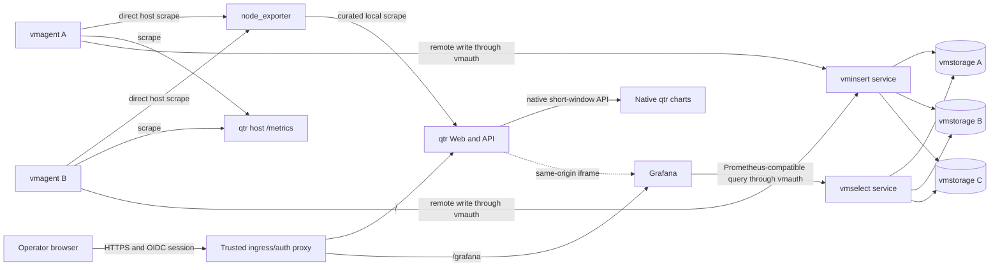

# Observability Deployment and qtr Integration

Status: proposed implementation design

This document defines the first production-oriented observability baseline for
Zettide. It covers standalone qtr charts, bundled host metrics, a highly
available VictoriaMetrics deployment, a recoverable Grafana deployment, qtr and
libvirt VM metrics, and secure dashboard embedding in qtr.

It does not claim that these capabilities exist today. The repository currently
has no product-level Kubernetes deployment layer, VictoriaMetrics resources,
Grafana provisioning, or qtr Prometheus endpoint.

## Decisions

The first implementation must use these decisions unless a later design changes
them explicitly:

- Deploy the monitoring stack on K3s or another conforming Kubernetes cluster.
- Require at least three schedulable nodes in distinct failure domains.
- Use the official VictoriaMetrics Operator and declarative custom resources.
- Run a VictoriaMetrics cluster with three `vmstorage` replicas and replication
  factor two.
- Run at least two replicas each of `vminsert`, `vmselect`, `vmauth`, and
  `vmagent`.
- Require an existing external StorageClass. The deployment must receive its
  name explicitly and must not silently use the cluster default.
- Start Grafana as one recoverable replica with dashboards and data sources
  provisioned from Git. Preserve a documented path to multi-replica Grafana.
- Provide native short-window VM charts in qtr with no VictoriaMetrics or
  Grafana dependency.
- Install a pinned `node_exporter` as a separate systemd service in the qtr host
  deployment profile and use it for optional native host charts.
- Put qtr and Grafana behind one TLS origin and one OIDC-authenticating reverse
  proxy.
- Embed provisioned Grafana panels in qtr for durable history and advanced
  analysis. Do not turn qtr's native charts into a general MetricsQL dashboard
  engine.
- Limit the first metrics scope to qtr, libvirt virtual machines, and the minimum
  health metrics needed to operate this ingestion path.

## Goals

- Show basic VM charts on a standalone qtr installation.
- Show basic host charts when the bundled `node_exporter` is enabled.
- Preserve long-term VM metrics across qtr, browser, and Grafana restarts when
  VictoriaMetrics is deployed.
- Continue accepting samples and serving queries after one stateless component
  replica fails.
- Keep replicated VM samples queryable after one `vmstorage` instance fails.
- Keep dashboards reproducible from repository state.
- Give a qtr user historical VM charts without a second Grafana login prompt.
- Keep VictoriaMetrics query and write endpoints off untrusted networks.
- Make storage, retention, version, and resource choices explicit deployment
  inputs.
- Verify ingestion, querying, restart recovery, embedding, and single-instance
  failure behavior in automated tests.

## Non-goals

- Monitoring every Zettide component in the first delivery.
- A general dashboard editor inside qtr.
- Durable or highly available storage for qtr's native short-window charts.
- Reimplementing Linux host collectors inside qtr.
- Multi-tenant metrics billing or tenant-controlled MetricsQL.
- Exposing Grafana anonymously, even with the Viewer role.
- Treating VictoriaMetrics replication as a backup.
- Claiming monitoring availability across a full Kubernetes cluster or storage
  failure-domain outage.
- Running `vmstorage` across high-latency regions.
- Grafana alerting high availability in the first delivery.

## Current State

qtr obtains live metrics directly from libvirt in `qtr/src/vm.rs`. Its REST API
includes one `VmMetrics` snapshot in VM summaries. The React pages in
`qtr/web/src/features/vms/vm-dashboard.tsx` and
`qtr/web/src/features/vms/detail.tsx` poll every two seconds, retain only the
previous browser snapshot, and calculate CPU and network rates locally. A page
reload discards that history.

qtr currently has:

- no `/metrics` endpoint;
- no historical metrics API;
- no native chart component or bounded time-series buffer;
- no Prometheus, MetricsQL, or VictoriaMetrics client;
- no chart dependency;
- no `node_exporter` deployment;
- no Grafana configuration;
- one management bearer token stored in browser `sessionStorage`.

The workspace currently has no Helm chart, Kubernetes operator deployment,
StorageClass, ServiceMonitor, VMServiceScrape, Grafana dashboard, or product
Ingress. `etz` has a Prometheus exporter, but it is outside the first delivery.

## Architecture



### Failure Domains

The three `vmstorage` pods must use required pod anti-affinity across
`kubernetes.io/hostname`. A production values file may replace this with a
stronger zone or rack topology key only when the StorageClass exposes matching
volume topology.

Every `vmstorage` replica owns a separate `ReadWriteOnce` PVC. The selected
StorageClass must provide volumes in independent storage failure domains. Pod
anti-affinity alone does not provide storage independence.

Use these minimum disruption budgets:

| Component | Replicas | Minimum available |
| --- | ---: | ---: |
| `vmstorage` | 3 | 2 |
| `vminsert` | 2 | 1 |
| `vmselect` | 2 | 1 |
| `vmauth` | 2 | 1 |
| `vmagent` | 2 | 1 |
| Grafana, initial profile | 1 | 0 |

`vminsert` and `vmselect` must both use replication factor two. VictoriaMetrics
deduplication must use the same interval as the qtr scrape interval. The initial
scrape and deduplication interval is 15 seconds.

Replication factor two is an availability mechanism, not a backup. The
production profile must define a separate `vmbackup` destination and restore
test before it can claim protection from deletion, corruption, or a full
cluster loss.

### Network Boundaries

Expose only the OIDC-protected HTTPS ingress to operator networks. Keep these
services cluster-private:

- `vminsert`;
- `vmselect`;
- `vmstorage`;
- `vmagent`;
- VictoriaMetrics Operator webhooks;
- direct Grafana service access.

Route remote writes and Grafana reads through separate `vmauth` credentials and
path allowlists. A read credential must not match insert or administrative
paths. A write credential must not match select or administrative paths.

qtr metrics listeners run on the management network, not the tenant or public
network. Firewall rules must allow only the K3s egress addresses used by
`vmagent`. Scraping uses a dedicated secret; it must never reuse the qtr
management API token.

## qtr Native Charts

Native charts are a core qtr capability. They must work when VictoriaMetrics,
Grafana, `vmagent`, and the observability Kubernetes deployment are absent.
Grafana extends this baseline; it does not replace it.

### Sampling and Retention

Add one qtr-owned sampler that reads libvirt every two seconds and stores a
bounded in-memory ring per stable VM UUID. Keep 15 minutes of samples, or 450
points at the initial cadence. When node_exporter is configured, sample the
fixed host metric set every five seconds and retain 180 points. The sampler
starts with `qtr web`, not when a browser opens a page, so navigating to a VM
immediately shows the history that qtr has observed.

The native history is deliberately process-local and ephemeral:

- a qtr restart starts with an empty ring;
- no samples are written to SQLite or another local database;
- browser refresh does not lose samples retained by the running qtr process;
- inactive VMs retain their existing ring until it ages out;
- deleted VM rings are removed promptly;
- counter resets create a gap rather than a negative rate.

Keep a hard global point budget in addition to the per-VM limit so an unusually
large domain count cannot grow memory without bound. The first implementation
must expose the configured cadence, retention, current point count, and dropped
sample count in diagnostics and Prometheus metrics.

The existing VM list and detail responses should use the sampler's latest
observation instead of independently polling libvirt for metrics. Lifecycle and
configuration operations continue to read authoritative libvirt state as
needed.

### Native Metrics API

Add authenticated, read-only endpoints:

```text
GET /api/v1/metrics/vms/{uuid}
GET /api/v1/metrics/host
```

Responses contain oldest-to-newest timestamped points and an explicit
`availableFromMs`. The VM response contains CPU percentage, memory used and
total bytes, and receive/transmit bytes per second. The host response contains
CPU percentage, memory used and total bytes, load average, root filesystem used
and total bytes, and aggregate receive/transmit bytes per second.

These endpoints expose only the fixed native series. They do not accept
PromQL/MetricsQL, arbitrary label matchers, arbitrary node_exporter metric
names, or caller-selected URLs. The server caps returned points and rejects an
unknown VM UUID.

### Native UI

The VM detail page always renders native CPU, memory, receive, and transmit
charts. Use a small, pinned SVG or Canvas chart dependency with keyboard and
screen-reader accessible summaries. Four independent giant cards are not
required; CPU and memory may share one compact compute section, and receive and
transmit may share one network section.

Add a host performance section to the VM inventory page when host samples are
available. If `node_exporter` is disabled or unavailable, show VM charts
normally and omit the host section with one concise unavailable state.

Native charts use the fixed 15-minute window. Time-range selection, durable
history, cross-host comparison, ad hoc queries, annotations, and dashboard
editing belong to Grafana.

### Bundled node_exporter

The qtr host deployment profile installs `node_exporter` alongside qtr, but as
an independently versioned package and hardened systemd service. Do not embed
its binary in the qtr RPM or run it in the qtr process. This preserves its
upstream collector and security lifecycle and keeps qtr's libvirt privileges
separate from host metric collection.

Pin the upstream version and artifact SHA-256. Run it as a dedicated unprivileged
user with read-only system access and no writable host paths. The initial
collector allowlist is:

```text
cpu, filesystem, loadavg, meminfo, netdev, time, uname
```

Exclude pseudo and workload-managed filesystems such as `/dev`, `/proc`,
`/sys`, `/run`, container storage, and kubelet pod mounts. Do not enable the
textfile collector until a producer, directory ownership contract, and stale
file cleanup policy are defined.

Configure node_exporter's `--web.config.file` with TLS and Basic authentication
for production management-network access. Provision separate users for qtr's
local reader and `vmagent`; do not reuse the qtr management or metrics token.
The certificate SAN must cover the local URL configured in qtr and the
management address used by `vmagent`. Firewall the listener to localhost and
approved monitoring-source addresses.

Add optional qtr configuration:

```text
--node-exporter-url <HTTPS_URL>
--node-exporter-username <USERNAME>
--node-exporter-password-file <FILE>
--node-exporter-ca-file <FILE>
```

The deployment profile configures these automatically. qtr requests only the
initial collector allowlist, parses only the fixed metrics needed by its native
host charts, enforces response size and request timeouts, and retains the last
successful sample age. A node_exporter timeout must not delay libvirt sampling
or VM management APIs.

When VictoriaMetrics is deployed, `vmagent` scrapes node_exporter directly. qtr
must not re-export the full node_exporter payload or become a proxy for it.

## qtr Metrics Contract

### Listener

Add an optional, dedicated metrics listener to `qtr web`:

```text
--metrics-listen <IP:PORT>
--metrics-token-file <FILE>
--metrics-host-id <STABLE_ID>
```

The listener is disabled unless `--metrics-listen` is present. It serves only:

```text
GET /metrics
```

It must not serve the qtr UI, management API, OpenAPI document, or VNC upgrade.
`--metrics-token-file` contains a scrape-only bearer token. The production
deployment requires it. The listener returns `401` for a missing or invalid
token and must use constant-time token comparison.

`--metrics-host-id` is a required stable deployment identity when metrics are
enabled. Do not derive it from a mutable IP address. The RPM deployment stores
the token and host ID below `/etc/qtr/` and restricts both to the qtr service
account.

### Collection

Render one coherent latest observation from the qtr sampler per scrape. Do not
invoke the REST list handler, trigger a second libvirt collection, or serialize
REST DTOs back into metrics. Keep exposition conversion as a narrow adapter over
typed VM observations.

A failed metric for one domain must not remove all other domains from the
response. Record the per-domain collection failure and omit only values that
could not be obtained. A failed libvirt connection returns a valid exposition
with `qtr_libvirt_up 0` and an HTTP success response so that the outage itself is
observable.

Do not calculate CPU percentage or network rates in the exporter. Export
cumulative counters and let MetricsQL calculate rates over a selected window.

### Initial Metric Names

| Metric | Type | Required labels | Meaning |
| --- | --- | --- | --- |
| `qtr_build_info` | gauge | `qtr_host_id`, `version` | Running qtr build |
| `qtr_libvirt_up` | gauge | `qtr_host_id` | Last scrape connected to libvirt |
| `qtr_libvirt_collect_duration_seconds` | histogram | `qtr_host_id` | Collection latency |
| `qtr_libvirt_collect_errors_total` | counter | `qtr_host_id`, `stage` | Collection failures |
| `qtr_vm_info` | gauge | `qtr_host_id`, `vm_id`, `vm_name` | Stable VM identity, always one |
| `qtr_vm_state` | gauge | `qtr_host_id`, `vm_id`, `state` | One-hot libvirt state |
| `qtr_vm_vcpus` | gauge | `qtr_host_id`, `vm_id` | Configured virtual CPUs |
| `qtr_vm_cpu_time_seconds_total` | counter | `qtr_host_id`, `vm_id` | Cumulative guest CPU time |
| `qtr_vm_memory_used_bytes` | gauge | `qtr_host_id`, `vm_id` | Observed used memory |
| `qtr_vm_memory_max_bytes` | gauge | `qtr_host_id`, `vm_id` | Observed maximum memory |
| `qtr_vm_network_receive_bytes_total` | counter | `qtr_host_id`, `vm_id` | Aggregate VM receive bytes |
| `qtr_vm_network_transmit_bytes_total` | counter | `qtr_host_id`, `vm_id` | Aggregate VM transmit bytes |

`vm_id` must be the stable libvirt UUID. `vm_name` is an informational label for
display and selection. Do not put device paths, IP addresses, errors, request
IDs, or timestamps in labels. Per-interface and per-disk labels are deferred
until their cardinality and identity semantics are defined.

The current `VmSummary.id` is libvirt's transient numeric domain ID and becomes
null while a VM is inactive. Add a separate `uuid` field to `VmSummary`, its
OpenAPI schema, and the frontend schema. Dashboard variables and links must use
`uuid`; they must never use the transient `id` or mutable VM name as identity.

### Recording Expressions

Grafana panels should start from these expressions:

```promql
100 * rate(qtr_vm_cpu_time_seconds_total[$__rate_interval])
  / qtr_vm_vcpus

100 * qtr_vm_memory_used_bytes
  / qtr_vm_memory_max_bytes

rate(qtr_vm_network_receive_bytes_total[$__rate_interval])

rate(qtr_vm_network_transmit_bytes_total[$__rate_interval])
```

The CPU result represents average utilization across the VM's configured vCPU
capacity and should be clamped to the dashboard's documented display range.

## VictoriaMetrics Resources

Use the VictoriaMetrics Operator rather than copying generated StatefulSets.
The deployment owns these resources:

- one `VMCluster`;
- one HA `VMAgent` pair;
- one HA `VMAuth` pair or equivalent chart-supported `vmauth` deployment;
- one `VMStaticScrape` for each external qtr host group;
- Kubernetes Secrets for read, write, and scrape credentials;
- optional minimum self-scrape resources needed to diagnose this path.

The production `VMCluster` profile has:

```yaml
spec:
  replicationFactor: 2
  vmstorage:
    replicaCount: 3
  vminsert:
    replicaCount: 2
  vmselect:
    replicaCount: 2
```

The actual resource must also include:

- explicit image versions or digests;
- explicit CPU and memory requests and limits;
- explicit `storageClassName` and PVC size;
- required anti-affinity for `vmstorage`;
- preferred or required anti-affinity for stateless pairs;
- topology spread constraints where supported;
- the disruption budgets listed above;
- an explicitly supplied retention period and matching deduplication settings;
- bounded query, ingestion, and shutdown behavior;
- `terminationGracePeriodSeconds` appropriate for clean storage shutdown.

Do not commit a production StorageClass name, OIDC secret, bearer token, admin
password, or object-storage credential. Validate required values before
rendering or installing.

## Grafana

### Initial Availability Profile

The initial Grafana profile uses one replica and one PVC for its SQLite state.
This is recoverable, not highly available. Data sources and dashboards are
provisioned from repository files, so loss of the Grafana database does not lose
the supported qtr dashboards.

The multi-replica profile is enabled only after an external PostgreSQL or MySQL
database, stable shared secrets, migration behavior, and alerting semantics are
defined and tested. Merely setting `replicas: 2` while retaining local SQLite is
invalid.

### Data Source

Provision one default Prometheus-compatible data source whose URL is the
read-only `vmauth` endpoint. Use server/proxy access so VictoriaMetrics
credentials never reach the browser. Assign a stable datasource UID such as
`victoriametrics` and reference the UID from every dashboard.

The data source must use POST queries and a 15-second minimum interval. It must
not have write, rule-management, or administrative access through `vmauth`.

### Dashboards

Provision these dashboards from Git:

| Dashboard | Variables | Initial panels |
| --- | --- | --- |
| qtr host overview | `qtr_host_id` | libvirt health, VM count by state, collection errors, collection latency |
| qtr VM detail | `qtr_host_id`, `vm_id` | state, CPU, memory, receive rate, transmit rate |

Use stable dashboard and panel UIDs. qtr embeds only known provisioned UIDs; it
must not accept an arbitrary iframe URL from API input or VM metadata.

Grafana dashboards are the durable and advanced view. They complement the
always-present native qtr VM charts with selectable time ranges, retained
history, host/VM correlation, and cross-host comparison.

## Authentication and Embedding

Use one public origin, for example:

```text
https://console.example.test/          -> qtr
https://console.example.test/grafana/  -> Grafana
```

The ingress authentication layer performs OIDC login before either route. It
must remove identity headers supplied by the client and inject trusted identity
headers only after successful authentication.

Grafana uses auth-proxy mode with:

- anonymous access disabled;
- `allow_embedding = true`;
- a trusted auth-proxy source IP allowlist;
- automatic Viewer provisioning only for authenticated users;
- secure cookies;
- `SameSite=Lax` under the same-origin layout;
- `root_url` and sub-path serving configured for `/grafana/`.

The reverse proxy must set a restrictive `frame-ancestors 'self'` policy for
Grafana. Grafana must not be reachable through a second service or ingress that
bypasses OIDC and auth-proxy header sanitization.

OIDC authenticates the operator-facing route but does not automatically replace
qtr's management authorization model. The first delivery keeps the existing qtr
bearer token for management API calls. A later qtr OIDC/RBAC design may remove
that duplicate login only after it defines users, roles, and API-client access.

### qtr Configuration

Add optional server configuration for the trusted Grafana location and fixed
dashboard UID:

```text
--grafana-base-url /grafana
--grafana-vm-dashboard-uid qtr-vm-detail
```

Expose this non-secret capability through the authenticated session response.
When absent, qtr renders its native charts without the Grafana section. The
frontend constructs the iframe URL with `URL` and `URLSearchParams`, passes the
current stable `qtr_host_id` and libvirt `vm_id` variables, and never places the
qtr API token in the URL.

The VM detail page renders native charts first, then embeds the provisioned
dashboard or selected panels when configured. It offers one short action to open
the full dashboard in Grafana. The iframe must have a descriptive title and a
bounded loading/error state. Native charts and current values remain available
before the first VictoriaMetrics sample is ingested and whenever Grafana is
unavailable.

## Repository Layout

Introduce a product-level deployment directory instead of placing these files
under the vendored SPDK monitoring example:

```text
deploy/observability/
  README.md
  Taskfile.yml
  versions.env
  victoria-metrics/
    operator-values.yaml
    cluster.yaml
    agent.yaml
    auth.yaml
    qtr-scrape.example.yaml
  grafana/
    values.yaml
    provisioning/
      datasources/victoriametrics.yaml
      dashboards/qtr-host-overview.json
      dashboards/qtr-vm-detail.json
  ingress/
    values.example.yaml
```

Keep environment-specific values, generated Secrets, and rendered manifests out
of Git. Pin all charts and container images. `Taskfile.yml` is the supported
harness for linting, rendering, installing, upgrading, smoke testing, and
uninstalling the stack.

## Delivery Plan

### 1. qtr Native VM Charts

Scope:

- add stable libvirt UUIDs to VM summaries and schemas;
- add the bounded two-second libvirt sampler and native metrics API;
- make existing current values consume the sampler's latest observation;
- add native CPU, memory, receive, and transmit charts to VM detail;
- add unit, API, memory-bound, and browser tests.

Exit criteria:

- charts work with no VictoriaMetrics, Grafana, node_exporter, or external
  monitoring connection;
- browser refresh retains process-local history;
- qtr restart and counter reset have explicit gap behavior;
- inactive and deleted VM rings follow the documented lifecycle;
- point and memory budgets remain bounded under a large VM fixture;
- chart semantics and accessible summaries have browser coverage.

### 2. Bundled node_exporter and Native Host Charts

Scope:

- package and deploy a version- and checksum-pinned node_exporter service;
- provision TLS, separate scrape credentials, firewalling, and the collector
  allowlist;
- add the bounded five-second host sampler and fixed host metrics API;
- add the optional host performance section to qtr;
- add timeout, parser, authentication, unavailable-state, and packaging tests.

Exit criteria:

- a default qtr host deployment shows native host CPU, memory, load, root
  filesystem, and network charts;
- qtr continues VM sampling and management when node_exporter is unavailable;
- qtr and `vmagent` use separate node_exporter credentials;
- no arbitrary exporter URL or metric query is exposed to browser clients;
- node_exporter does not run with qtr's libvirt privileges;
- uninstall and upgrade ownership of configuration and credentials is defined.

### 3. qtr Prometheus Exporter

Scope:

- add the dedicated listener and scrape credential handling;
- expose the initial metric contract;
- preserve partial results on per-domain failure;
- update RPM/systemd and deployment documentation;
- add unit and libvirt integration tests.

Exit criteria:

- Prometheus text parsing succeeds;
- counters remain monotonic across scrapes while libvirt counters are monotonic;
- inactive, renamed, and deleted VMs have defined series behavior;
- scrape authentication and listener isolation tests pass;
- `task check` passes in the qtr repository.

### 4. VictoriaMetrics Deployment

Scope:

- add the pinned operator and CR manifests;
- require StorageClass, PVC size, retention, and OIDC host inputs;
- deploy the HA component counts and disruption budgets;
- add qtr and node_exporter `VMStaticScrape` examples and secret references;
- add render, schema, and cluster smoke tests.

Exit criteria:

- all components become Ready on a three-node K3s cluster;
- each `vmstorage` pod and PVC is in the intended failure domain;
- a unique synthetic sample survives stateless pod replacement;
- queries remain successful after one `vmstorage` pod is unavailable;
- the sample remains after a full controlled workload restart;
- no direct select, insert, storage, or Grafana endpoint is externally exposed.

### 5. Grafana Provisioning and OIDC Boundary

Scope:

- deploy the recoverable single-replica profile;
- provision the read-only VictoriaMetrics data source;
- provision qtr host and VM dashboards;
- configure the same-origin sub-path and trusted auth proxy;
- document the future external-database HA profile.

Exit criteria:

- Grafana datasource health succeeds;
- dashboards return qtr test series after reprovisioning;
- unauthenticated requests redirect to OIDC;
- spoofed identity headers do not reach Grafana;
- anonymous access and direct service access fail;
- Grafana pod replacement preserves or reconstructs supported state.

### 6. qtr Dashboard Embedding

Scope:

- expose non-secret monitoring configuration in the session API;
- add the VM detail historical metrics section;
- pass stable host and VM identifiers as dashboard variables;
- add the full-dashboard action and graceful fallback behavior;
- update OpenAPI, browser tests, and deployment documentation.

Exit criteria:

- embedding is absent when qtr monitoring is unconfigured;
- native qtr charts remain present when embedding is absent or broken;
- the iframe uses only the configured same-origin Grafana base path;
- no credential appears in iframe URLs, logs, or browser history;
- a user with an OIDC session sees the correct VM without a second login;
- native qtr charts continue updating while Grafana is unavailable;
- `mise run check:qtr` passes from the workspace.

### 7. Production Failure and Restore Gate

Run this gate on the target K3s and external StorageClass, not only on kind:

1. Verify native VM and host charts before the monitoring stack is reachable.
2. Ingest uniquely labeled qtr VM and node_exporter host series.
3. Replace one `vmagent`, `vminsert`, `vmselect`, and `vmauth` pod in turn.
4. Make one `vmstorage` pod unavailable and query with partial responses
   disabled.
5. Restore the storage pod and verify normal replication/query state.
6. Restart Grafana and verify provisioned dashboards and embedding.
7. Stop node_exporter and Grafana and verify VM-native chart degradation.
8. Restart qtr and verify that native rings reset while retained Grafana history
   remains available.
9. Perform a VictoriaMetrics backup and restore into an isolated namespace.
10. Archive Kubernetes objects, events, logs, query results, and cleanup status.

The deployment is not production-ready until this gate passes with the selected
StorageClass and backup destination.

## Validation Matrix

| Area | Automated validation |
| --- | --- |
| qtr native sampler | cadence, gaps, ring eviction, global point budget, restart behavior |
| qtr native API | authentication, stable UUID selection, fixed schema, response cap |
| qtr native charts | standalone rendering, accessible summary, unavailable states |
| node_exporter service | pinned checksum, hardening, TLS, collector allowlist, upgrade |
| host metric adapter | fixed parser, timeout isolation, stale age, bounded ring |
| qtr metric encoding | Rust unit tests parse exposition and assert labels/types |
| libvirt collection | Existing test driver plus active/inactive/error fixtures |
| qtr listener security | missing, wrong, and correct scrape token tests |
| deployment syntax | pinned Helm lint/template plus Kubernetes schema validation |
| ingestion | write or scrape a unique run ID and query it through read-only `vmauth` |
| deduplication | two vmagent replicas do not produce two visible logical series |
| storage restart | controlled pod and workload restart retains the sample |
| single failure | one stateless replica and one storage replica can be unavailable |
| Grafana provisioning | datasource health and dashboard UID API checks |
| OIDC boundary | redirect, valid session, header stripping, and bypass rejection |
| qtr embedding | browser tests for URL variables, native fallback, and no-token leakage |

kind may validate rendering, reconciliation, scraping, querying, and browser
integration. It cannot prove independent persistent-storage failure domains.
That assertion requires the production-like K3s gate.

## Operational Requirements

Before production use, document and alert on:

- ingestion rejection, queue growth, and remote-write errors;
- unavailable or read-only `vmstorage` instances;
- partial query responses;
- PVC capacity and retention pressure;
- qtr scrape age, libvirt connectivity, and collection errors;
- certificate, OIDC client secret, and scrape credential rotation;
- backup age and isolated restore-test age;
- version skew and the tested upgrade/rollback sequence.

Capacity planning must derive PVC size from measured active series, sample rate,
retention, and safety margin. The example deployment must not present one fixed
PVC size as a production default.

## Open Follow-ups

- Select and pin exact VictoriaMetrics Operator, VictoriaMetrics, Grafana,
  ingress, and OIDC proxy versions during implementation.
- Record the target StorageClass capabilities, volume topology, expansion
  support, reclaim policy, and snapshot support.
- Select the OIDC provider and map its groups to Grafana Viewer/Admin roles.
- Select the backup object store and retention policy.
- Decide whether qtr management authentication will later migrate from its
  bearer token to OIDC-backed users and RBAC.
- Decide when Grafana requires multi-replica availability and an external SQL
  database.
